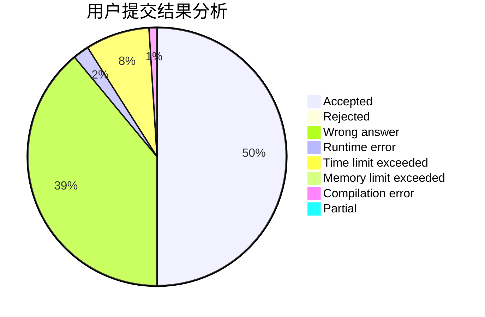
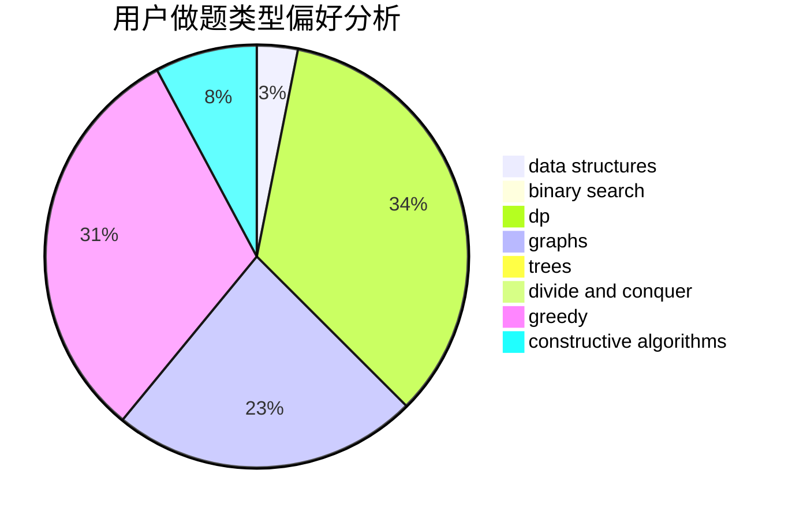
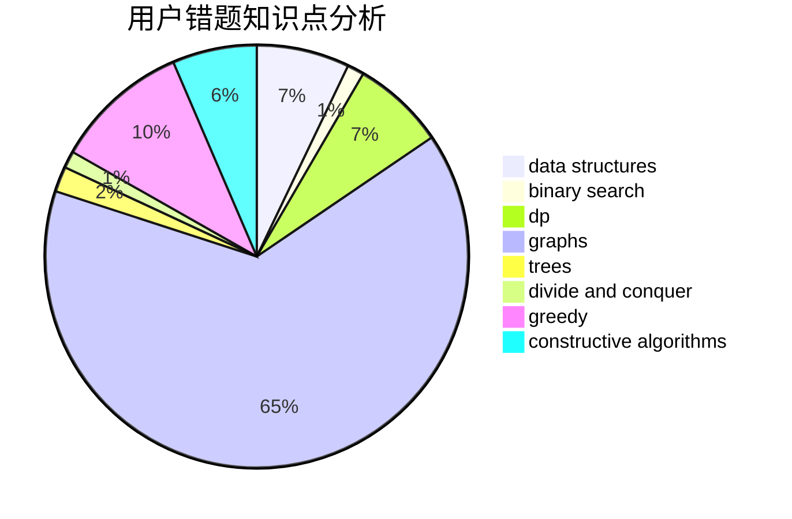

# Frozen_Guardian

<!-- tabs:start -->

#### **用户提交结果分析**

#### **用户做题类型偏好分析**

#### **用户错题知识点分析**

<!-- tabs:end -->
# 推荐题目
[1379B](https://codeforces.com/contest/1379/problem/B)		binary search,
                        brute force,
                        math,
                        number theory		  
[739D](https://codeforces.com/contest/739/problem/D)		graph matchings		  
[862D](https://codeforces.com/contest/862/problem/D)		binary search,
                        divide and conquer,
                        interactive		  
[351E](https://codeforces.com/contest/351/problem/E)		greedy		  
[634A](https://codeforces.com/contest/634/problem/A)		constructive algorithms,
                        implementation		  
[16B](https://codeforces.com/contest/16/problem/B)		greedy,
                        implementation,
                        sortings		  
[862A](https://codeforces.com/contest/862/problem/A)		greedy,
                        implementation		  
[862B](https://codeforces.com/contest/862/problem/B)		dfs and similar,
                        graphs,
                        trees		  
[1261A](https://codeforces.com/contest/1261/problem/A)		dsu,graphs,sortings,trees		  
[1407E](https://codeforces.com/contest/1407/problem/E)		constructive algorithms,
                        dfs and similar,
                        dp,
                        graphs,
                        greedy,
                        shortest paths		  
