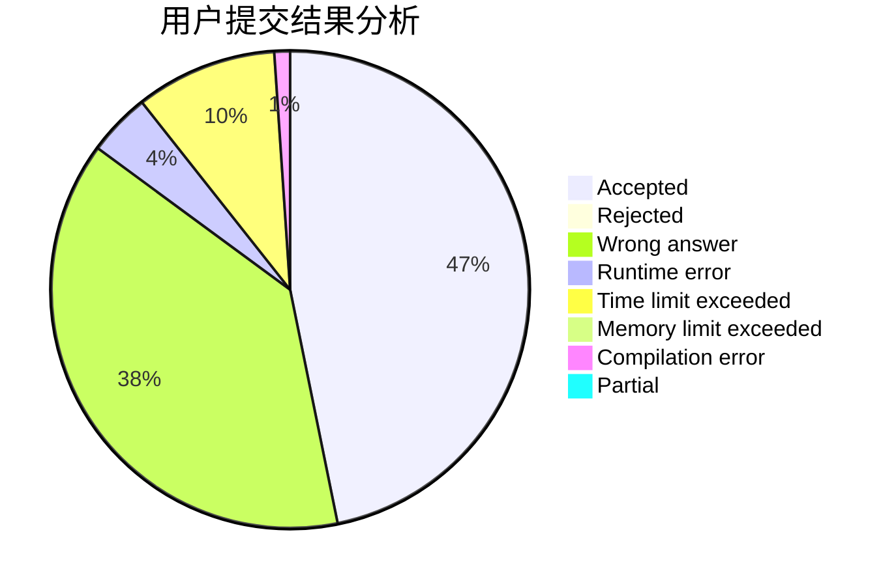
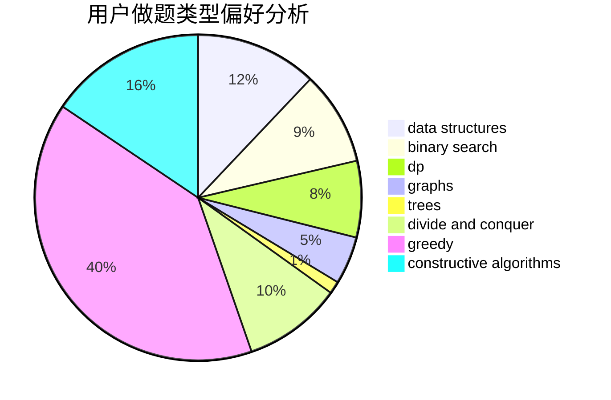

# Frozencode

<!-- tabs:start -->

#### **用户提交结果分析**

#### **用户做题类型偏好分析**

#### **用户错题知识点分析**

<!-- tabs:end -->
# 推荐题目
[1504B](https://codeforces.com/contest/1504/problem/B)		constructive algorithms,
                        greedy,
                        implementation,
                        math		  
[1445C](https://codeforces.com/contest/1445/problem/C)		dsu,graphs,sortings,trees		  
[883C](https://codeforces.com/contest/883/problem/C)		binary search,
                        implementation		  
[1375H](https://codeforces.com/contest/1375/problem/H)		constructive algorithms,
                        divide and conquer		  
[716A](https://codeforces.com/contest/716/problem/A)		implementation		  
[1187E](https://codeforces.com/contest/1187/problem/E)		dfs and similar,
                        dp,
                        trees		  
[1070H](https://codeforces.com/contest/1070/problem/H)		brute force,
                        implementation		  
[727E](https://codeforces.com/contest/727/problem/E)		data structures,
                        hashing,
                        string suffix structures,
                        strings		  
[294B](https://codeforces.com/contest/294/problem/B)		dp,
                        greedy		  
[520C](https://codeforces.com/contest/520/problem/C)		math,
                        strings		  
