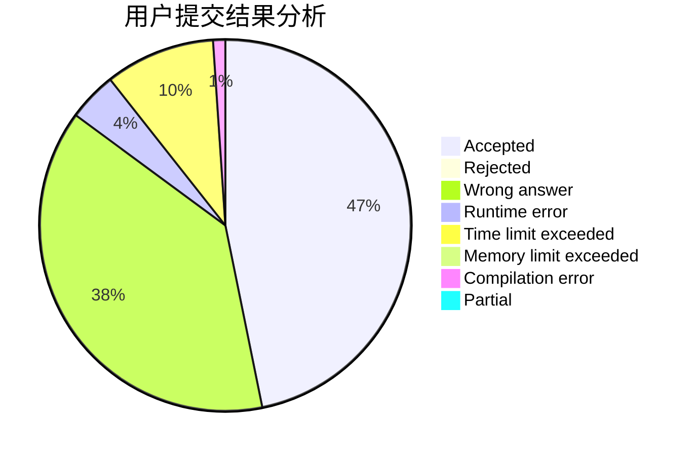
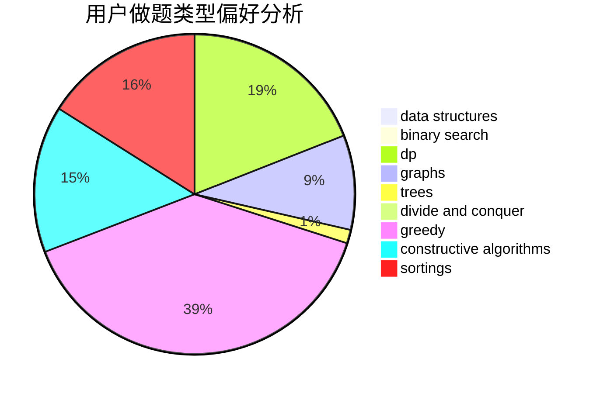

# Frozencode
<!-- tabs:start -->
#### **用户提交结果分析**

#### **用户做题类型偏好分析**

#### **用户错题知识点分析**

<!-- tabs:end -->
# 推荐题目
[1495B](http://codeforces.com/problemset/problem/1495/B)		games,
                        greedy		  
[1114F](http://codeforces.com/problemset/problem/1114/F)		bitmasks,
                        data structures,
                        divide and conquer,
                        math,
                        number theory		  
[1234F](http://codeforces.com/problemset/problem/1234/F)		bitmasks,
                        dp		  
[1435C](https://codeforces.com/contest/1435/problem/C)		binary search,
                        brute force,
                        dp,
                        implementation,
                        sortings,
                        two pointers		  
[1154E](http://codeforces.com/problemset/problem/1154/E)		data structures,
                        implementation,
                        sortings		  
[863A](http://codeforces.com/problemset/problem/863/A)		brute force,
                        implementation		  
[699B](http://codeforces.com/problemset/problem/699/B)		implementation		  
[1184B2](http://codeforces.com/problemset/problem/1184/B2)		flows,
                        graph matchings,
                        graphs,
                        shortest paths,
                        sortings		  
[279B](http://codeforces.com/problemset/problem/279/B)		binary search,
                        brute force,
                        implementation,
                        two pointers		  
[1070E](http://codeforces.com/problemset/problem/1070/E)		binary search,
                        data structures		  
<!-- tabs:start -->
#### **data structures**
[1114F](http://codeforces.com/problemset/problem/1114/F)		bitmasks,
                        data structures,
                        divide and conquer,
                        math,
                        number theory		  
[1154E](http://codeforces.com/problemset/problem/1154/E)		data structures,
                        implementation,
                        sortings		  
[1070E](http://codeforces.com/problemset/problem/1070/E)		binary search,
                        data structures		  
[862E](http://codeforces.com/problemset/problem/862/E)		binary search,
                        data structures,
                        sortings		  
[229B](http://codeforces.com/problemset/problem/229/B)		binary search,
                        data structures,
                        graphs,
                        shortest paths		  
[587F](http://codeforces.com/problemset/problem/587/F)		data structures,
                        strings		  
[708C](http://codeforces.com/problemset/problem/708/C)		data structures,
                        dfs and similar,
                        dp,
                        graphs,
                        greedy,
                        trees		  
[156B](http://codeforces.com/problemset/problem/156/B)		constructive algorithms,
                        data structures,
                        implementation		  
[1293C](https://codeforces.com/contest/1293/problem/C)		data structures,
                        dsu,
                        implementation		  
[4C](http://codeforces.com/problemset/problem/4/C)		data structures,
                        hashing,
                        implementation		  
#### **binary search**
[1435C](https://codeforces.com/contest/1435/problem/C)		binary search,
                        brute force,
                        dp,
                        implementation,
                        sortings,
                        two pointers		  
[279B](http://codeforces.com/problemset/problem/279/B)		binary search,
                        brute force,
                        implementation,
                        two pointers		  
[1070E](http://codeforces.com/problemset/problem/1070/E)		binary search,
                        data structures		  
[862E](http://codeforces.com/problemset/problem/862/E)		binary search,
                        data structures,
                        sortings		  
[229B](http://codeforces.com/problemset/problem/229/B)		binary search,
                        data structures,
                        graphs,
                        shortest paths		  
[1463A](http://codeforces.com/problemset/problem/1463/A)		binary search,
                        math		  
[1492C](http://codeforces.com/problemset/problem/1492/C)		binary search,
                        data structures,
                        dp,
                        greedy,
                        two pointers		  
[1463D](http://codeforces.com/problemset/problem/1463/D)		binary search,
                        constructive algorithms,
                        greedy,
                        two pointers		  
[1490G](http://codeforces.com/problemset/problem/1490/G)		binary search,
                        data structures,
                        math		  
[1479D](http://codeforces.com/problemset/problem/1479/D)		binary search,
                        bitmasks,
                        brute force,
                        data structures,
                        probabilities,
                        trees		  
#### **dp**
[1234F](http://codeforces.com/problemset/problem/1234/F)		bitmasks,
                        dp		  
[1435C](https://codeforces.com/contest/1435/problem/C)		binary search,
                        brute force,
                        dp,
                        implementation,
                        sortings,
                        two pointers		  
[1372D](http://codeforces.com/problemset/problem/1372/D)		brute force,
                        dp,
                        games,
                        greedy		  
[708C](http://codeforces.com/problemset/problem/708/C)		data structures,
                        dfs and similar,
                        dp,
                        graphs,
                        greedy,
                        trees		  
[1398C](http://codeforces.com/problemset/problem/1398/C)		data structures,
                        dp,
                        math		  
[1492C](http://codeforces.com/problemset/problem/1492/C)		binary search,
                        data structures,
                        dp,
                        greedy,
                        two pointers		  
[1457C](https://codeforces.com/contest/1457/problem/C)		brute force,
                        dp,
                        implementation		  
[1491C](http://codeforces.com/problemset/problem/1491/C)		brute force,
                        data structures,
                        dp,
                        greedy,
                        implementation		  
[1437C](http://codeforces.com/problemset/problem/1437/C)		dp,
                        flows,
                        graph matchings,
                        greedy,
                        math,
                        sortings		  
[1499B](http://codeforces.com/problemset/problem/1499/B)		brute force,
                        dp,
                        greedy,
                        implementation		  
#### **graph**
[1184B2](http://codeforces.com/problemset/problem/1184/B2)		flows,
                        graph matchings,
                        graphs,
                        shortest paths,
                        sortings		  
[1027D](http://codeforces.com/problemset/problem/1027/D)		dfs and similar,
                        graphs		  
[229B](http://codeforces.com/problemset/problem/229/B)		binary search,
                        data structures,
                        graphs,
                        shortest paths		  
[708C](http://codeforces.com/problemset/problem/708/C)		data structures,
                        dfs and similar,
                        dp,
                        graphs,
                        greedy,
                        trees		  
[1496E](https://codeforces.com/contest/1496/problem/E)		constructive algorithms,
                        graphs		  
[1422D](http://codeforces.com/problemset/problem/1422/D)		graphs,
                        shortest paths,
                        sortings		  
[1487C](http://codeforces.com/problemset/problem/1487/C)		brute force,
                        constructive algorithms,
                        dfs and similar,
                        graphs,
                        greedy,
                        implementation,
                        math		  
[1437C](http://codeforces.com/problemset/problem/1437/C)		dp,
                        flows,
                        graph matchings,
                        greedy,
                        math,
                        sortings		  
[1470D](http://codeforces.com/problemset/problem/1470/D)		constructive algorithms,
                        dfs and similar,
                        graph matchings,
                        graphs,
                        greedy		  
[1476C](http://codeforces.com/problemset/problem/1476/C)		dp,
                        graphs,
                        greedy		  
#### **trees**
[708C](http://codeforces.com/problemset/problem/708/C)		data structures,
                        dfs and similar,
                        dp,
                        graphs,
                        greedy,
                        trees		  
[1479D](http://codeforces.com/problemset/problem/1479/D)		binary search,
                        bitmasks,
                        brute force,
                        data structures,
                        probabilities,
                        trees		  
[1511C](http://codeforces.com/problemset/problem/1511/C)		brute force,
                        data structures,
                        implementation,
                        trees		  
[1499F](http://codeforces.com/problemset/problem/1499/F)		combinatorics,
                        dfs and similar,
                        dp,
                        trees		  
[1491E](http://codeforces.com/problemset/problem/1491/E)		brute force,
                        dfs and similar,
                        divide and conquer,
                        number theory,
                        trees		  
[1466D](http://codeforces.com/problemset/problem/1466/D)		data structures,
                        greedy,
                        sortings,
                        trees		  
[1495D](http://codeforces.com/problemset/problem/1495/D)		combinatorics,
                        dfs and similar,
                        graphs,
                        math,
                        shortest paths,
                        trees		  
[1303G](http://codeforces.com/problemset/problem/1303/G)		data structures,
                        divide and conquer,
                        geometry,
                        trees		  
[1454E](http://codeforces.com/problemset/problem/1454/E)		combinatorics,
                        dfs and similar,
                        graphs,
                        trees		  
[1494D](http://codeforces.com/problemset/problem/1494/D)		constructive algorithms,
                        data structures,
                        dfs and similar,
                        divide and conquer,
                        dsu,
                        greedy,
                        sortings,
                        trees		  
#### **divide and conquer**
[1114F](http://codeforces.com/problemset/problem/1114/F)		bitmasks,
                        data structures,
                        divide and conquer,
                        math,
                        number theory		  
[1461D](http://codeforces.com/problemset/problem/1461/D)		binary search,
                        brute force,
                        data structures,
                        divide and conquer,
                        implementation,
                        sortings		  
[1466G](http://codeforces.com/problemset/problem/1466/G)		combinatorics,
                        divide and conquer,
                        hashing,
                        math,
                        string suffix structures,
                        strings		  
[1490D](http://codeforces.com/problemset/problem/1490/D)		dfs and similar,
                        divide and conquer,
                        implementation		  
[1483C](https://codeforces.com/contest/1483/problem/C)		data structures,
                        divide and conquer,
                        dp		  
[1491E](http://codeforces.com/problemset/problem/1491/E)		brute force,
                        dfs and similar,
                        divide and conquer,
                        number theory,
                        trees		  
[1303G](http://codeforces.com/problemset/problem/1303/G)		data structures,
                        divide and conquer,
                        geometry,
                        trees		  
[1494D](http://codeforces.com/problemset/problem/1494/D)		constructive algorithms,
                        data structures,
                        dfs and similar,
                        divide and conquer,
                        dsu,
                        greedy,
                        sortings,
                        trees		  
[1482E](http://codeforces.com/problemset/problem/1482/E)		data structures,
                        divide and conquer,
                        dp		  
[566C](http://codeforces.com/problemset/problem/566/C)		dfs and similar,
                        divide and conquer,
                        trees		  
#### **greedy**
[1495B](http://codeforces.com/problemset/problem/1495/B)		games,
                        greedy		  
[1372D](http://codeforces.com/problemset/problem/1372/D)		brute force,
                        dp,
                        games,
                        greedy		  
[708C](http://codeforces.com/problemset/problem/708/C)		data structures,
                        dfs and similar,
                        dp,
                        graphs,
                        greedy,
                        trees		  
[1255D](https://codeforces.com/contest/1255/problem/D)		constructive algorithms,
                        greedy,
                        implementation		  
[1368A](http://codeforces.com/problemset/problem/1368/A)		brute force,
                        greedy,
                        implementation,
                        math		  
[1492C](http://codeforces.com/problemset/problem/1492/C)		binary search,
                        data structures,
                        dp,
                        greedy,
                        two pointers		  
[1496C](https://codeforces.com/contest/1496/problem/C)		geometry,
                        greedy,
                        math,
                        sortings		  
[1493A](http://codeforces.com/problemset/problem/1493/A)		constructive algorithms,
                        greedy		  
[1463D](http://codeforces.com/problemset/problem/1463/D)		binary search,
                        constructive algorithms,
                        greedy,
                        two pointers		  
[1462C](http://codeforces.com/problemset/problem/1462/C)		brute force,
                        greedy,
                        math		  
#### **constructive algorithms**
[1335B](http://codeforces.com/problemset/problem/1335/B)		constructive algorithms		  
[156B](http://codeforces.com/problemset/problem/156/B)		constructive algorithms,
                        data structures,
                        implementation		  
[1255D](https://codeforces.com/contest/1255/problem/D)		constructive algorithms,
                        greedy,
                        implementation		  
[1496E](https://codeforces.com/contest/1496/problem/E)		constructive algorithms,
                        graphs		  
[1493A](http://codeforces.com/problemset/problem/1493/A)		constructive algorithms,
                        greedy		  
[1463D](http://codeforces.com/problemset/problem/1463/D)		binary search,
                        constructive algorithms,
                        greedy,
                        two pointers		  
[1456B](https://codeforces.com/contest/1456/problem/B)		bitmasks,
                        brute force,
                        constructive algorithms		  
[1492D](http://codeforces.com/problemset/problem/1492/D)		bitmasks,
                        constructive algorithms,
                        greedy,
                        math		  
[1504D](https://codeforces.com/contest/1504/problem/D)		constructive algorithms,
                        games,
                        interactive		  
[1483A](https://codeforces.com/contest/1483/problem/A)		brute force,
                        constructive algorithms,
                        greedy,
                        implementation		  
#### **sortings**
[1435C](https://codeforces.com/contest/1435/problem/C)		binary search,
                        brute force,
                        dp,
                        implementation,
                        sortings,
                        two pointers		  
[1154E](http://codeforces.com/problemset/problem/1154/E)		data structures,
                        implementation,
                        sortings		  
[1184B2](http://codeforces.com/problemset/problem/1184/B2)		flows,
                        graph matchings,
                        graphs,
                        shortest paths,
                        sortings		  
[862E](http://codeforces.com/problemset/problem/862/E)		binary search,
                        data structures,
                        sortings		  
[1422D](http://codeforces.com/problemset/problem/1422/D)		graphs,
                        shortest paths,
                        sortings		  
[1496C](https://codeforces.com/contest/1496/problem/C)		geometry,
                        greedy,
                        math,
                        sortings		  
[1495A](http://codeforces.com/problemset/problem/1495/A)		geometry,
                        greedy,
                        math,
                        sortings		  
[1497A](http://codeforces.com/problemset/problem/1497/A)		brute force,
                        data structures,
                        greedy,
                        sortings		  
[1427A](http://codeforces.com/problemset/problem/1427/A)		math,
                        sortings		  
[1461D](http://codeforces.com/problemset/problem/1461/D)		binary search,
                        brute force,
                        data structures,
                        divide and conquer,
                        implementation,
                        sortings		  
<!-- tabs:end -->
