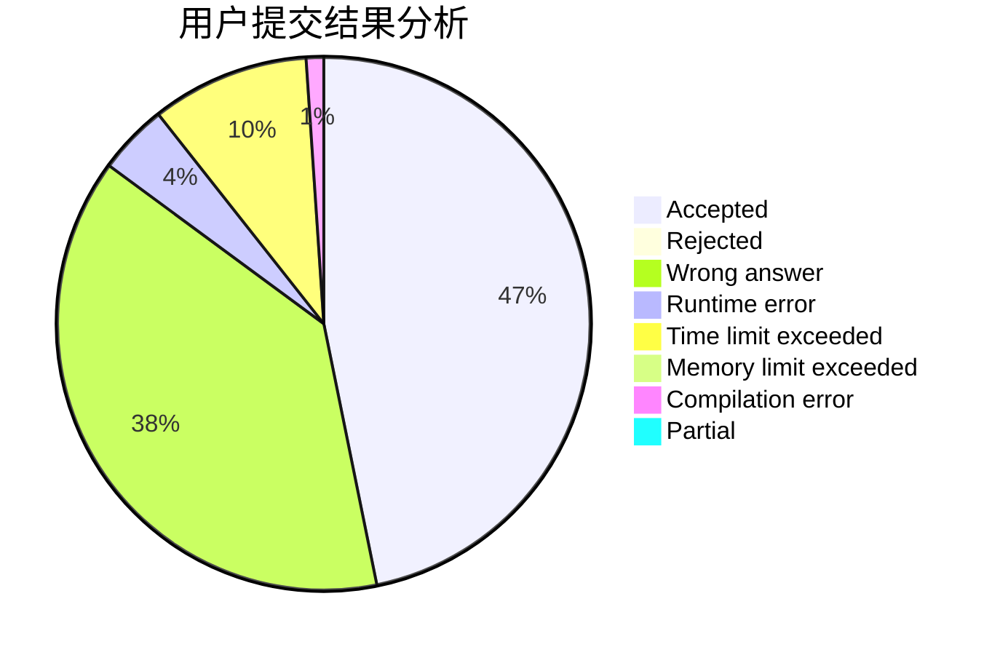
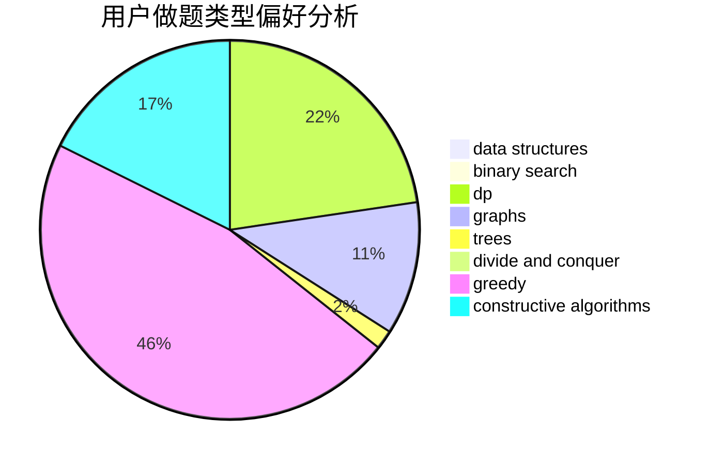

# Frozencode
<!-- tabs:start -->
#### **用户提交结果分析**

#### **用户做题类型偏好分析**

#### **用户错题知识点分析**

<!-- tabs:end -->
# 推荐题目
[Let's Go Hiking](http://codeforces.com/problemset/problem/1495/B)		games,
                        greedy		  
[Please, another Queries on Array?](http://codeforces.com/problemset/problem/1114/F)		bitmasks,
                        data structures,
                        divide and conquer,
                        math,
                        number theory		  
[Yet Another Substring Reverse](http://codeforces.com/problemset/problem/1234/F)		bitmasks,
                        dp		  
[Perform Easily](https://codeforces.com/contest/1435/problem/C)		binary search,
                        brute force,
                        dp,
                        implementation,
                        sortings,
                        two pointers		  
[Two Teams](http://codeforces.com/problemset/problem/1154/E)		data structures,
                        implementation,
                        sortings		  
[Quasi-palindrome](http://codeforces.com/problemset/problem/863/A)		brute force,
                        implementation		  
[One Bomb](http://codeforces.com/problemset/problem/699/B)		implementation		  
[The Doctor Meets Vader (Medium)](http://codeforces.com/problemset/problem/1184/B2)		flows,
                        graph matchings,
                        graphs,
                        shortest paths,
                        sortings		  
[Books](http://codeforces.com/problemset/problem/279/B)		binary search,
                        brute force,
                        implementation,
                        two pointers		  
[Getting Deals Done](http://codeforces.com/problemset/problem/1070/E)		binary search,
                        data structures		  
<!-- tabs:start -->
#### **data structures**
[Let's Go Hiking](http://codeforces.com/problemset/problem/1114/F)		bitmasks,
                        data structures,
                        divide and conquer,
                        math,
                        number theory		  
[Please, another Queries on Array?](http://codeforces.com/problemset/problem/1154/E)		data structures,
                        implementation,
                        sortings		  
[Yet Another Substring Reverse](http://codeforces.com/problemset/problem/1070/E)		binary search,
                        data structures		  
[Perform Easily](http://codeforces.com/problemset/problem/862/E)		binary search,
                        data structures,
                        sortings		  
[Two Teams](http://codeforces.com/problemset/problem/229/B)		binary search,
                        data structures,
                        graphs,
                        shortest paths		  
[Quasi-palindrome](http://codeforces.com/problemset/problem/587/F)		data structures,
                        strings		  
[One Bomb](http://codeforces.com/problemset/problem/708/C)		data structures,
                        dfs and similar,
                        dp,
                        graphs,
                        greedy,
                        trees		  
[The Doctor Meets Vader (Medium)](http://codeforces.com/problemset/problem/156/B)		constructive algorithms,
                        data structures,
                        implementation		  
[Books](https://codeforces.com/contest/1293/problem/C)		data structures,
                        dsu,
                        implementation		  
[Getting Deals Done](http://codeforces.com/problemset/problem/4/C)		data structures,
                        hashing,
                        implementation		  
#### **binary search**
[Let's Go Hiking](https://codeforces.com/contest/1435/problem/C)		binary search,
                        brute force,
                        dp,
                        implementation,
                        sortings,
                        two pointers		  
[Please, another Queries on Array?](http://codeforces.com/problemset/problem/279/B)		binary search,
                        brute force,
                        implementation,
                        two pointers		  
[Yet Another Substring Reverse](http://codeforces.com/problemset/problem/1070/E)		binary search,
                        data structures		  
[Perform Easily](http://codeforces.com/problemset/problem/862/E)		binary search,
                        data structures,
                        sortings		  
[Two Teams](http://codeforces.com/problemset/problem/229/B)		binary search,
                        data structures,
                        graphs,
                        shortest paths		  
[Quasi-palindrome](http://codeforces.com/problemset/problem/1463/A)		binary search,
                        math		  
[One Bomb](http://codeforces.com/problemset/problem/1492/C)		binary search,
                        data structures,
                        dp,
                        greedy,
                        two pointers		  
[The Doctor Meets Vader (Medium)](http://codeforces.com/problemset/problem/1463/D)		binary search,
                        constructive algorithms,
                        greedy,
                        two pointers		  
[Books](http://codeforces.com/problemset/problem/1490/G)		binary search,
                        data structures,
                        math		  
[Getting Deals Done](http://codeforces.com/problemset/problem/1479/D)		binary search,
                        bitmasks,
                        brute force,
                        data structures,
                        probabilities,
                        trees		  
#### **dp**
[Let's Go Hiking](http://codeforces.com/problemset/problem/1234/F)		bitmasks,
                        dp		  
[Please, another Queries on Array?](https://codeforces.com/contest/1435/problem/C)		binary search,
                        brute force,
                        dp,
                        implementation,
                        sortings,
                        two pointers		  
[Yet Another Substring Reverse](http://codeforces.com/problemset/problem/1372/D)		brute force,
                        dp,
                        games,
                        greedy		  
[Perform Easily](http://codeforces.com/problemset/problem/708/C)		data structures,
                        dfs and similar,
                        dp,
                        graphs,
                        greedy,
                        trees		  
[Two Teams](http://codeforces.com/problemset/problem/1398/C)		data structures,
                        dp,
                        math		  
[Quasi-palindrome](http://codeforces.com/problemset/problem/1492/C)		binary search,
                        data structures,
                        dp,
                        greedy,
                        two pointers		  
[One Bomb](https://codeforces.com/contest/1457/problem/C)		brute force,
                        dp,
                        implementation		  
[The Doctor Meets Vader (Medium)](http://codeforces.com/problemset/problem/1491/C)		brute force,
                        data structures,
                        dp,
                        greedy,
                        implementation		  
[Books](http://codeforces.com/problemset/problem/1437/C)		dp,
                        flows,
                        graph matchings,
                        greedy,
                        math,
                        sortings		  
[Getting Deals Done](http://codeforces.com/problemset/problem/1499/B)		brute force,
                        dp,
                        greedy,
                        implementation		  
#### **graph**
[Let's Go Hiking](http://codeforces.com/problemset/problem/1184/B2)		flows,
                        graph matchings,
                        graphs,
                        shortest paths,
                        sortings		  
[Please, another Queries on Array?](http://codeforces.com/problemset/problem/1027/D)		dfs and similar,
                        graphs		  
[Yet Another Substring Reverse](http://codeforces.com/problemset/problem/229/B)		binary search,
                        data structures,
                        graphs,
                        shortest paths		  
[Perform Easily](http://codeforces.com/problemset/problem/708/C)		data structures,
                        dfs and similar,
                        dp,
                        graphs,
                        greedy,
                        trees		  
[Two Teams](https://codeforces.com/contest/1496/problem/E)		constructive algorithms,
                        graphs		  
[Quasi-palindrome](http://codeforces.com/problemset/problem/1422/D)		graphs,
                        shortest paths,
                        sortings		  
[One Bomb](http://codeforces.com/problemset/problem/1487/C)		brute force,
                        constructive algorithms,
                        dfs and similar,
                        graphs,
                        greedy,
                        implementation,
                        math		  
[The Doctor Meets Vader (Medium)](http://codeforces.com/problemset/problem/1437/C)		dp,
                        flows,
                        graph matchings,
                        greedy,
                        math,
                        sortings		  
[Books](http://codeforces.com/problemset/problem/1470/D)		constructive algorithms,
                        dfs and similar,
                        graph matchings,
                        graphs,
                        greedy		  
[Getting Deals Done](http://codeforces.com/problemset/problem/1476/C)		dp,
                        graphs,
                        greedy		  
#### **trees**
[Let's Go Hiking](http://codeforces.com/problemset/problem/708/C)		data structures,
                        dfs and similar,
                        dp,
                        graphs,
                        greedy,
                        trees		  
[Please, another Queries on Array?](http://codeforces.com/problemset/problem/1479/D)		binary search,
                        bitmasks,
                        brute force,
                        data structures,
                        probabilities,
                        trees		  
[Yet Another Substring Reverse](http://codeforces.com/problemset/problem/1511/C)		brute force,
                        data structures,
                        implementation,
                        trees		  
[Perform Easily](http://codeforces.com/problemset/problem/1499/F)		combinatorics,
                        dfs and similar,
                        dp,
                        trees		  
[Two Teams](http://codeforces.com/problemset/problem/1491/E)		brute force,
                        dfs and similar,
                        divide and conquer,
                        number theory,
                        trees		  
[Quasi-palindrome](http://codeforces.com/problemset/problem/1466/D)		data structures,
                        greedy,
                        sortings,
                        trees		  
[One Bomb](http://codeforces.com/problemset/problem/1495/D)		combinatorics,
                        dfs and similar,
                        graphs,
                        math,
                        shortest paths,
                        trees		  
[The Doctor Meets Vader (Medium)](http://codeforces.com/problemset/problem/1303/G)		data structures,
                        divide and conquer,
                        geometry,
                        trees		  
[Books](http://codeforces.com/problemset/problem/1454/E)		combinatorics,
                        dfs and similar,
                        graphs,
                        trees		  
[Getting Deals Done](http://codeforces.com/problemset/problem/1494/D)		constructive algorithms,
                        data structures,
                        dfs and similar,
                        divide and conquer,
                        dsu,
                        greedy,
                        sortings,
                        trees		  
#### **divide and conquer**
[Let's Go Hiking](http://codeforces.com/problemset/problem/1114/F)		bitmasks,
                        data structures,
                        divide and conquer,
                        math,
                        number theory		  
[Please, another Queries on Array?](http://codeforces.com/problemset/problem/1461/D)		binary search,
                        brute force,
                        data structures,
                        divide and conquer,
                        implementation,
                        sortings		  
[Yet Another Substring Reverse](http://codeforces.com/problemset/problem/1466/G)		combinatorics,
                        divide and conquer,
                        hashing,
                        math,
                        string suffix structures,
                        strings		  
[Perform Easily](http://codeforces.com/problemset/problem/1490/D)		dfs and similar,
                        divide and conquer,
                        implementation		  
[Two Teams](https://codeforces.com/contest/1483/problem/C)		data structures,
                        divide and conquer,
                        dp		  
[Quasi-palindrome](http://codeforces.com/problemset/problem/1491/E)		brute force,
                        dfs and similar,
                        divide and conquer,
                        number theory,
                        trees		  
[One Bomb](http://codeforces.com/problemset/problem/1303/G)		data structures,
                        divide and conquer,
                        geometry,
                        trees		  
[The Doctor Meets Vader (Medium)](http://codeforces.com/problemset/problem/1494/D)		constructive algorithms,
                        data structures,
                        dfs and similar,
                        divide and conquer,
                        dsu,
                        greedy,
                        sortings,
                        trees		  
[Books](http://codeforces.com/problemset/problem/1482/E)		data structures,
                        divide and conquer,
                        dp		  
[Getting Deals Done](http://codeforces.com/problemset/problem/566/C)		dfs and similar,
                        divide and conquer,
                        trees		  
#### **greedy**
[Let's Go Hiking](http://codeforces.com/problemset/problem/1495/B)		games,
                        greedy		  
[Please, another Queries on Array?](http://codeforces.com/problemset/problem/1372/D)		brute force,
                        dp,
                        games,
                        greedy		  
[Yet Another Substring Reverse](http://codeforces.com/problemset/problem/708/C)		data structures,
                        dfs and similar,
                        dp,
                        graphs,
                        greedy,
                        trees		  
[Perform Easily](https://codeforces.com/contest/1255/problem/D)		constructive algorithms,
                        greedy,
                        implementation		  
[Two Teams](http://codeforces.com/problemset/problem/1368/A)		brute force,
                        greedy,
                        implementation,
                        math		  
[Quasi-palindrome](http://codeforces.com/problemset/problem/1492/C)		binary search,
                        data structures,
                        dp,
                        greedy,
                        two pointers		  
[One Bomb](https://codeforces.com/contest/1496/problem/C)		geometry,
                        greedy,
                        math,
                        sortings		  
[The Doctor Meets Vader (Medium)](http://codeforces.com/problemset/problem/1493/A)		constructive algorithms,
                        greedy		  
[Books](http://codeforces.com/problemset/problem/1463/D)		binary search,
                        constructive algorithms,
                        greedy,
                        two pointers		  
[Getting Deals Done](http://codeforces.com/problemset/problem/1462/C)		brute force,
                        greedy,
                        math		  
#### **constructive algorithms**
[Let's Go Hiking](http://codeforces.com/problemset/problem/1335/B)		constructive algorithms		  
[Please, another Queries on Array?](http://codeforces.com/problemset/problem/156/B)		constructive algorithms,
                        data structures,
                        implementation		  
[Yet Another Substring Reverse](https://codeforces.com/contest/1255/problem/D)		constructive algorithms,
                        greedy,
                        implementation		  
[Perform Easily](https://codeforces.com/contest/1496/problem/E)		constructive algorithms,
                        graphs		  
[Two Teams](http://codeforces.com/problemset/problem/1493/A)		constructive algorithms,
                        greedy		  
[Quasi-palindrome](http://codeforces.com/problemset/problem/1463/D)		binary search,
                        constructive algorithms,
                        greedy,
                        two pointers		  
[One Bomb](https://codeforces.com/contest/1456/problem/B)		bitmasks,
                        brute force,
                        constructive algorithms		  
[The Doctor Meets Vader (Medium)](http://codeforces.com/problemset/problem/1492/D)		bitmasks,
                        constructive algorithms,
                        greedy,
                        math		  
[Books](https://codeforces.com/contest/1504/problem/D)		constructive algorithms,
                        games,
                        interactive		  
[Getting Deals Done](https://codeforces.com/contest/1483/problem/A)		brute force,
                        constructive algorithms,
                        greedy,
                        implementation		  
#### **sortings**
[Let's Go Hiking](https://codeforces.com/contest/1435/problem/C)		binary search,
                        brute force,
                        dp,
                        implementation,
                        sortings,
                        two pointers		  
[Please, another Queries on Array?](http://codeforces.com/problemset/problem/1154/E)		data structures,
                        implementation,
                        sortings		  
[Yet Another Substring Reverse](http://codeforces.com/problemset/problem/1184/B2)		flows,
                        graph matchings,
                        graphs,
                        shortest paths,
                        sortings		  
[Perform Easily](http://codeforces.com/problemset/problem/862/E)		binary search,
                        data structures,
                        sortings		  
[Two Teams](http://codeforces.com/problemset/problem/1422/D)		graphs,
                        shortest paths,
                        sortings		  
[Quasi-palindrome](https://codeforces.com/contest/1496/problem/C)		geometry,
                        greedy,
                        math,
                        sortings		  
[One Bomb](http://codeforces.com/problemset/problem/1495/A)		geometry,
                        greedy,
                        math,
                        sortings		  
[The Doctor Meets Vader (Medium)](http://codeforces.com/problemset/problem/1497/A)		brute force,
                        data structures,
                        greedy,
                        sortings		  
[Books](http://codeforces.com/problemset/problem/1427/A)		math,
                        sortings		  
[Getting Deals Done](http://codeforces.com/problemset/problem/1461/D)		binary search,
                        brute force,
                        data structures,
                        divide and conquer,
                        implementation,
                        sortings		  
<!-- tabs:end -->
