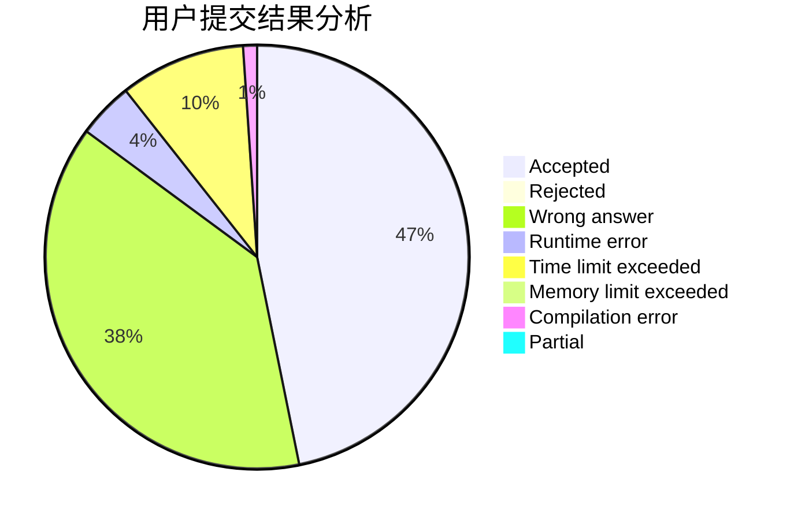
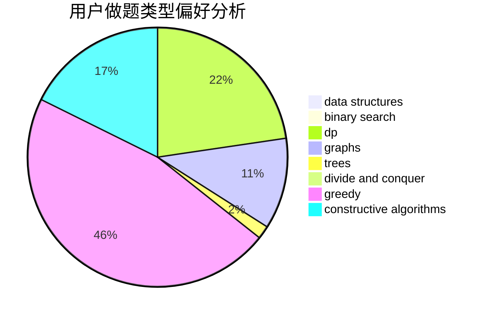

# Frozencode

<!-- tabs:start -->

#### **用户提交结果分析**

#### **用户做题类型偏好分析**

#### **用户错题知识点分析**

<!-- tabs:end -->
# 推荐题目
[1495B](https://codeforces.com/contest/1495/problem/B)		games,
                        greedy		  
[1435C](https://codeforces.com/contest/1435/problem/C)		dsu,graphs,sortings,trees		  
[863A](https://codeforces.com/contest/863/problem/A)		brute force,
                        implementation		  
[1368H2](https://codeforces.com/contest/1368H/problem/2)		nan		  
[699B](https://codeforces.com/contest/699/problem/B)		implementation		  
[1184B2](https://codeforces.com/contest/1184B/problem/2)		flows,
                        graph matchings,
                        graphs,
                        shortest paths,
                        sortings		  
[1070E](https://codeforces.com/contest/1070/problem/E)		binary search,
                        data structures		  
[708C](https://codeforces.com/contest/708/problem/C)		data structures,
                        dfs and similar,
                        dp,
                        graphs,
                        greedy,
                        trees		  
[279B](https://codeforces.com/contest/279/problem/B)		binary search,
                        brute force,
                        implementation,
                        two pointers		  
[4C](https://codeforces.com/contest/4/problem/C)		data structures,
                        hashing,
                        implementation		  
