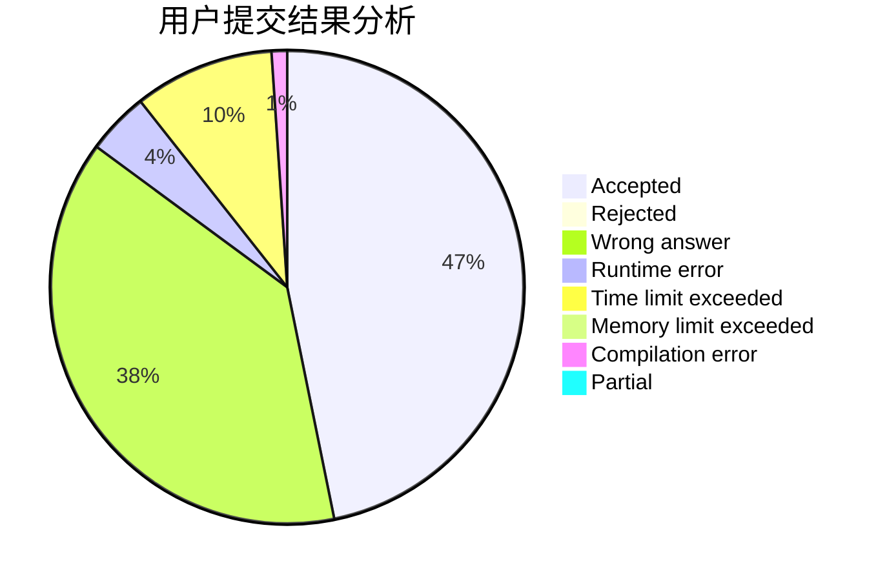
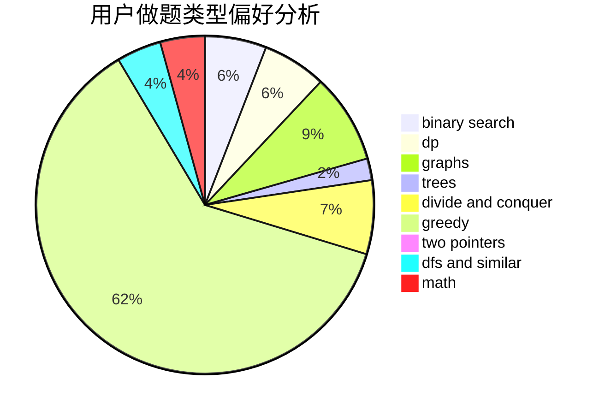

# Frozencode

<!-- tabs:start -->

#### **用户提交结果分析**

#### **用户做题类型偏好分析**

<!-- tabs:end -->
# 推荐题目
[1504B](https://codeforces.com/contest/1504/problem/B)
[1445C](https://codeforces.com/contest/1445/problem/C)
[883C](https://codeforces.com/contest/883/problem/C)
[1375H](https://codeforces.com/contest/1375/problem/H)
[716A](https://codeforces.com/contest/716/problem/A)
[1187E](https://codeforces.com/contest/1187/problem/E)
[1070H](https://codeforces.com/contest/1070/problem/H)
[727E](https://codeforces.com/contest/727/problem/E)
[294B](https://codeforces.com/contest/294/problem/B)
[520C](https://codeforces.com/contest/520/problem/C)
