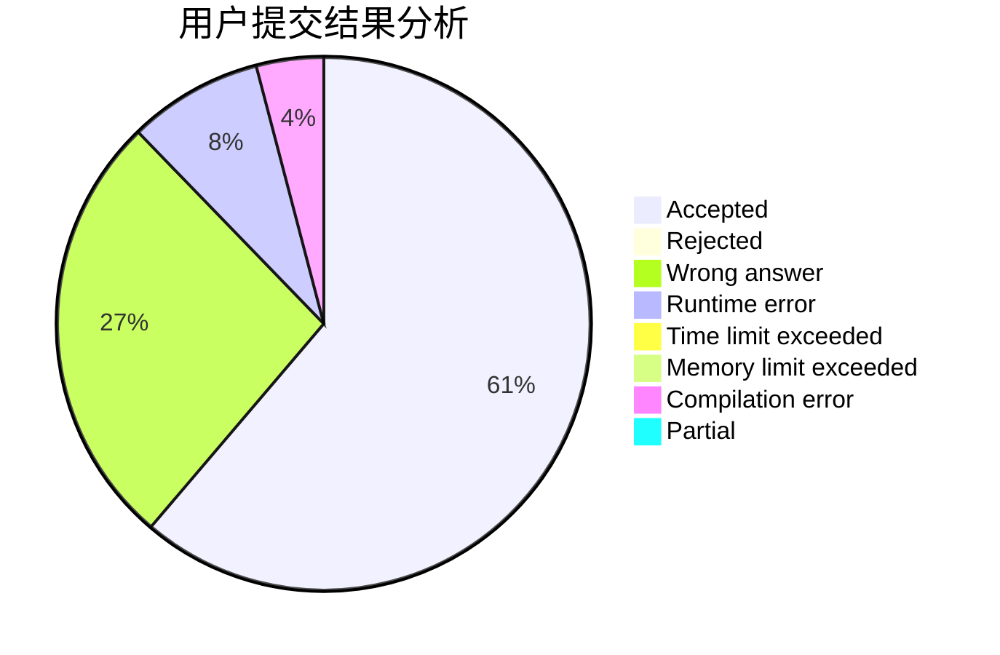
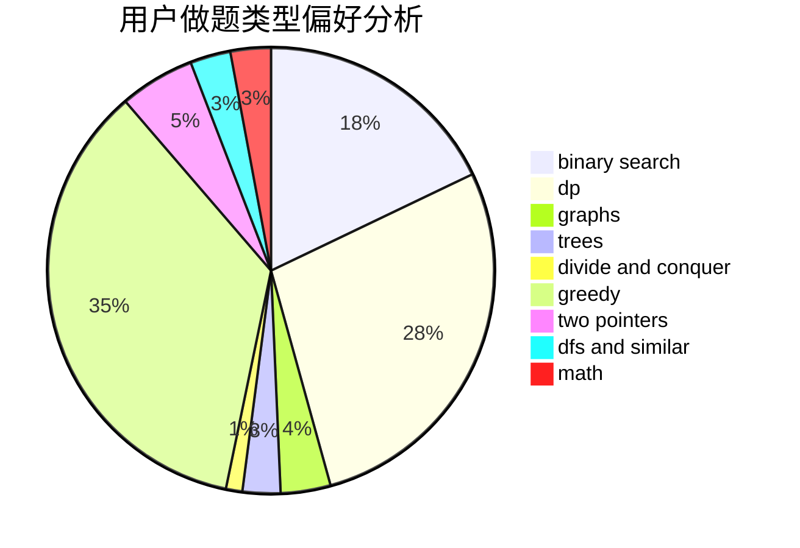

# FuWeak

<!-- tabs:start -->

#### **用户提交结果分析**

#### **用户做题类型偏好分析**

<!-- tabs:end -->
# 推荐题目
[1445D](https://codeforces.com/contest/1445/problem/D)
[13681](https://codeforces.com/contest/1368/problem/1)
[18C](https://codeforces.com/contest/18/problem/C)
[594E](https://codeforces.com/contest/594/problem/E)
[698D](https://codeforces.com/contest/698/problem/D)
[1290A](https://codeforces.com/contest/1290/problem/A)
[704E](https://codeforces.com/contest/704/problem/E)
[414B](https://codeforces.com/contest/414/problem/B)
[472G](https://codeforces.com/contest/472/problem/G)
[1287B](https://codeforces.com/contest/1287/problem/B)
