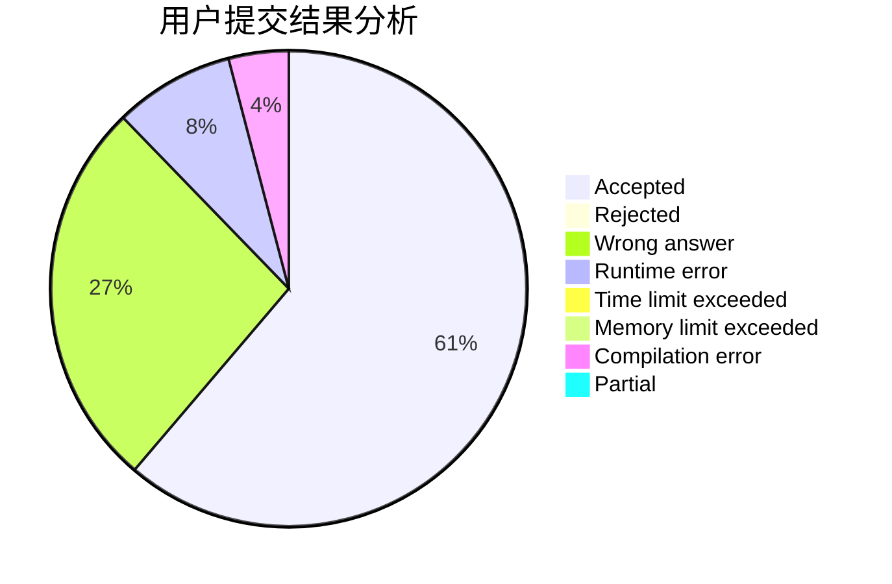
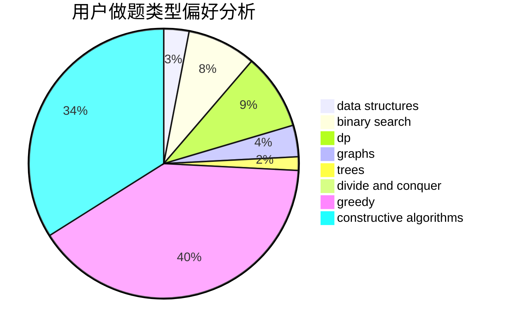

# FuWeak

<!-- tabs:start -->

#### **用户提交结果分析**

#### **用户做题类型偏好分析**

#### **用户错题知识点分析**

<!-- tabs:end -->
# 推荐题目
[1435D](https://codeforces.com/contest/1435/problem/D)		dsu,graphs,sortings,trees		  
[135B](https://codeforces.com/contest/135/problem/B)		brute force,
                        geometry,
                        math		  
[165A](https://codeforces.com/contest/165/problem/A)		implementation		  
[574D](https://codeforces.com/contest/574/problem/D)		dsu,graphs,sortings,trees		  
[672C](https://codeforces.com/contest/672/problem/C)		dsu,graphs,sortings,trees		  
[1283A](https://codeforces.com/contest/1283/problem/A)		math		  
[681A](https://codeforces.com/contest/681/problem/A)		implementation		  
[383A](https://codeforces.com/contest/383/problem/A)		data structures,
                        greedy		  
[451E](https://codeforces.com/contest/451/problem/E)		bitmasks,
                        combinatorics,
                        number theory		  
[1281B](https://codeforces.com/contest/1281/problem/B)		greedy		  
