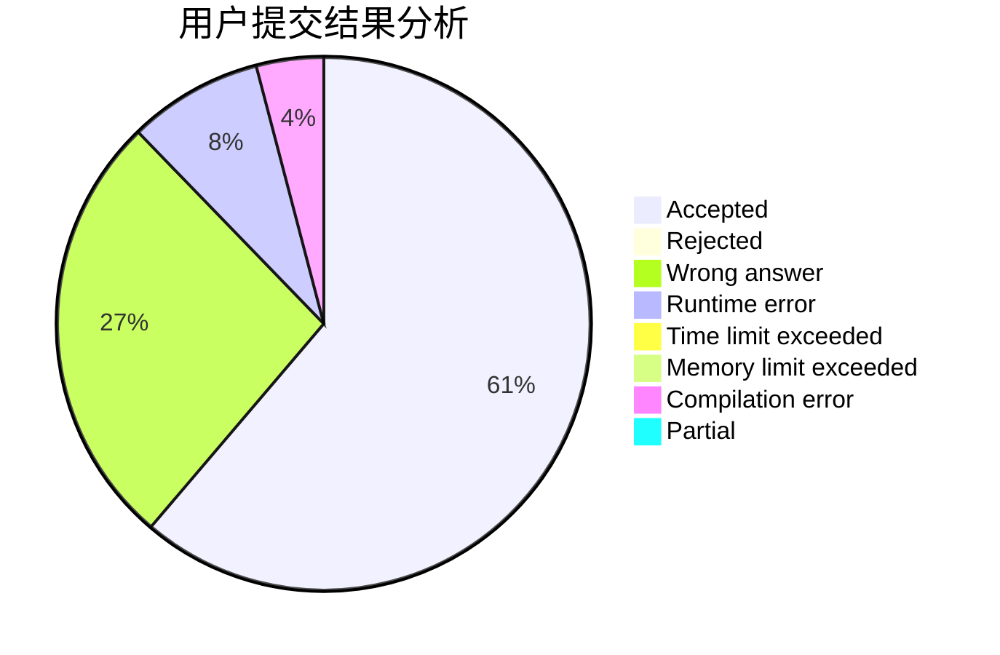
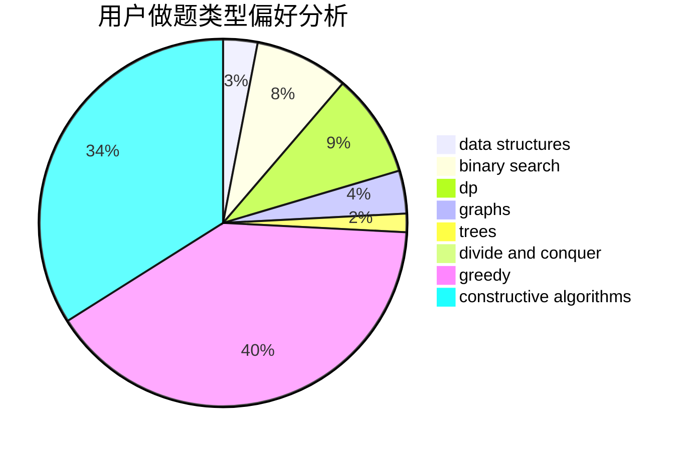

# FuWeak
<!-- tabs:start -->
#### **用户提交结果分析**

#### **用户做题类型偏好分析**

#### **用户错题知识点分析**

<!-- tabs:end -->
# 推荐题目
[Shurikens](https://codeforces.com/contest/1435/problem/D)		data structures,
                        greedy,
                        implementation		  
[Tennis Championship](https://codeforces.com/contest/736/problem/A)		combinatorics,
                        constructive algorithms,
                        greedy,
                        math		  
[A Good Contest](http://codeforces.com/problemset/problem/681/A)		implementation		  
[Mike and Geometry Problem](http://codeforces.com/problemset/problem/689/E)		combinatorics,
                        data structures,
                        dp,
                        geometry,
                        implementation		  
[Rectangle and Square](http://codeforces.com/problemset/problem/135/B)		brute force,
                        geometry,
                        math		  
[Prepare superposition of basis states with the same parity](http://codeforces.com/problemset/problem/1357/C2)		nan		  
[Bear and Blocks](https://codeforces.com/contest/574/problem/D)		binary search,
                        data structures,
                        dp,
                        math		  
[Recycling Bottles](https://codeforces.com/contest/672/problem/C)		dp,
                        geometry,
                        greedy,
                        implementation		  
[Spongebob and Squares](http://codeforces.com/problemset/problem/599/D)		brute force,
                        math		  
[Linova and Kingdom](https://codeforces.com/contest/1337/problem/C)		dfs and similar,
                        dp,
                        greedy,
                        sortings,
                        trees		  
<!-- tabs:start -->
#### **data structures**
[Shurikens](https://codeforces.com/contest/1435/problem/D)		data structures,
                        greedy,
                        implementation		  
[Tennis Championship](http://codeforces.com/problemset/problem/689/E)		combinatorics,
                        data structures,
                        dp,
                        geometry,
                        implementation		  
[A Good Contest](https://codeforces.com/contest/574/problem/D)		binary search,
                        data structures,
                        dp,
                        math		  
[Mike and Geometry Problem](http://codeforces.com/problemset/problem/383/A)		data structures,
                        greedy		  
[Rectangle and Square](http://codeforces.com/problemset/problem/863/E)		data structures,
                        sortings		  
[Prepare superposition of basis states with the same parity](http://codeforces.com/problemset/problem/18/C)		data structures,
                        implementation		  
[Bear and Blocks](http://codeforces.com/problemset/problem/367/A)		data structures,
                        implementation		  
[Recycling Bottles](http://codeforces.com/problemset/problem/1250/C)		data structures		  
[Spongebob and Squares](http://codeforces.com/problemset/problem/567/C)		binary search,
                        data structures,
                        dp		  
[Linova and Kingdom](http://codeforces.com/problemset/problem/1056/G)		brute force,
                        data structures,
                        graphs		  
#### **binary search**
[Shurikens](https://codeforces.com/contest/574/problem/D)		binary search,
                        data structures,
                        dp,
                        math		  
[Tennis Championship](https://codeforces.com/contest/497/problem/B)		binary search		  
[A Good Contest](http://codeforces.com/problemset/problem/567/C)		binary search,
                        data structures,
                        dp		  
[Mike and Geometry Problem](http://codeforces.com/problemset/problem/555/D)		binary search,
                        implementation,
                        math		  
[Rectangle and Square](http://codeforces.com/problemset/problem/84/C)		binary search,
                        implementation		  
[Prepare superposition of basis states with the same parity](http://codeforces.com/problemset/problem/1492/C)		binary search,
                        data structures,
                        dp,
                        greedy,
                        two pointers		  
[Bear and Blocks](http://codeforces.com/problemset/problem/1463/D)		binary search,
                        constructive algorithms,
                        greedy,
                        two pointers		  
[Recycling Bottles](http://codeforces.com/problemset/problem/1490/G)		binary search,
                        data structures,
                        math		  
[Spongebob and Squares](http://codeforces.com/problemset/problem/1479/D)		binary search,
                        bitmasks,
                        brute force,
                        data structures,
                        probabilities,
                        trees		  
[Linova and Kingdom](http://codeforces.com/problemset/problem/1436/E)		binary search,
                        data structures,
                        two pointers		  
#### **dp**
[Shurikens](http://codeforces.com/problemset/problem/689/E)		combinatorics,
                        data structures,
                        dp,
                        geometry,
                        implementation		  
[Tennis Championship](https://codeforces.com/contest/574/problem/D)		binary search,
                        data structures,
                        dp,
                        math		  
[A Good Contest](https://codeforces.com/contest/672/problem/C)		dp,
                        geometry,
                        greedy,
                        implementation		  
[Mike and Geometry Problem](https://codeforces.com/contest/1337/problem/C)		dfs and similar,
                        dp,
                        greedy,
                        sortings,
                        trees		  
[Rectangle and Square](http://codeforces.com/problemset/problem/180/C)		dp		  
[Prepare superposition of basis states with the same parity](http://codeforces.com/problemset/problem/229/E)		combinatorics,
                        dp,
                        math,
                        probabilities		  
[Bear and Blocks](http://codeforces.com/problemset/problem/436/D)		dp		  
[Recycling Bottles](http://codeforces.com/problemset/problem/567/C)		binary search,
                        data structures,
                        dp		  
[Spongebob and Squares](http://codeforces.com/problemset/problem/314/C)		data structures,
                        dp		  
[Linova and Kingdom](http://codeforces.com/problemset/problem/165/E)		bitmasks,
                        brute force,
                        dfs and similar,
                        dp		  
#### **graph**
[Shurikens](http://codeforces.com/problemset/problem/737/E)		graph matchings,
                        graphs,
                        greedy,
                        schedules		  
[Tennis Championship](http://codeforces.com/problemset/problem/1056/G)		brute force,
                        data structures,
                        graphs		  
[A Good Contest](https://codeforces.com/contest/1281/problem/E)		dfs and similar,
                        graphs,
                        greedy,
                        trees		  
[Mike and Geometry Problem](http://codeforces.com/problemset/problem/542/E)		graphs,
                        shortest paths		  
[Rectangle and Square](http://codeforces.com/problemset/problem/863/C)		graphs,
                        implementation		  
[Prepare superposition of basis states with the same parity](http://codeforces.com/problemset/problem/331/E1)		constructive algorithms,
                        graphs,
                        implementation		  
[Bear and Blocks](http://codeforces.com/problemset/problem/845/G)		dfs and similar,
                        graphs,
                        math		  
[Recycling Bottles](http://codeforces.com/problemset/problem/1473/E)		graphs,
                        shortest paths		  
[Spongebob and Squares](http://codeforces.com/problemset/problem/1360/E)		dp,
                        graphs,
                        implementation,
                        shortest paths		  
[Linova and Kingdom](http://codeforces.com/problemset/problem/1487/C)		brute force,
                        constructive algorithms,
                        dfs and similar,
                        graphs,
                        greedy,
                        implementation,
                        math		  
#### **trees**
[Shurikens](https://codeforces.com/contest/1337/problem/C)		dfs and similar,
                        dp,
                        greedy,
                        sortings,
                        trees		  
[Tennis Championship](https://codeforces.com/contest/1281/problem/E)		dfs and similar,
                        graphs,
                        greedy,
                        trees		  
[A Good Contest](http://codeforces.com/problemset/problem/1101/D)		data structures,
                        dfs and similar,
                        dp,
                        number theory,
                        trees		  
[Mike and Geometry Problem](http://codeforces.com/problemset/problem/1479/D)		binary search,
                        bitmasks,
                        brute force,
                        data structures,
                        probabilities,
                        trees		  
[Rectangle and Square](http://codeforces.com/problemset/problem/1511/C)		brute force,
                        data structures,
                        implementation,
                        trees		  
[Prepare superposition of basis states with the same parity](http://codeforces.com/problemset/problem/1499/F)		combinatorics,
                        dfs and similar,
                        dp,
                        trees		  
[Bear and Blocks](http://codeforces.com/problemset/problem/1491/E)		brute force,
                        dfs and similar,
                        divide and conquer,
                        number theory,
                        trees		  
[Recycling Bottles](http://codeforces.com/problemset/problem/1466/D)		data structures,
                        greedy,
                        sortings,
                        trees		  
[Spongebob and Squares](http://codeforces.com/problemset/problem/1495/D)		combinatorics,
                        dfs and similar,
                        graphs,
                        math,
                        shortest paths,
                        trees		  
[Linova and Kingdom](http://codeforces.com/problemset/problem/1303/G)		data structures,
                        divide and conquer,
                        geometry,
                        trees		  
#### **divide and conquer**
[Shurikens](http://codeforces.com/problemset/problem/1461/D)		binary search,
                        brute force,
                        data structures,
                        divide and conquer,
                        implementation,
                        sortings		  
[Tennis Championship](http://codeforces.com/problemset/problem/1466/G)		combinatorics,
                        divide and conquer,
                        hashing,
                        math,
                        string suffix structures,
                        strings		  
[A Good Contest](http://codeforces.com/problemset/problem/1490/D)		dfs and similar,
                        divide and conquer,
                        implementation		  
[Mike and Geometry Problem](https://codeforces.com/contest/1483/problem/C)		data structures,
                        divide and conquer,
                        dp		  
[Rectangle and Square](http://codeforces.com/problemset/problem/1491/E)		brute force,
                        dfs and similar,
                        divide and conquer,
                        number theory,
                        trees		  
[Prepare superposition of basis states with the same parity](http://codeforces.com/problemset/problem/1303/G)		data structures,
                        divide and conquer,
                        geometry,
                        trees		  
[Bear and Blocks](http://codeforces.com/problemset/problem/1494/D)		constructive algorithms,
                        data structures,
                        dfs and similar,
                        divide and conquer,
                        dsu,
                        greedy,
                        sortings,
                        trees		  
[Recycling Bottles](http://codeforces.com/problemset/problem/1482/E)		data structures,
                        divide and conquer,
                        dp		  
[Spongebob and Squares](http://codeforces.com/problemset/problem/566/C)		dfs and similar,
                        divide and conquer,
                        trees		  
[Linova and Kingdom](http://codeforces.com/problemset/problem/1428/F)		binary search,
                        data structures,
                        divide and conquer,
                        dp,
                        two pointers		  
#### **greedy**
[Shurikens](https://codeforces.com/contest/1435/problem/D)		data structures,
                        greedy,
                        implementation		  
[Tennis Championship](https://codeforces.com/contest/736/problem/A)		combinatorics,
                        constructive algorithms,
                        greedy,
                        math		  
[A Good Contest](https://codeforces.com/contest/672/problem/C)		dp,
                        geometry,
                        greedy,
                        implementation		  
[Mike and Geometry Problem](https://codeforces.com/contest/1337/problem/C)		dfs and similar,
                        dp,
                        greedy,
                        sortings,
                        trees		  
[Rectangle and Square](http://codeforces.com/problemset/problem/1281/B)		greedy		  
[Prepare superposition of basis states with the same parity](http://codeforces.com/problemset/problem/383/A)		data structures,
                        greedy		  
[Bear and Blocks](http://codeforces.com/problemset/problem/709/B)		greedy,
                        implementation,
                        sortings		  
[Recycling Bottles](http://codeforces.com/problemset/problem/737/E)		graph matchings,
                        graphs,
                        greedy,
                        schedules		  
[Spongebob and Squares](http://codeforces.com/problemset/problem/37/B)		greedy,
                        implementation		  
[Linova and Kingdom](http://codeforces.com/problemset/problem/863/B)		brute force,
                        greedy,
                        sortings		  
#### **constructive algorithms**
[Shurikens](https://codeforces.com/contest/736/problem/A)		combinatorics,
                        constructive algorithms,
                        greedy,
                        math		  
[Tennis Championship](http://codeforces.com/problemset/problem/1158/B)		constructive algorithms,
                        math,
                        strings		  
[A Good Contest](http://codeforces.com/problemset/problem/1305/E)		constructive algorithms,
                        greedy,
                        implementation,
                        math		  
[Mike and Geometry Problem](http://codeforces.com/problemset/problem/331/E1)		constructive algorithms,
                        graphs,
                        implementation		  
[Rectangle and Square](http://codeforces.com/problemset/problem/1178/D)		constructive algorithms,
                        greedy,
                        math,
                        number theory		  
[Prepare superposition of basis states with the same parity](http://codeforces.com/problemset/problem/1419/E)		constructive algorithms,
                        implementation,
                        math,
                        number theory		  
[Bear and Blocks](http://codeforces.com/problemset/problem/1463/B)		bitmasks,
                        constructive algorithms,
                        greedy		  
[Recycling Bottles](http://codeforces.com/problemset/problem/1493/A)		constructive algorithms,
                        greedy		  
[Spongebob and Squares](http://codeforces.com/problemset/problem/1463/D)		binary search,
                        constructive algorithms,
                        greedy,
                        two pointers		  
[Linova and Kingdom](https://codeforces.com/contest/1456/problem/B)		bitmasks,
                        brute force,
                        constructive algorithms		  
#### **sortings**
[Shurikens](https://codeforces.com/contest/1337/problem/C)		dfs and similar,
                        dp,
                        greedy,
                        sortings,
                        trees		  
[Tennis Championship](http://codeforces.com/problemset/problem/864/A)		implementation,
                        sortings		  
[A Good Contest](http://codeforces.com/problemset/problem/863/E)		data structures,
                        sortings		  
[Mike and Geometry Problem](http://codeforces.com/problemset/problem/709/B)		greedy,
                        implementation,
                        sortings		  
[Rectangle and Square](http://codeforces.com/problemset/problem/710/B)		brute force,
                        sortings		  
[Prepare superposition of basis states with the same parity](http://codeforces.com/problemset/problem/863/B)		brute force,
                        greedy,
                        sortings		  
[Bear and Blocks](http://codeforces.com/problemset/problem/1355/B)		dp,
                        greedy,
                        sortings		  
[Recycling Bottles](https://codeforces.com/contest/1496/problem/C)		geometry,
                        greedy,
                        math,
                        sortings		  
[Spongebob and Squares](http://codeforces.com/problemset/problem/1495/A)		geometry,
                        greedy,
                        math,
                        sortings		  
[Linova and Kingdom](http://codeforces.com/problemset/problem/1497/A)		brute force,
                        data structures,
                        greedy,
                        sortings		  
<!-- tabs:end -->
