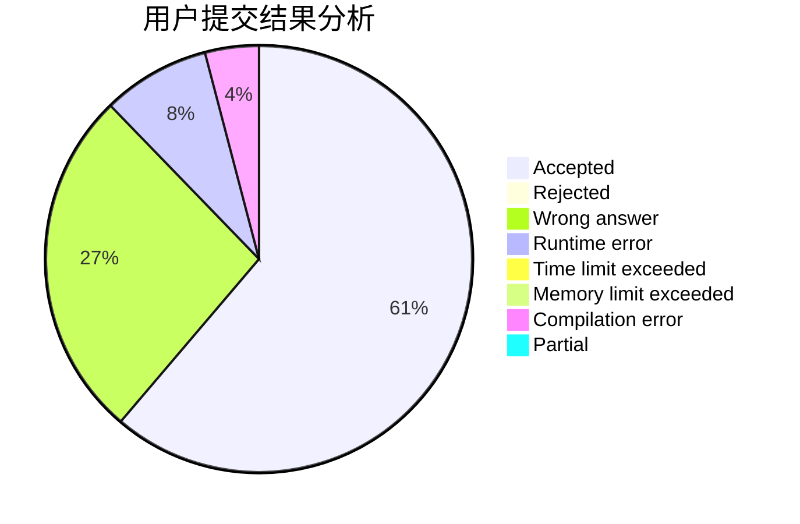
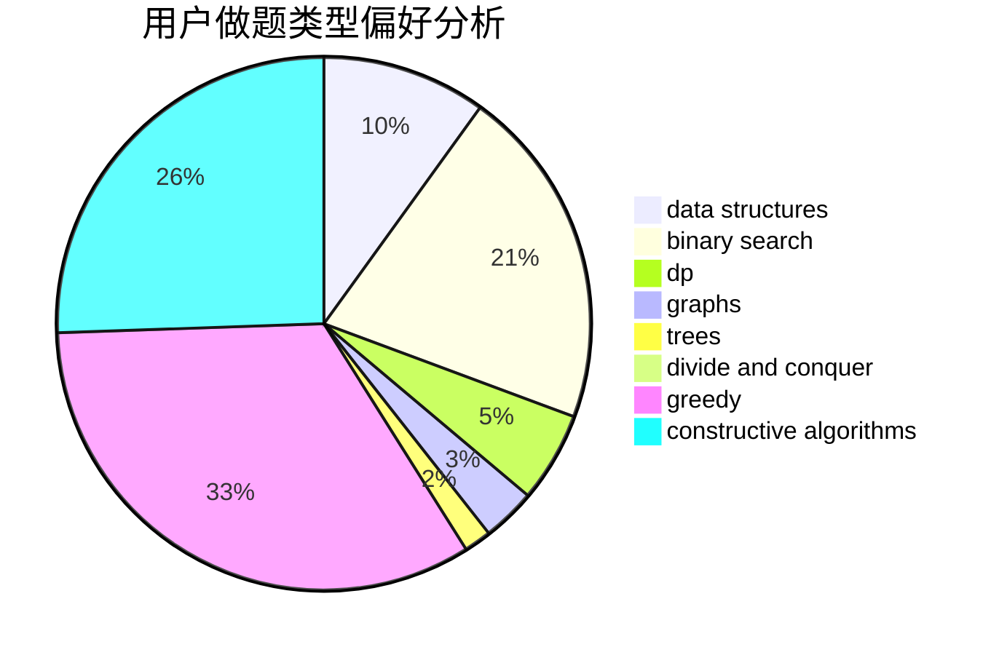

# FuWeak

<!-- tabs:start -->

#### **用户提交结果分析**

#### **用户做题类型偏好分析**

#### **用户错题知识点分析**

<!-- tabs:end -->
# 推荐题目
[1445D](https://codeforces.com/contest/1445/problem/D)		dsu,graphs,sortings,trees		  
[13681](https://codeforces.com/contest/1368/problem/1)		dsu,graphs,sortings,trees		  
[18C](https://codeforces.com/contest/18/problem/C)		data structures,
                        implementation		  
[594E](https://codeforces.com/contest/594/problem/E)		string suffix structures,
                        strings		  
[698D](https://codeforces.com/contest/698/problem/D)		brute force,
                        geometry,
                        math		  
[1290A](https://codeforces.com/contest/1290/problem/A)		brute force,
                        data structures,
                        implementation		  
[704E](https://codeforces.com/contest/704/problem/E)		data structures,
                        geometry,
                        trees		  
[414B](https://codeforces.com/contest/414/problem/B)		combinatorics,
                        dp,
                        number theory		  
[472G](https://codeforces.com/contest/472/problem/G)		bitmasks,
                        data structures,
                        fft		  
[1287B](https://codeforces.com/contest/1287/problem/B)		brute force,
                        data structures,
                        implementation		  
