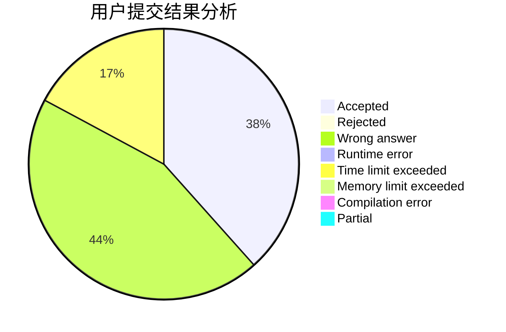
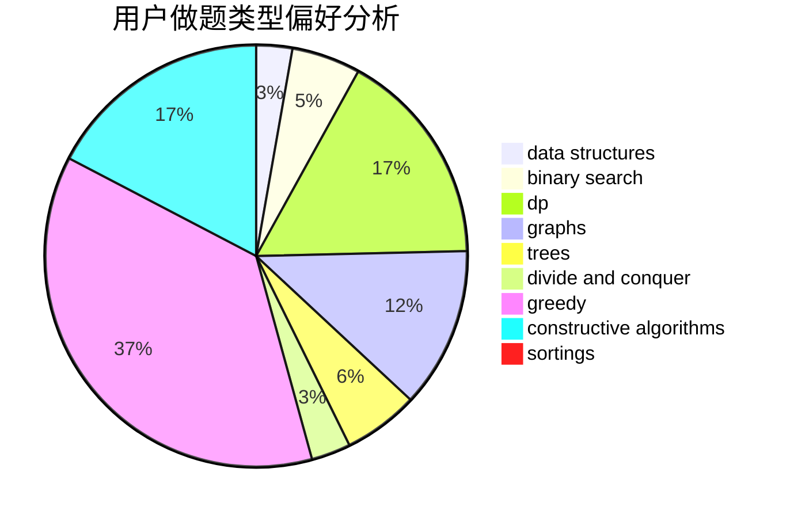
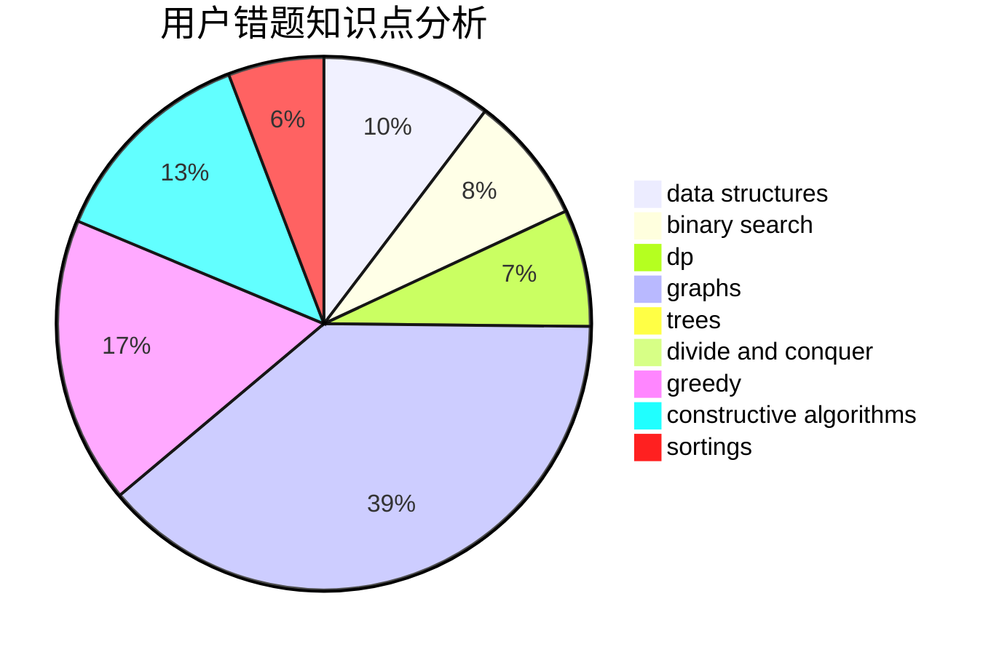

# Fuko_Ibuki
<!-- tabs:start -->
#### **用户提交结果分析**

#### **用户做题类型偏好分析**

#### **用户错题知识点分析**

<!-- tabs:end -->
# 推荐题目
[455E](http://codeforces.com/problemset/problem/455/E)		data structures		  
[1428G1](http://codeforces.com/problemset/problem/1428/G1)		dp,
                        greedy		  
[1189D1](https://codeforces.com/contest/1189/problem/D1)		trees		  
[1482E](http://codeforces.com/problemset/problem/1482/E)		data structures,
                        divide and conquer,
                        dp		  
[1214H](http://codeforces.com/problemset/problem/1214/H)		constructive algorithms,
                        dfs and similar,
                        trees		  
[1113A](http://codeforces.com/problemset/problem/1113/A)		dp,
                        greedy,
                        math		  
[864C](http://codeforces.com/problemset/problem/864/C)		greedy,
                        implementation,
                        math		  
[346A](http://codeforces.com/problemset/problem/346/A)		games,
                        math,
                        number theory		  
[516B](https://codeforces.com/contest/516/problem/B)		constructive algorithms,
                        greedy		  
[244C](https://codeforces.com/contest/244/problem/C)		bitmasks		  
<!-- tabs:start -->
#### **data structures**
[455E](http://codeforces.com/problemset/problem/455/E)		data structures		  
[1482E](http://codeforces.com/problemset/problem/1482/E)		data structures,
                        divide and conquer,
                        dp		  
[1056G](http://codeforces.com/problemset/problem/1056/G)		brute force,
                        data structures,
                        graphs		  
[1447F1](https://codeforces.com/contest/1447/problem/F1)		data structures,
                        greedy		  
[1104B](http://codeforces.com/problemset/problem/1104/B)		data structures,
                        implementation,
                        math		  
[494E](http://codeforces.com/problemset/problem/494/E)		data structures,
                        games		  
[1477E](http://codeforces.com/problemset/problem/1477/E)		data structures,
                        greedy		  
[1442D](http://codeforces.com/problemset/problem/1442/D)		data structures,
                        divide and conquer,
                        dp,
                        greedy		  
[1492C](http://codeforces.com/problemset/problem/1492/C)		binary search,
                        data structures,
                        dp,
                        greedy,
                        two pointers		  
[1490G](http://codeforces.com/problemset/problem/1490/G)		binary search,
                        data structures,
                        math		  
#### **binary search**
[778A](http://codeforces.com/problemset/problem/778/A)		binary search,
                        greedy,
                        strings		  
[1010A](http://codeforces.com/problemset/problem/1010/A)		binary search,
                        math		  
[1345B](http://codeforces.com/problemset/problem/1345/B)		binary search,
                        brute force,
                        dp,
                        math		  
[1492C](http://codeforces.com/problemset/problem/1492/C)		binary search,
                        data structures,
                        dp,
                        greedy,
                        two pointers		  
[1463D](http://codeforces.com/problemset/problem/1463/D)		binary search,
                        constructive algorithms,
                        greedy,
                        two pointers		  
[1490G](http://codeforces.com/problemset/problem/1490/G)		binary search,
                        data structures,
                        math		  
[1479D](http://codeforces.com/problemset/problem/1479/D)		binary search,
                        bitmasks,
                        brute force,
                        data structures,
                        probabilities,
                        trees		  
[1436E](http://codeforces.com/problemset/problem/1436/E)		binary search,
                        data structures,
                        two pointers		  
[1461D](http://codeforces.com/problemset/problem/1461/D)		binary search,
                        brute force,
                        data structures,
                        divide and conquer,
                        implementation,
                        sortings		  
[1493C](http://codeforces.com/problemset/problem/1493/C)		binary search,
                        brute force,
                        constructive algorithms,
                        greedy,
                        strings		  
#### **dp**
[1428G1](http://codeforces.com/problemset/problem/1428/G1)		dp,
                        greedy		  
[1482E](http://codeforces.com/problemset/problem/1482/E)		data structures,
                        divide and conquer,
                        dp		  
[1113A](http://codeforces.com/problemset/problem/1113/A)		dp,
                        greedy,
                        math		  
[222E](http://codeforces.com/problemset/problem/222/E)		dp,
                        matrices		  
[672C](https://codeforces.com/contest/672/problem/C)		dp,
                        geometry,
                        greedy,
                        implementation		  
[1426F](http://codeforces.com/problemset/problem/1426/F)		combinatorics,
                        dp,
                        strings		  
[864E](http://codeforces.com/problemset/problem/864/E)		dp,
                        sortings		  
[1345B](http://codeforces.com/problemset/problem/1345/B)		binary search,
                        brute force,
                        dp,
                        math		  
[285E](http://codeforces.com/problemset/problem/285/E)		combinatorics,
                        dp,
                        math		  
[1442D](http://codeforces.com/problemset/problem/1442/D)		data structures,
                        divide and conquer,
                        dp,
                        greedy		  
#### **graph**
[1056G](http://codeforces.com/problemset/problem/1056/G)		brute force,
                        data structures,
                        graphs		  
[864F](http://codeforces.com/problemset/problem/864/F)		dfs and similar,
                        graphs,
                        trees		  
[350B](http://codeforces.com/problemset/problem/350/B)		graphs		  
[1242E](http://codeforces.com/problemset/problem/1242/E)		constructive algorithms,
                        graphs		  
[1470D](http://codeforces.com/problemset/problem/1470/D)		constructive algorithms,
                        dfs and similar,
                        graph matchings,
                        graphs,
                        greedy		  
[1461E](http://codeforces.com/problemset/problem/1461/E)		brute force,
                        graphs,
                        greedy,
                        implementation,
                        math		  
[1487C](http://codeforces.com/problemset/problem/1487/C)		brute force,
                        constructive algorithms,
                        dfs and similar,
                        graphs,
                        greedy,
                        implementation,
                        math		  
[1437C](http://codeforces.com/problemset/problem/1437/C)		dp,
                        flows,
                        graph matchings,
                        greedy,
                        math,
                        sortings		  
[1470D](http://codeforces.com/problemset/problem/1470/D)		constructive algorithms,
                        dfs and similar,
                        graph matchings,
                        graphs,
                        greedy		  
[1476C](http://codeforces.com/problemset/problem/1476/C)		dp,
                        graphs,
                        greedy		  
#### **trees**
[1189D1](https://codeforces.com/contest/1189/problem/D1)		trees		  
[1214H](http://codeforces.com/problemset/problem/1214/H)		constructive algorithms,
                        dfs and similar,
                        trees		  
[864F](http://codeforces.com/problemset/problem/864/F)		dfs and similar,
                        graphs,
                        trees		  
[1479D](http://codeforces.com/problemset/problem/1479/D)		binary search,
                        bitmasks,
                        brute force,
                        data structures,
                        probabilities,
                        trees		  
[1511C](http://codeforces.com/problemset/problem/1511/C)		brute force,
                        data structures,
                        implementation,
                        trees		  
[1499F](http://codeforces.com/problemset/problem/1499/F)		combinatorics,
                        dfs and similar,
                        dp,
                        trees		  
[1491E](http://codeforces.com/problemset/problem/1491/E)		brute force,
                        dfs and similar,
                        divide and conquer,
                        number theory,
                        trees		  
[1466D](http://codeforces.com/problemset/problem/1466/D)		data structures,
                        greedy,
                        sortings,
                        trees		  
[1495D](http://codeforces.com/problemset/problem/1495/D)		combinatorics,
                        dfs and similar,
                        graphs,
                        math,
                        shortest paths,
                        trees		  
[1303G](http://codeforces.com/problemset/problem/1303/G)		data structures,
                        divide and conquer,
                        geometry,
                        trees		  
#### **divide and conquer**
[1482E](http://codeforces.com/problemset/problem/1482/E)		data structures,
                        divide and conquer,
                        dp		  
[1442D](http://codeforces.com/problemset/problem/1442/D)		data structures,
                        divide and conquer,
                        dp,
                        greedy		  
[1461D](http://codeforces.com/problemset/problem/1461/D)		binary search,
                        brute force,
                        data structures,
                        divide and conquer,
                        implementation,
                        sortings		  
[1466G](http://codeforces.com/problemset/problem/1466/G)		combinatorics,
                        divide and conquer,
                        hashing,
                        math,
                        string suffix structures,
                        strings		  
[1490D](http://codeforces.com/problemset/problem/1490/D)		dfs and similar,
                        divide and conquer,
                        implementation		  
[1483C](https://codeforces.com/contest/1483/problem/C)		data structures,
                        divide and conquer,
                        dp		  
[1491E](http://codeforces.com/problemset/problem/1491/E)		brute force,
                        dfs and similar,
                        divide and conquer,
                        number theory,
                        trees		  
[1303G](http://codeforces.com/problemset/problem/1303/G)		data structures,
                        divide and conquer,
                        geometry,
                        trees		  
[1494D](http://codeforces.com/problemset/problem/1494/D)		constructive algorithms,
                        data structures,
                        dfs and similar,
                        divide and conquer,
                        dsu,
                        greedy,
                        sortings,
                        trees		  
[1482E](http://codeforces.com/problemset/problem/1482/E)		data structures,
                        divide and conquer,
                        dp		  
#### **greedy**
[1428G1](http://codeforces.com/problemset/problem/1428/G1)		dp,
                        greedy		  
[1113A](http://codeforces.com/problemset/problem/1113/A)		dp,
                        greedy,
                        math		  
[864C](http://codeforces.com/problemset/problem/864/C)		greedy,
                        implementation,
                        math		  
[516B](https://codeforces.com/contest/516/problem/B)		constructive algorithms,
                        greedy		  
[1447F1](https://codeforces.com/contest/1447/problem/F1)		data structures,
                        greedy		  
[778A](http://codeforces.com/problemset/problem/778/A)		binary search,
                        greedy,
                        strings		  
[1477E](http://codeforces.com/problemset/problem/1477/E)		data structures,
                        greedy		  
[672C](https://codeforces.com/contest/672/problem/C)		dp,
                        geometry,
                        greedy,
                        implementation		  
[716B](http://codeforces.com/problemset/problem/716/B)		greedy,
                        two pointers		  
[1470D](http://codeforces.com/problemset/problem/1470/D)		constructive algorithms,
                        dfs and similar,
                        graph matchings,
                        graphs,
                        greedy		  
#### **constructive algorithms**
[1214H](http://codeforces.com/problemset/problem/1214/H)		constructive algorithms,
                        dfs and similar,
                        trees		  
[516B](https://codeforces.com/contest/516/problem/B)		constructive algorithms,
                        greedy		  
[730B](http://codeforces.com/problemset/problem/730/B)		constructive algorithms,
                        interactive		  
[1242E](http://codeforces.com/problemset/problem/1242/E)		constructive algorithms,
                        graphs		  
[1470D](http://codeforces.com/problemset/problem/1470/D)		constructive algorithms,
                        dfs and similar,
                        graph matchings,
                        graphs,
                        greedy		  
[1332E](http://codeforces.com/problemset/problem/1332/E)		combinatorics,
                        constructive algorithms,
                        math,
                        matrices		  
[1493A](http://codeforces.com/problemset/problem/1493/A)		constructive algorithms,
                        greedy		  
[1463D](http://codeforces.com/problemset/problem/1463/D)		binary search,
                        constructive algorithms,
                        greedy,
                        two pointers		  
[1456B](https://codeforces.com/contest/1456/problem/B)		bitmasks,
                        brute force,
                        constructive algorithms		  
[1492D](http://codeforces.com/problemset/problem/1492/D)		bitmasks,
                        constructive algorithms,
                        greedy,
                        math		  
#### **sortings**
[864E](http://codeforces.com/problemset/problem/864/E)		dp,
                        sortings		  
[1214F](http://codeforces.com/problemset/problem/1214/F)		greedy,
                        sortings		  
[1496C](https://codeforces.com/contest/1496/problem/C)		geometry,
                        greedy,
                        math,
                        sortings		  
[1495A](http://codeforces.com/problemset/problem/1495/A)		geometry,
                        greedy,
                        math,
                        sortings		  
[1497A](http://codeforces.com/problemset/problem/1497/A)		brute force,
                        data structures,
                        greedy,
                        sortings		  
[1427A](http://codeforces.com/problemset/problem/1427/A)		math,
                        sortings		  
[1461D](http://codeforces.com/problemset/problem/1461/D)		binary search,
                        brute force,
                        data structures,
                        divide and conquer,
                        implementation,
                        sortings		  
[1437C](http://codeforces.com/problemset/problem/1437/C)		dp,
                        flows,
                        graph matchings,
                        greedy,
                        math,
                        sortings		  
[1473A](http://codeforces.com/problemset/problem/1473/A)		greedy,
                        implementation,
                        math,
                        sortings		  
[1486B](http://codeforces.com/problemset/problem/1486/B)		binary search,
                        geometry,
                        shortest paths,
                        sortings		  
<!-- tabs:end -->
