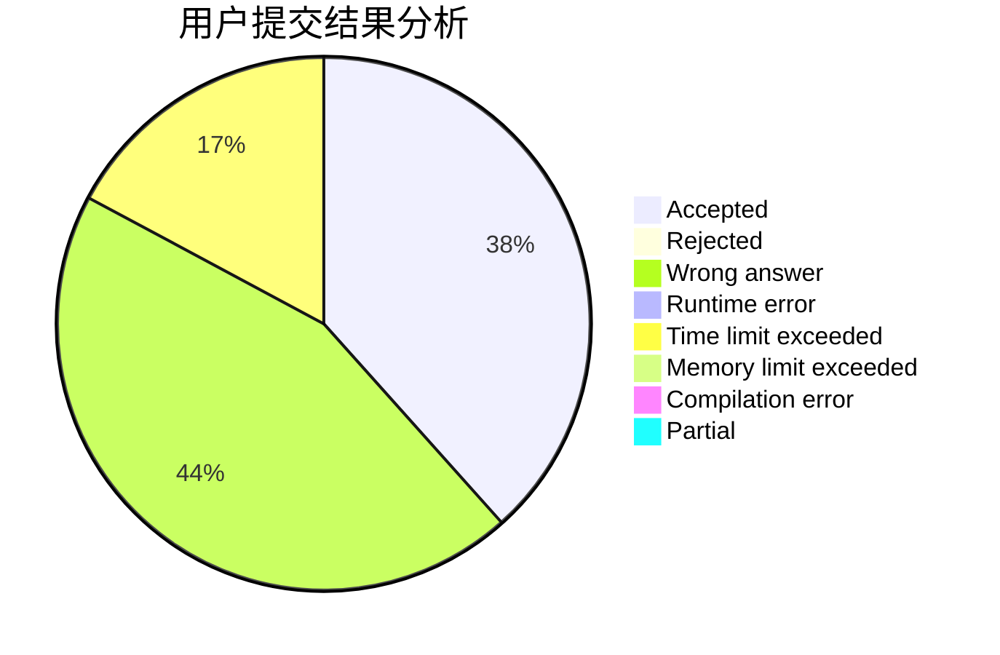
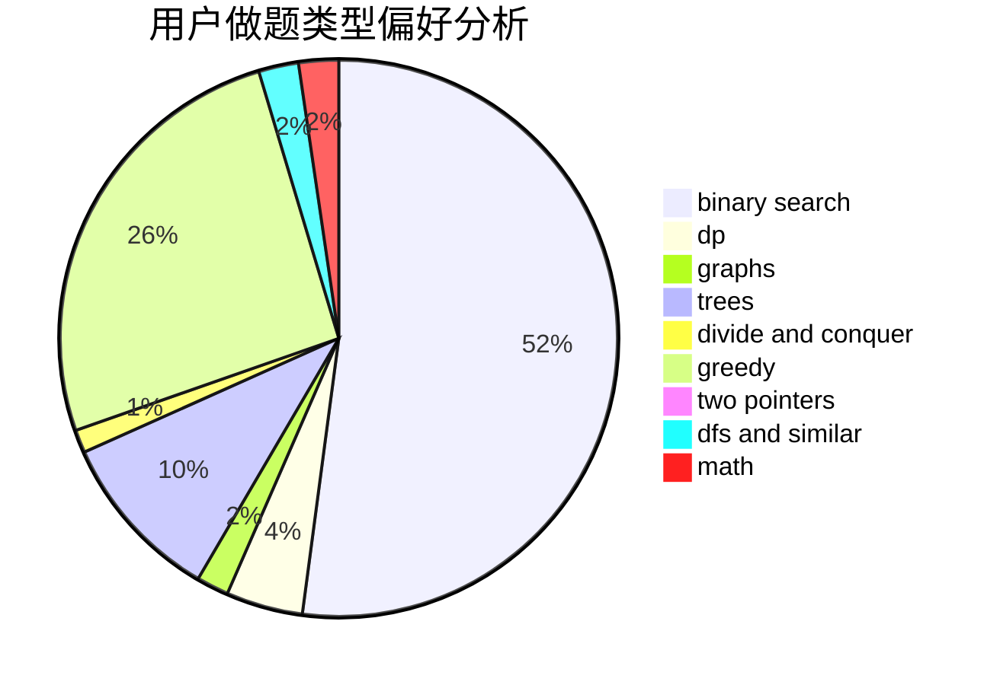

# Fuko_Ibuki

<!-- tabs:start -->

#### **用户提交结果分析**

#### **用户做题类型偏好分析**

<!-- tabs:end -->
# 推荐题目
[1437G](https://codeforces.com/contest/1437/problem/G)
[1194F](https://codeforces.com/contest/1194/problem/F)
[515A](https://codeforces.com/contest/515/problem/A)
[884A](https://codeforces.com/contest/884/problem/A)
[883M](https://codeforces.com/contest/883/problem/M)
[1113D](https://codeforces.com/contest/1113/problem/D)
[477A](https://codeforces.com/contest/477/problem/A)
[265D](https://codeforces.com/contest/265/problem/D)
[418A](https://codeforces.com/contest/418/problem/A)
[1104E](https://codeforces.com/contest/1104/problem/E)
