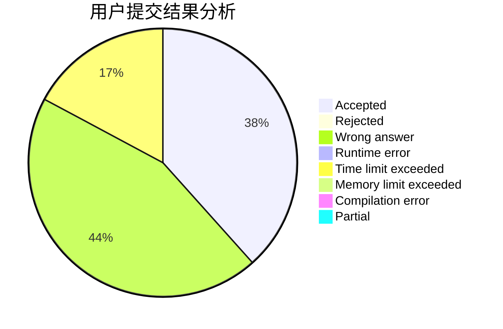
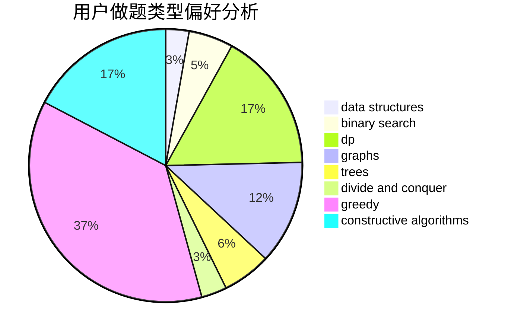
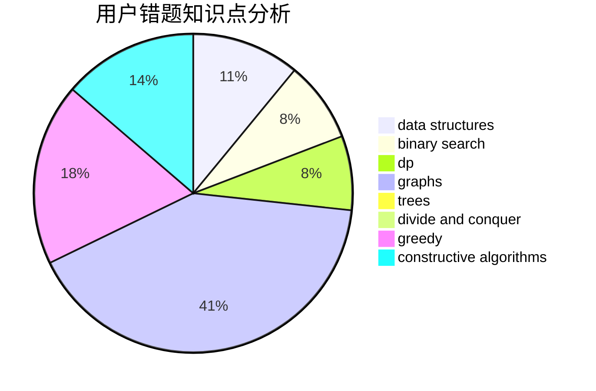

# Fuko_Ibuki

<!-- tabs:start -->

#### **用户提交结果分析**

#### **用户做题类型偏好分析**

#### **用户错题知识点分析**

<!-- tabs:end -->
# 推荐题目
[1428G1](https://codeforces.com/contest/1428G/problem/1)		dp,
                        greedy		  
[1189D1](https://codeforces.com/contest/1189D/problem/1)		dsu,graphs,sortings,trees		  
[494E](https://codeforces.com/contest/494/problem/E)		data structures,
                        games		  
[864D](https://codeforces.com/contest/864/problem/D)		greedy,
                        implementation,
                        math		  
[864C](https://codeforces.com/contest/864/problem/C)		greedy,
                        implementation,
                        math		  
[1113A](https://codeforces.com/contest/1113/problem/A)		dp,
                        greedy,
                        math		  
[455E](https://codeforces.com/contest/455/problem/E)		data structures		  
[244C](https://codeforces.com/contest/244/problem/C)		dsu,graphs,sortings,trees		  
[388D](https://codeforces.com/contest/388/problem/D)		math		  
[1104B](https://codeforces.com/contest/1104/problem/B)		data structures,
                        implementation,
                        math		  
