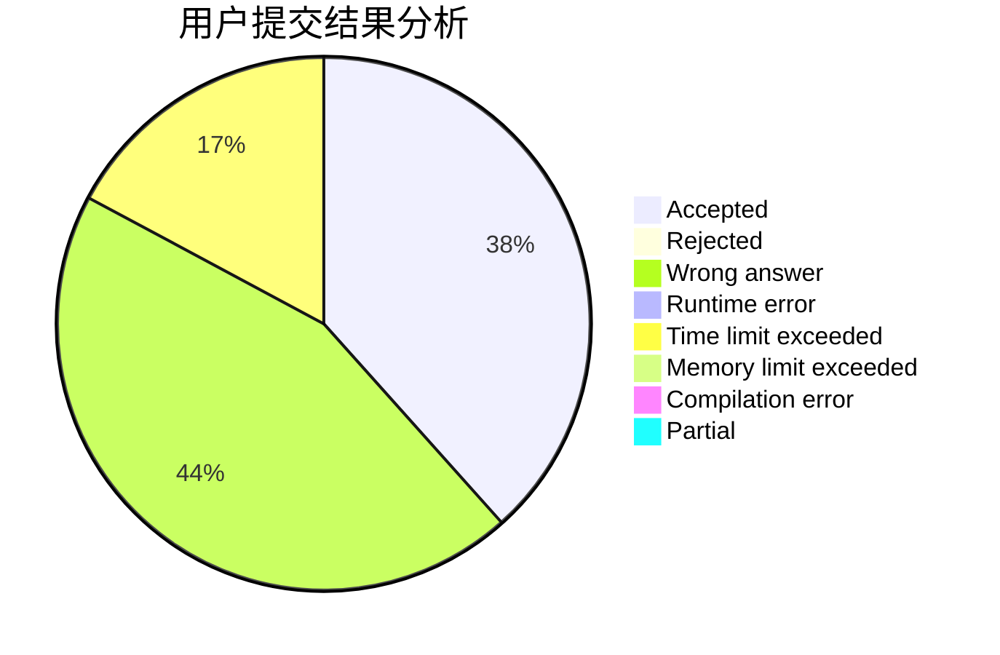
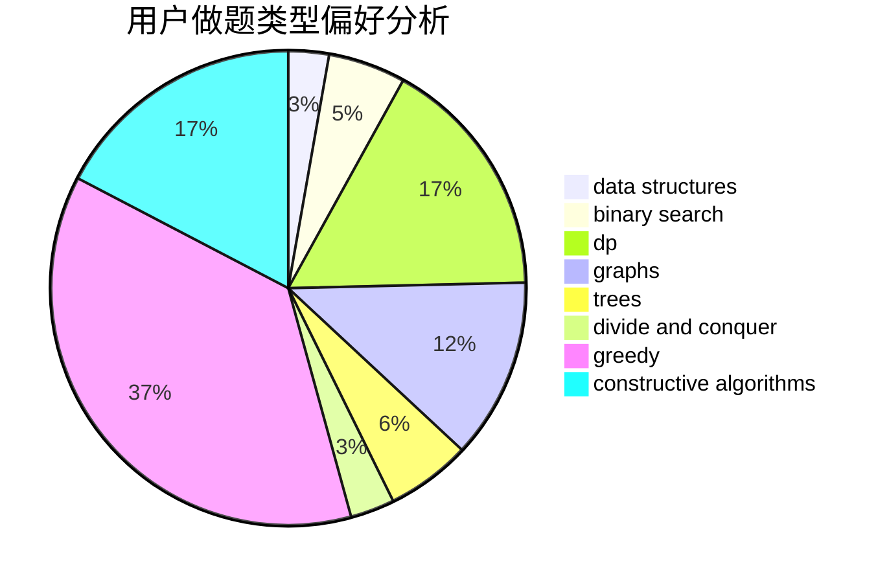
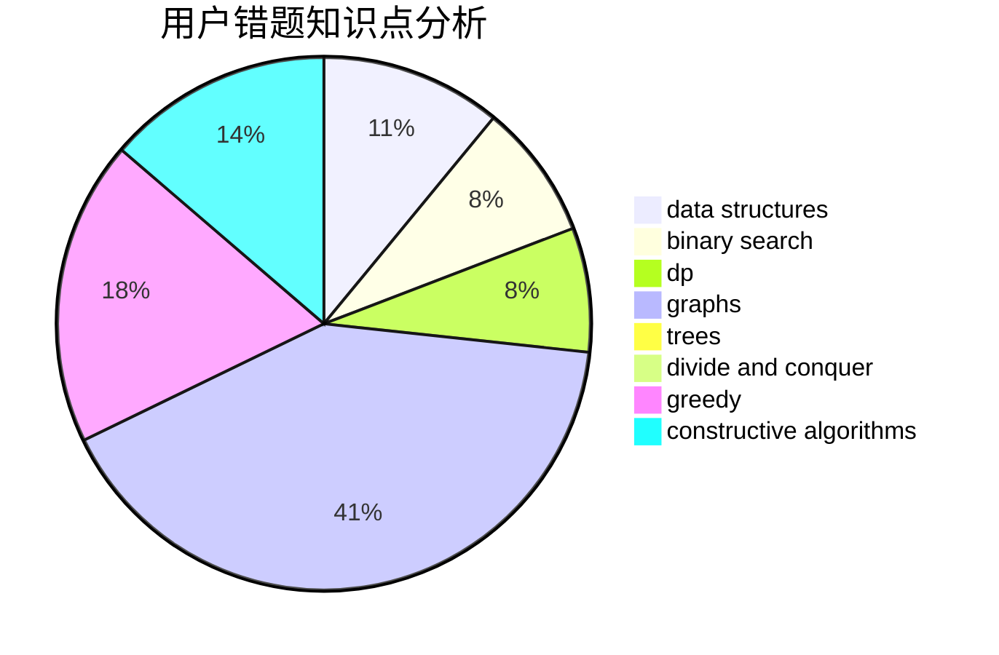

# Fuko_Ibuki
<!-- tabs:start -->
#### **用户提交结果分析**

#### **用户做题类型偏好分析**

#### **用户错题知识点分析**

<!-- tabs:end -->
# 推荐题目
[Function](http://codeforces.com/problemset/problem/455/E)		data structures		  
[Lucky Numbers (Easy Version)](http://codeforces.com/problemset/problem/1428/G1)		dp,
                        greedy		  
[Add on a Tree](https://codeforces.com/contest/1189/problem/D1)		trees		  
[Skyline Photo](http://codeforces.com/problemset/problem/1482/E)		data structures,
                        divide and conquer,
                        dp		  
[Tiles Placement](http://codeforces.com/problemset/problem/1214/H)		constructive algorithms,
                        dfs and similar,
                        trees		  
[Sasha and His Trip](http://codeforces.com/problemset/problem/1113/A)		dp,
                        greedy,
                        math		  
[Bus](http://codeforces.com/problemset/problem/864/C)		greedy,
                        implementation,
                        math		  
[Alice and Bob](http://codeforces.com/problemset/problem/346/A)		games,
                        math,
                        number theory		  
[Drazil and Tiles](https://codeforces.com/contest/516/problem/B)		constructive algorithms,
                        greedy		  
[The Brand New Function](https://codeforces.com/contest/244/problem/C)		bitmasks		  
<!-- tabs:start -->
#### **data structures**
[Function](http://codeforces.com/problemset/problem/455/E)		data structures		  
[Skyline Photo](http://codeforces.com/problemset/problem/1482/E)		data structures,
                        divide and conquer,
                        dp		  
[Take Metro](http://codeforces.com/problemset/problem/1056/G)		brute force,
                        data structures,
                        graphs		  
[Frequency Problem (Easy Version)](https://codeforces.com/contest/1447/problem/F1)		data structures,
                        greedy		  
[Game with string](http://codeforces.com/problemset/problem/1104/B)		data structures,
                        implementation,
                        math		  
[Sharti](http://codeforces.com/problemset/problem/494/E)		data structures,
                        games		  
[Nezzar and Tournaments](http://codeforces.com/problemset/problem/1477/E)		data structures,
                        greedy		  
[Sum](http://codeforces.com/problemset/problem/1442/D)		data structures,
                        divide and conquer,
                        dp,
                        greedy		  
[Maximum width](http://codeforces.com/problemset/problem/1492/C)		binary search,
                        data structures,
                        dp,
                        greedy,
                        two pointers		  
[Old Floppy Drive](http://codeforces.com/problemset/problem/1490/G)		binary search,
                        data structures,
                        math		  
#### **binary search**
[String Game](http://codeforces.com/problemset/problem/778/A)		binary search,
                        greedy,
                        strings		  
[Fly](http://codeforces.com/problemset/problem/1010/A)		binary search,
                        math		  
[Card Constructions](http://codeforces.com/problemset/problem/1345/B)		binary search,
                        brute force,
                        dp,
                        math		  
[Maximum width](http://codeforces.com/problemset/problem/1492/C)		binary search,
                        data structures,
                        dp,
                        greedy,
                        two pointers		  
[Pairs](http://codeforces.com/problemset/problem/1463/D)		binary search,
                        constructive algorithms,
                        greedy,
                        two pointers		  
[Old Floppy Drive](http://codeforces.com/problemset/problem/1490/G)		binary search,
                        data structures,
                        math		  
[Odd Mineral Resource](http://codeforces.com/problemset/problem/1479/D)		binary search,
                        bitmasks,
                        brute force,
                        data structures,
                        probabilities,
                        trees		  
[Complicated Computations](http://codeforces.com/problemset/problem/1436/E)		binary search,
                        data structures,
                        two pointers		  
[Divide and Summarize](http://codeforces.com/problemset/problem/1461/D)		binary search,
                        brute force,
                        data structures,
                        divide and conquer,
                        implementation,
                        sortings		  
[K-beautiful Strings](http://codeforces.com/problemset/problem/1493/C)		binary search,
                        brute force,
                        constructive algorithms,
                        greedy,
                        strings		  
#### **dp**
[Lucky Numbers (Easy Version)](http://codeforces.com/problemset/problem/1428/G1)		dp,
                        greedy		  
[Skyline Photo](http://codeforces.com/problemset/problem/1482/E)		data structures,
                        divide and conquer,
                        dp		  
[Sasha and His Trip](http://codeforces.com/problemset/problem/1113/A)		dp,
                        greedy,
                        math		  
[Decoding Genome](http://codeforces.com/problemset/problem/222/E)		dp,
                        matrices		  
[Recycling Bottles](https://codeforces.com/contest/672/problem/C)		dp,
                        geometry,
                        greedy,
                        implementation		  
[Number of Subsequences](http://codeforces.com/problemset/problem/1426/F)		combinatorics,
                        dp,
                        strings		  
[Fire](http://codeforces.com/problemset/problem/864/E)		dp,
                        sortings		  
[Card Constructions](http://codeforces.com/problemset/problem/1345/B)		binary search,
                        brute force,
                        dp,
                        math		  
[Positions in Permutations](http://codeforces.com/problemset/problem/285/E)		combinatorics,
                        dp,
                        math		  
[Sum](http://codeforces.com/problemset/problem/1442/D)		data structures,
                        divide and conquer,
                        dp,
                        greedy		  
#### **graph**
[Take Metro](http://codeforces.com/problemset/problem/1056/G)		brute force,
                        data structures,
                        graphs		  
[Cities Excursions](http://codeforces.com/problemset/problem/864/F)		dfs and similar,
                        graphs,
                        trees		  
[Resort](http://codeforces.com/problemset/problem/350/B)		graphs		  
[Planar Perimeter](http://codeforces.com/problemset/problem/1242/E)		constructive algorithms,
                        graphs		  
[Strange Housing](http://codeforces.com/problemset/problem/1470/D)		constructive algorithms,
                        dfs and similar,
                        graph matchings,
                        graphs,
                        greedy		  
[Water Level](http://codeforces.com/problemset/problem/1461/E)		brute force,
                        graphs,
                        greedy,
                        implementation,
                        math		  
[Minimum Ties](http://codeforces.com/problemset/problem/1487/C)		brute force,
                        constructive algorithms,
                        dfs and similar,
                        graphs,
                        greedy,
                        implementation,
                        math		  
[Chef Monocarp](http://codeforces.com/problemset/problem/1437/C)		dp,
                        flows,
                        graph matchings,
                        greedy,
                        math,
                        sortings		  
[Strange Housing](http://codeforces.com/problemset/problem/1470/D)		constructive algorithms,
                        dfs and similar,
                        graph matchings,
                        graphs,
                        greedy		  
[Longest Simple Cycle](http://codeforces.com/problemset/problem/1476/C)		dp,
                        graphs,
                        greedy		  
#### **trees**
[Add on a Tree](https://codeforces.com/contest/1189/problem/D1)		trees		  
[Tiles Placement](http://codeforces.com/problemset/problem/1214/H)		constructive algorithms,
                        dfs and similar,
                        trees		  
[Cities Excursions](http://codeforces.com/problemset/problem/864/F)		dfs and similar,
                        graphs,
                        trees		  
[Odd Mineral Resource](http://codeforces.com/problemset/problem/1479/D)		binary search,
                        bitmasks,
                        brute force,
                        data structures,
                        probabilities,
                        trees		  
[Yet Another Card Deck](http://codeforces.com/problemset/problem/1511/C)		brute force,
                        data structures,
                        implementation,
                        trees		  
[Diameter Cuts](http://codeforces.com/problemset/problem/1499/F)		combinatorics,
                        dfs and similar,
                        dp,
                        trees		  
[Fib-tree](http://codeforces.com/problemset/problem/1491/E)		brute force,
                        dfs and similar,
                        divide and conquer,
                        number theory,
                        trees		  
[13th Labour of Heracles](http://codeforces.com/problemset/problem/1466/D)		data structures,
                        greedy,
                        sortings,
                        trees		  
[BFS Trees](http://codeforces.com/problemset/problem/1495/D)		combinatorics,
                        dfs and similar,
                        graphs,
                        math,
                        shortest paths,
                        trees		  
[Sum of Prefix Sums](http://codeforces.com/problemset/problem/1303/G)		data structures,
                        divide and conquer,
                        geometry,
                        trees		  
#### **divide and conquer**
[Skyline Photo](http://codeforces.com/problemset/problem/1482/E)		data structures,
                        divide and conquer,
                        dp		  
[Sum](http://codeforces.com/problemset/problem/1442/D)		data structures,
                        divide and conquer,
                        dp,
                        greedy		  
[Divide and Summarize](http://codeforces.com/problemset/problem/1461/D)		binary search,
                        brute force,
                        data structures,
                        divide and conquer,
                        implementation,
                        sortings		  
[Song of the Sirens](http://codeforces.com/problemset/problem/1466/G)		combinatorics,
                        divide and conquer,
                        hashing,
                        math,
                        string suffix structures,
                        strings		  
[Permutation Transformation](http://codeforces.com/problemset/problem/1490/D)		dfs and similar,
                        divide and conquer,
                        implementation		  
[Skyline Photo](https://codeforces.com/contest/1483/problem/C)		data structures,
                        divide and conquer,
                        dp		  
[Fib-tree](http://codeforces.com/problemset/problem/1491/E)		brute force,
                        dfs and similar,
                        divide and conquer,
                        number theory,
                        trees		  
[Sum of Prefix Sums](http://codeforces.com/problemset/problem/1303/G)		data structures,
                        divide and conquer,
                        geometry,
                        trees		  
[Dogeforces](http://codeforces.com/problemset/problem/1494/D)		constructive algorithms,
                        data structures,
                        dfs and similar,
                        divide and conquer,
                        dsu,
                        greedy,
                        sortings,
                        trees		  
[Skyline Photo](http://codeforces.com/problemset/problem/1482/E)		data structures,
                        divide and conquer,
                        dp		  
#### **greedy**
[Lucky Numbers (Easy Version)](http://codeforces.com/problemset/problem/1428/G1)		dp,
                        greedy		  
[Sasha and His Trip](http://codeforces.com/problemset/problem/1113/A)		dp,
                        greedy,
                        math		  
[Bus](http://codeforces.com/problemset/problem/864/C)		greedy,
                        implementation,
                        math		  
[Drazil and Tiles](https://codeforces.com/contest/516/problem/B)		constructive algorithms,
                        greedy		  
[Frequency Problem (Easy Version)](https://codeforces.com/contest/1447/problem/F1)		data structures,
                        greedy		  
[String Game](http://codeforces.com/problemset/problem/778/A)		binary search,
                        greedy,
                        strings		  
[Nezzar and Tournaments](http://codeforces.com/problemset/problem/1477/E)		data structures,
                        greedy		  
[Recycling Bottles](https://codeforces.com/contest/672/problem/C)		dp,
                        geometry,
                        greedy,
                        implementation		  
[Complete the Word](http://codeforces.com/problemset/problem/716/B)		greedy,
                        two pointers		  
[Strange Housing](http://codeforces.com/problemset/problem/1470/D)		constructive algorithms,
                        dfs and similar,
                        graph matchings,
                        graphs,
                        greedy		  
#### **constructive algorithms**
[Tiles Placement](http://codeforces.com/problemset/problem/1214/H)		constructive algorithms,
                        dfs and similar,
                        trees		  
[Drazil and Tiles](https://codeforces.com/contest/516/problem/B)		constructive algorithms,
                        greedy		  
[Minimum and Maximum](http://codeforces.com/problemset/problem/730/B)		constructive algorithms,
                        interactive		  
[Planar Perimeter](http://codeforces.com/problemset/problem/1242/E)		constructive algorithms,
                        graphs		  
[Strange Housing](http://codeforces.com/problemset/problem/1470/D)		constructive algorithms,
                        dfs and similar,
                        graph matchings,
                        graphs,
                        greedy		  
[Height All the Same](http://codeforces.com/problemset/problem/1332/E)		combinatorics,
                        constructive algorithms,
                        math,
                        matrices		  
[Anti-knapsack](http://codeforces.com/problemset/problem/1493/A)		constructive algorithms,
                        greedy		  
[Pairs](http://codeforces.com/problemset/problem/1463/D)		binary search,
                        constructive algorithms,
                        greedy,
                        two pointers		  
[XOR-gun](https://codeforces.com/contest/1456/problem/B)		bitmasks,
                        brute force,
                        constructive algorithms		  
[Genius's Gambit](http://codeforces.com/problemset/problem/1492/D)		bitmasks,
                        constructive algorithms,
                        greedy,
                        math		  
#### **sortings**
[Fire](http://codeforces.com/problemset/problem/864/E)		dp,
                        sortings		  
[Employment](http://codeforces.com/problemset/problem/1214/F)		greedy,
                        sortings		  
[Diamond Miner](https://codeforces.com/contest/1496/problem/C)		geometry,
                        greedy,
                        math,
                        sortings		  
[Diamond Miner](http://codeforces.com/problemset/problem/1495/A)		geometry,
                        greedy,
                        math,
                        sortings		  
[Meximization](http://codeforces.com/problemset/problem/1497/A)		brute force,
                        data structures,
                        greedy,
                        sortings		  
[Avoiding Zero](http://codeforces.com/problemset/problem/1427/A)		math,
                        sortings		  
[Divide and Summarize](http://codeforces.com/problemset/problem/1461/D)		binary search,
                        brute force,
                        data structures,
                        divide and conquer,
                        implementation,
                        sortings		  
[Chef Monocarp](http://codeforces.com/problemset/problem/1437/C)		dp,
                        flows,
                        graph matchings,
                        greedy,
                        math,
                        sortings		  
[Replacing Elements](http://codeforces.com/problemset/problem/1473/A)		greedy,
                        implementation,
                        math,
                        sortings		  
[Eastern Exhibition](http://codeforces.com/problemset/problem/1486/B)		binary search,
                        geometry,
                        shortest paths,
                        sortings		  
<!-- tabs:end -->
