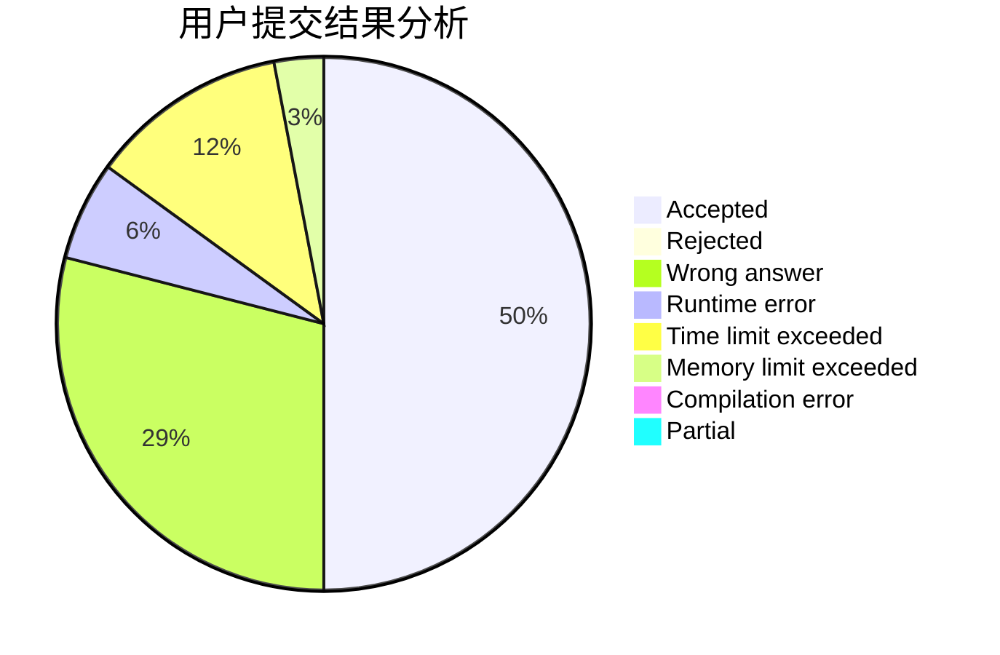
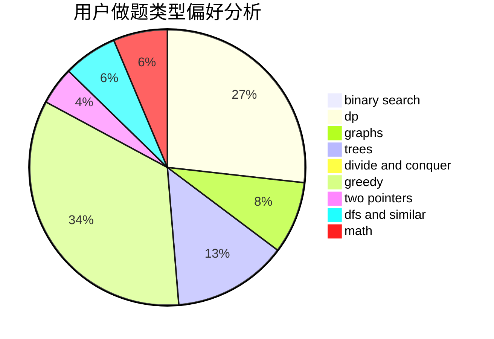

# Fulisike

<!-- tabs:start -->

#### **用户提交结果分析**

#### **用户做题类型偏好分析**

<!-- tabs:end -->
# 推荐题目
[346B](https://codeforces.com/contest/346/problem/B)
[870A](https://codeforces.com/contest/870/problem/A)
[707B](https://codeforces.com/contest/707/problem/B)
[662D](https://codeforces.com/contest/662/problem/D)
[670B](https://codeforces.com/contest/670/problem/B)
[886F](https://codeforces.com/contest/886/problem/F)
[886C](https://codeforces.com/contest/886/problem/C)
[1210C](https://codeforces.com/contest/1210/problem/C)
[1155A](https://codeforces.com/contest/1155/problem/A)
[884D](https://codeforces.com/contest/884/problem/D)
