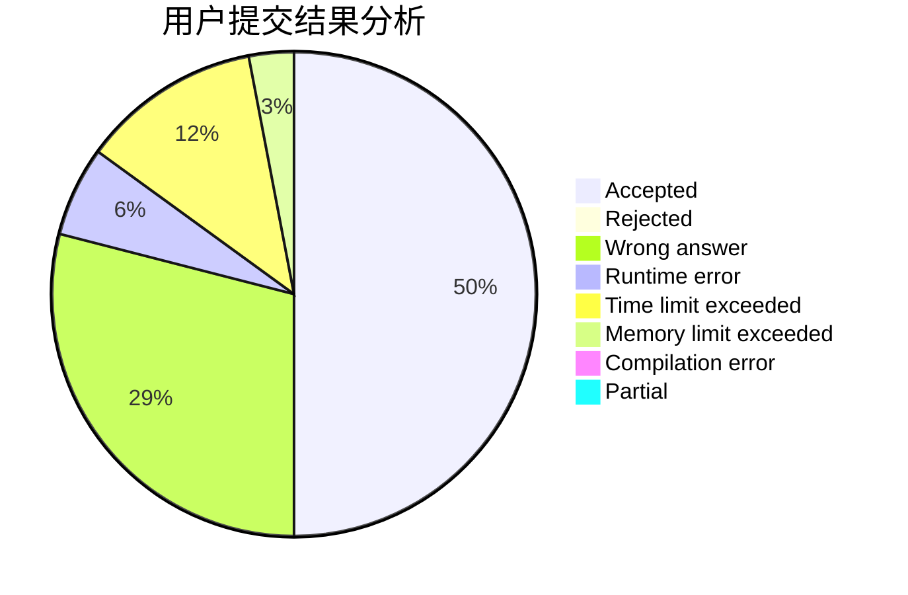
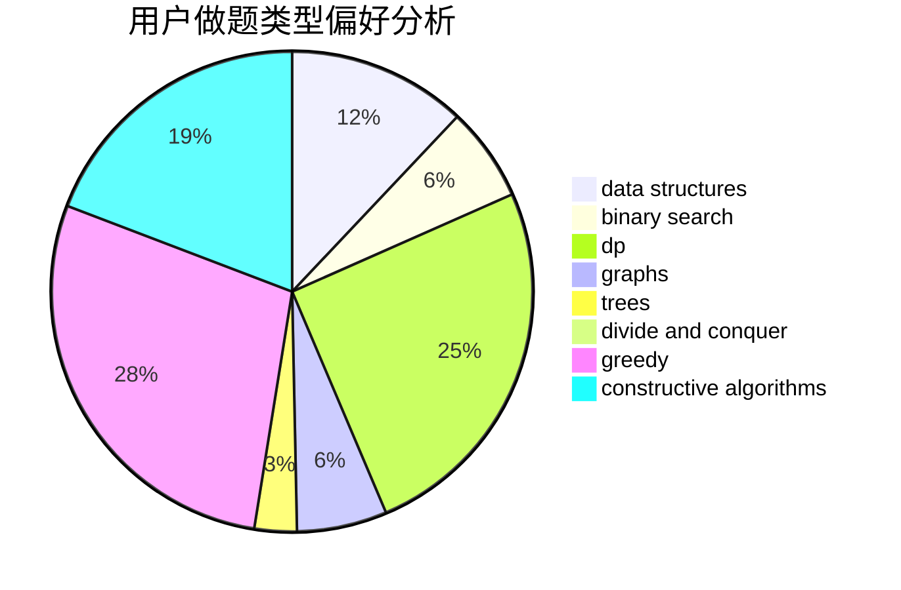
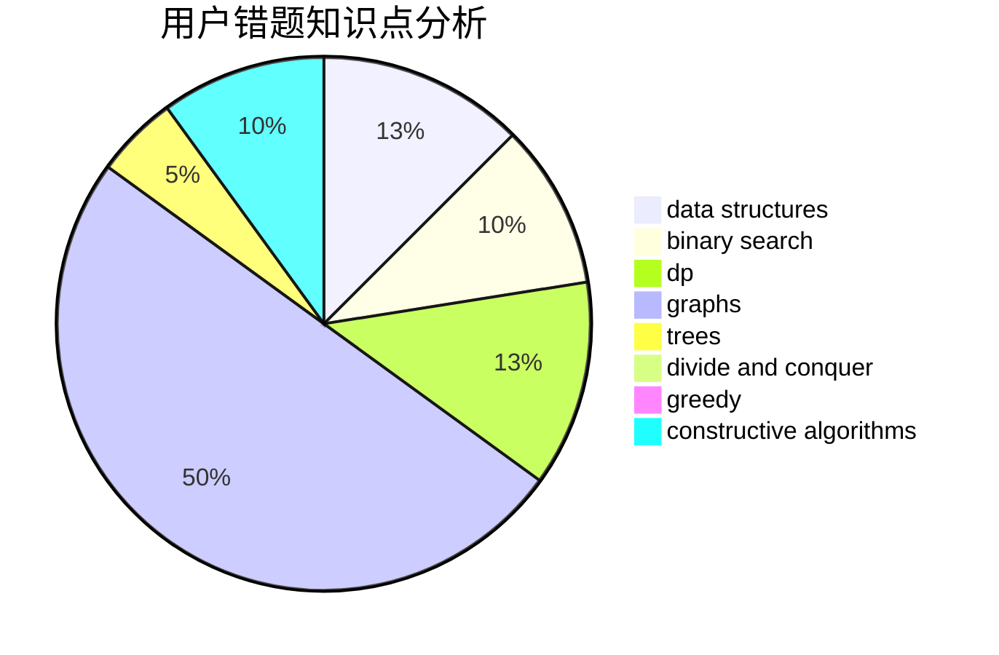

# Fulisike

<!-- tabs:start -->

#### **用户提交结果分析**

#### **用户做题类型偏好分析**

#### **用户错题知识点分析**

<!-- tabs:end -->
# 推荐题目
[317A](https://codeforces.com/contest/317/problem/A)		brute force		  
[851D](https://codeforces.com/contest/851/problem/D)		dsu,graphs,sortings,trees		  
[683A](https://codeforces.com/contest/683/problem/A)		*special problem,
                        geometry		  
[631E](https://codeforces.com/contest/631/problem/E)		data structures,
                        dp,
                        geometry		  
[643D](https://codeforces.com/contest/643/problem/D)		nan		  
[866D](https://codeforces.com/contest/866/problem/D)		dsu,graphs,sortings,trees		  
[865G](https://codeforces.com/contest/865/problem/G)		combinatorics,
                        math,
                        matrices		  
[1206B](https://codeforces.com/contest/1206/problem/B)		dp,
                        implementation		  
[1153A](https://codeforces.com/contest/1153/problem/A)		brute force,
                        math		  
[865A](https://codeforces.com/contest/865/problem/A)		constructive algorithms		  
