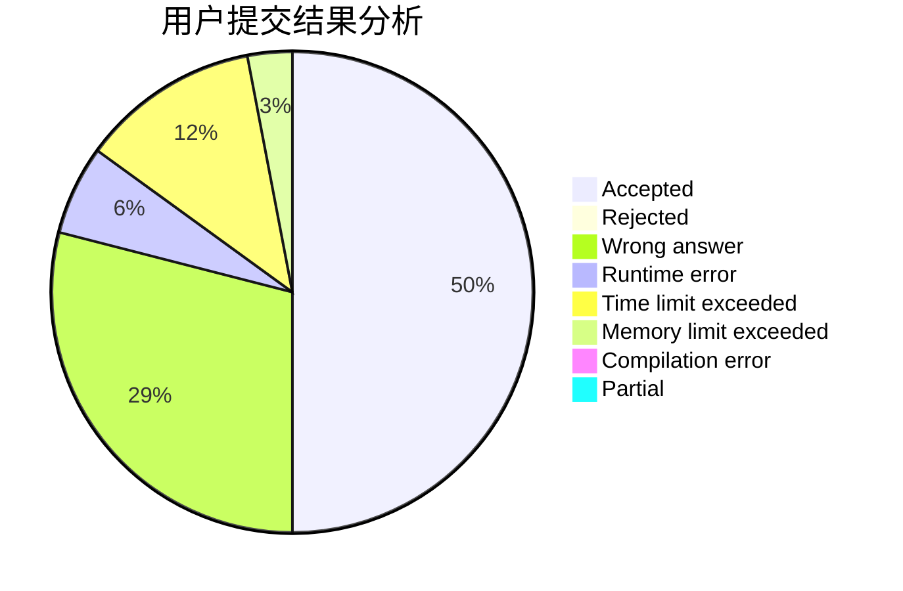
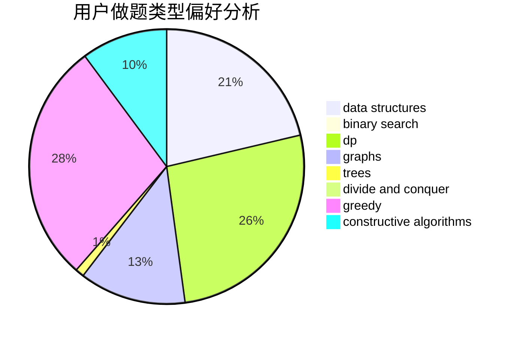
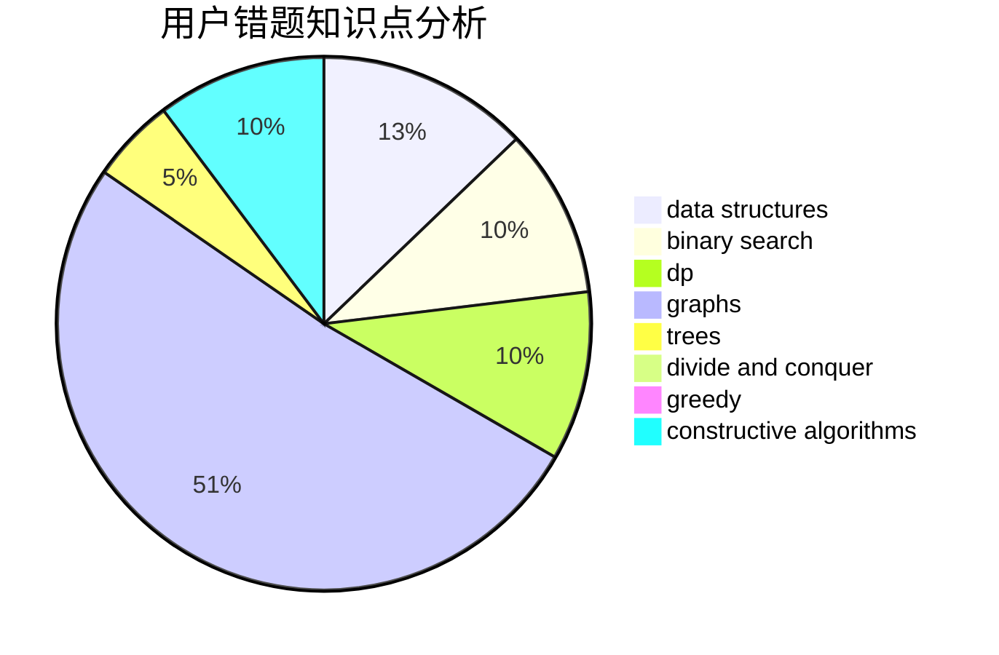

# Fulisike

<!-- tabs:start -->

#### **用户提交结果分析**

#### **用户做题类型偏好分析**

#### **用户错题知识点分析**

<!-- tabs:end -->
# 推荐题目
[346B](https://codeforces.com/contest/346/problem/B)		dp,
                        strings		  
[870A](https://codeforces.com/contest/870/problem/A)		brute force,
                        implementation		  
[707B](https://codeforces.com/contest/707/problem/B)		graphs		  
[662D](https://codeforces.com/contest/662/problem/D)		constructive algorithms,
                        greedy,
                        implementation,
                        math		  
[670B](https://codeforces.com/contest/670/problem/B)		implementation		  
[886F](https://codeforces.com/contest/886/problem/F)		geometry		  
[886C](https://codeforces.com/contest/886/problem/C)		dsu,
                        greedy,
                        implementation,
                        trees		  
[1210C](https://codeforces.com/contest/1210/problem/C)		math,
                        number theory,
                        trees		  
[1155A](https://codeforces.com/contest/1155/problem/A)		implementation,
                        sortings,
                        strings		  
[884D](https://codeforces.com/contest/884/problem/D)		data structures,
                        greedy		  
