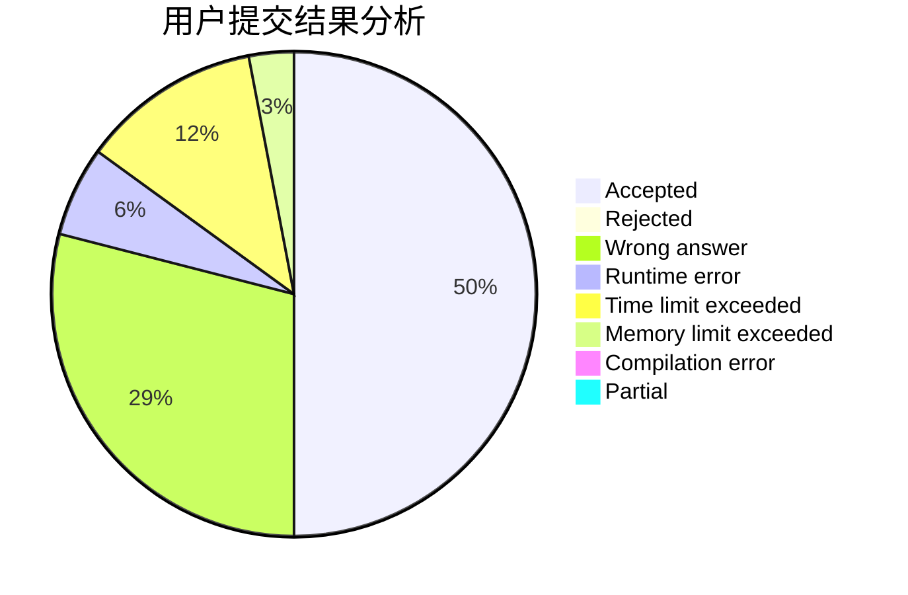
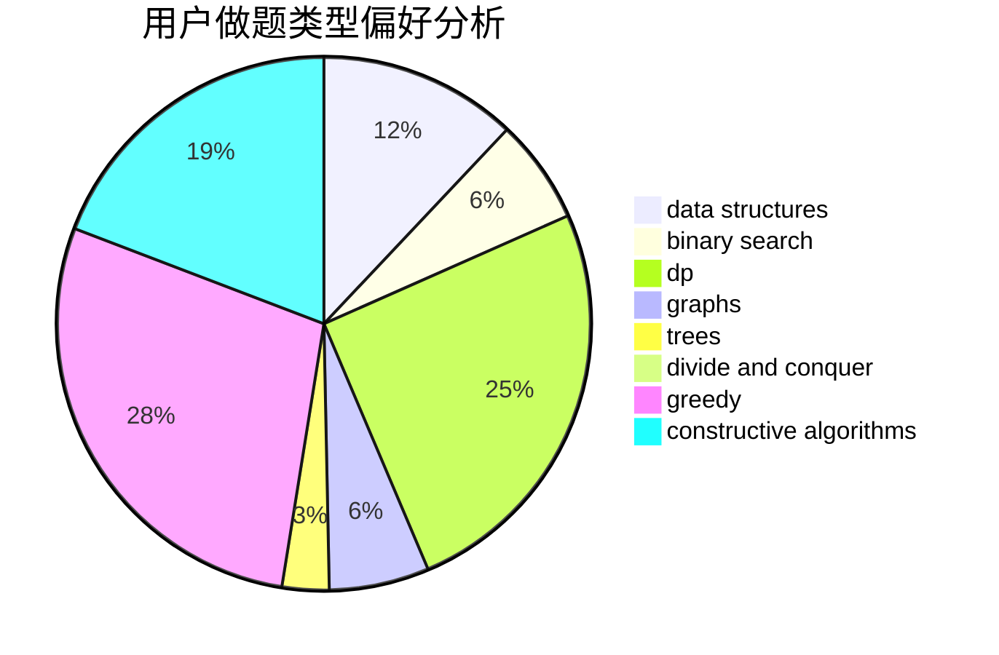
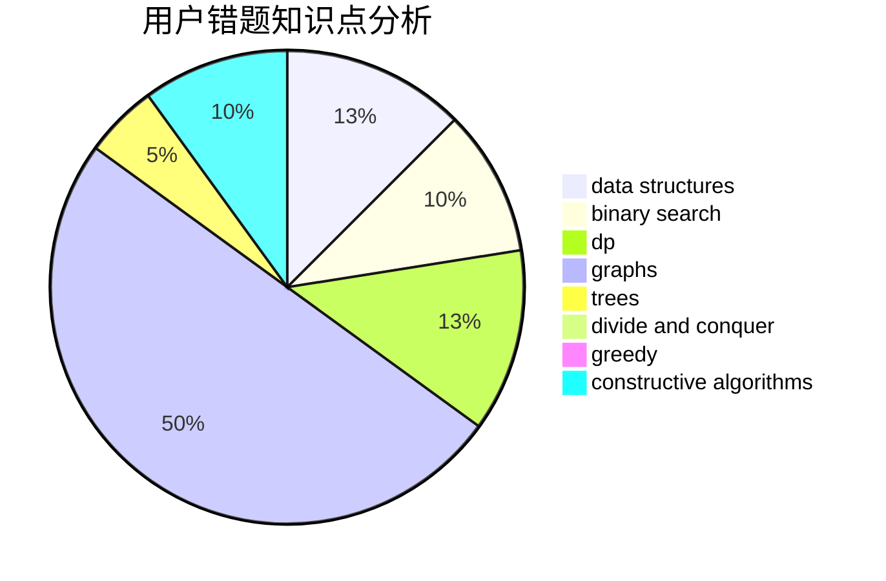

# Fulisike
<!-- tabs:start -->
#### **用户提交结果分析**

#### **用户做题类型偏好分析**

#### **用户错题知识点分析**

<!-- tabs:end -->
# 推荐题目
[Arpa and a list of numbers](https://codeforces.com/contest/851/problem/D)		implementation,
                        number theory		  
[Little Robber Girl's Zoo](http://codeforces.com/problemset/problem/686/B)		constructive algorithms,
                        implementation,
                        sortings		  
[Product Sum](http://codeforces.com/problemset/problem/631/E)		data structures,
                        dp,
                        geometry		  
[Perfect Pair](http://codeforces.com/problemset/problem/317/A)		brute force		  
[Flowers and Chocolate](http://codeforces.com/problemset/problem/865/G)		combinatorics,
                        math,
                        matrices		  
[The Check of the Point](http://codeforces.com/problemset/problem/683/A)		*special problem,
                        geometry		  
[Bearish Fanpages](http://codeforces.com/problemset/problem/643/D)		nan		  
[Red-Black Cobweb](http://codeforces.com/problemset/problem/833/D)		data structures,
                        divide and conquer,
                        implementation,
                        trees		  
[So Mean](http://codeforces.com/problemset/problem/1299/E)		interactive,
                        math		  
[Ordering Pizza](http://codeforces.com/problemset/problem/865/B)		binary search,
                        sortings,
                        ternary search		  
<!-- tabs:start -->
#### **data structures**
[Product Sum](http://codeforces.com/problemset/problem/631/E)		data structures,
                        dp,
                        geometry		  
[Red-Black Cobweb](http://codeforces.com/problemset/problem/833/D)		data structures,
                        divide and conquer,
                        implementation,
                        trees		  
[Persistent Bookcase](http://codeforces.com/problemset/problem/707/D)		bitmasks,
                        data structures,
                        dfs and similar,
                        implementation		  
[Multiset](http://codeforces.com/problemset/problem/1354/D)		binary search,
                        data structures		  
[Buy Low Sell High](http://codeforces.com/problemset/problem/865/D)		constructive algorithms,
                        data structures,
                        greedy		  
[Rainbow Triples](http://codeforces.com/problemset/problem/1408/H)		binary search,
                        data structures,
                        flows,
                        greedy		  
[Summer Homework](http://codeforces.com/problemset/problem/316/E1)		brute force,
                        data structures		  
[Minimum Grid Path](http://codeforces.com/problemset/problem/1499/C)		brute force,
                        data structures,
                        greedy,
                        math		  
[Maximum width](http://codeforces.com/problemset/problem/1492/C)		binary search,
                        data structures,
                        dp,
                        greedy,
                        two pointers		  
[Old Floppy Drive](http://codeforces.com/problemset/problem/1490/G)		binary search,
                        data structures,
                        math		  
#### **binary search**
[Ordering Pizza](http://codeforces.com/problemset/problem/865/B)		binary search,
                        sortings,
                        ternary search		  
[Multiset](http://codeforces.com/problemset/problem/1354/D)		binary search,
                        data structures		  
[Polycarp's problems](http://codeforces.com/problemset/problem/727/F)		binary search,
                        dp,
                        greedy		  
[Gotta Go Fast](https://codeforces.com/contest/866/problem/C)		binary search,
                        dp		  
[Rainbow Triples](http://codeforces.com/problemset/problem/1408/H)		binary search,
                        data structures,
                        flows,
                        greedy		  
[Maximum Subrectangle](http://codeforces.com/problemset/problem/1060/C)		binary search,
                        implementation,
                        two pointers		  
[Cycles](http://codeforces.com/problemset/problem/232/A)		binary search,
                        constructive algorithms,
                        graphs,
                        greedy		  
[Asterism (Easy Version)](http://codeforces.com/problemset/problem/1371/E1)		binary search,
                        brute force,
                        combinatorics,
                        math,
                        number theory,
                        sortings		  
[The Parade](http://codeforces.com/problemset/problem/1250/J)		binary search,
                        greedy		  
[Maximum width](http://codeforces.com/problemset/problem/1492/C)		binary search,
                        data structures,
                        dp,
                        greedy,
                        two pointers		  
#### **dp**
[Product Sum](http://codeforces.com/problemset/problem/631/E)		data structures,
                        dp,
                        geometry		  
[Neko and Aki's Prank](http://codeforces.com/problemset/problem/1152/D)		dp,
                        greedy,
                        trees		  
[Cow and Message](http://codeforces.com/problemset/problem/1307/C)		brute force,
                        dp,
                        math,
                        strings		  
[Make Product Equal One](http://codeforces.com/problemset/problem/1206/B)		dp,
                        implementation		  
[Polycarp's problems](http://codeforces.com/problemset/problem/727/F)		binary search,
                        dp,
                        greedy		  
[Helping People](http://codeforces.com/problemset/problem/494/C)		dp,
                        probabilities		  
[Gotta Go Fast](https://codeforces.com/contest/866/problem/C)		binary search,
                        dp		  
[Dima and Figure](http://codeforces.com/problemset/problem/273/D)		dp		  
[Lucky Common Subsequence](http://codeforces.com/problemset/problem/346/B)		dp,
                        strings		  
[Bananas in a Microwave](http://codeforces.com/problemset/problem/1498/D)		dfs and similar,
                        dp,
                        graphs,
                        implementation		  
#### **graph**
[Hide and Seek](https://codeforces.com/contest/1161/problem/A)		graphs		  
[Road Map](http://codeforces.com/problemset/problem/34/D)		dfs and similar,
                        graphs		  
[Cycles](http://codeforces.com/problemset/problem/232/A)		binary search,
                        constructive algorithms,
                        graphs,
                        greedy		  
[Johnny Solving](https://codeforces.com/contest/1104/problem/E)		constructive algorithms,
                        dfs and similar,
                        graphs,
                        math		  
[Igor In the Museum](http://codeforces.com/problemset/problem/598/D)		dfs and similar,
                        graphs,
                        shortest paths		  
[Delete The Edges](http://codeforces.com/problemset/problem/1494/F)		brute force,
                        constructive algorithms,
                        dfs and similar,
                        graphs,
                        implementation		  
[CNF 2](http://codeforces.com/problemset/problem/571/C)		constructive algorithms,
                        dfs and similar,
                        graphs,
                        greedy		  
[Garland](http://codeforces.com/problemset/problem/767/C)		dfs and similar,
                        graphs,
                        greedy,
                        trees		  
[Bananas in a Microwave](http://codeforces.com/problemset/problem/1498/D)		dfs and similar,
                        dp,
                        graphs,
                        implementation		  
[Minimum Ties](http://codeforces.com/problemset/problem/1487/C)		brute force,
                        constructive algorithms,
                        dfs and similar,
                        graphs,
                        greedy,
                        implementation,
                        math		  
#### **trees**
[Red-Black Cobweb](http://codeforces.com/problemset/problem/833/D)		data structures,
                        divide and conquer,
                        implementation,
                        trees		  
[Neko and Aki's Prank](http://codeforces.com/problemset/problem/1152/D)		dp,
                        greedy,
                        trees		  
[Garland](http://codeforces.com/problemset/problem/767/C)		dfs and similar,
                        graphs,
                        greedy,
                        trees		  
[Odd Mineral Resource](http://codeforces.com/problemset/problem/1479/D)		binary search,
                        bitmasks,
                        brute force,
                        data structures,
                        probabilities,
                        trees		  
[Yet Another Card Deck](http://codeforces.com/problemset/problem/1511/C)		brute force,
                        data structures,
                        implementation,
                        trees		  
[Diameter Cuts](http://codeforces.com/problemset/problem/1499/F)		combinatorics,
                        dfs and similar,
                        dp,
                        trees		  
[Fib-tree](http://codeforces.com/problemset/problem/1491/E)		brute force,
                        dfs and similar,
                        divide and conquer,
                        number theory,
                        trees		  
[13th Labour of Heracles](http://codeforces.com/problemset/problem/1466/D)		data structures,
                        greedy,
                        sortings,
                        trees		  
[BFS Trees](http://codeforces.com/problemset/problem/1495/D)		combinatorics,
                        dfs and similar,
                        graphs,
                        math,
                        shortest paths,
                        trees		  
[Sum of Prefix Sums](http://codeforces.com/problemset/problem/1303/G)		data structures,
                        divide and conquer,
                        geometry,
                        trees		  
#### **divide and conquer**
[Red-Black Cobweb](http://codeforces.com/problemset/problem/833/D)		data structures,
                        divide and conquer,
                        implementation,
                        trees		  
[Divide and Summarize](http://codeforces.com/problemset/problem/1461/D)		binary search,
                        brute force,
                        data structures,
                        divide and conquer,
                        implementation,
                        sortings		  
[Song of the Sirens](http://codeforces.com/problemset/problem/1466/G)		combinatorics,
                        divide and conquer,
                        hashing,
                        math,
                        string suffix structures,
                        strings		  
[Permutation Transformation](http://codeforces.com/problemset/problem/1490/D)		dfs and similar,
                        divide and conquer,
                        implementation		  
[Skyline Photo](https://codeforces.com/contest/1483/problem/C)		data structures,
                        divide and conquer,
                        dp		  
[Fib-tree](http://codeforces.com/problemset/problem/1491/E)		brute force,
                        dfs and similar,
                        divide and conquer,
                        number theory,
                        trees		  
[Sum of Prefix Sums](http://codeforces.com/problemset/problem/1303/G)		data structures,
                        divide and conquer,
                        geometry,
                        trees		  
[Dogeforces](http://codeforces.com/problemset/problem/1494/D)		constructive algorithms,
                        data structures,
                        dfs and similar,
                        divide and conquer,
                        dsu,
                        greedy,
                        sortings,
                        trees		  
[Logistical Questions](http://codeforces.com/problemset/problem/566/C)		dfs and similar,
                        divide and conquer,
                        trees		  
[Fruit Sequences](http://codeforces.com/problemset/problem/1428/F)		binary search,
                        data structures,
                        divide and conquer,
                        dp,
                        two pointers		  
#### **greedy**
[Neko and Aki's Prank](http://codeforces.com/problemset/problem/1152/D)		dp,
                        greedy,
                        trees		  
[Polycarp's problems](http://codeforces.com/problemset/problem/727/F)		binary search,
                        dp,
                        greedy		  
[Bear and Elections](http://codeforces.com/problemset/problem/574/A)		greedy,
                        implementation		  
[Buy Low Sell High](http://codeforces.com/problemset/problem/865/D)		constructive algorithms,
                        data structures,
                        greedy		  
[Polygons](http://codeforces.com/problemset/problem/1208/G)		greedy,
                        math,
                        number theory		  
[Rainbow Triples](http://codeforces.com/problemset/problem/1408/H)		binary search,
                        data structures,
                        flows,
                        greedy		  
[Cycles](http://codeforces.com/problemset/problem/232/A)		binary search,
                        constructive algorithms,
                        graphs,
                        greedy		  
[Drazil and Tiles](http://codeforces.com/problemset/problem/515/D)		constructive algorithms,
                        greedy		  
[CNF 2](http://codeforces.com/problemset/problem/571/C)		constructive algorithms,
                        dfs and similar,
                        graphs,
                        greedy		  
[The Parade](http://codeforces.com/problemset/problem/1250/J)		binary search,
                        greedy		  
#### **constructive algorithms**
[Little Robber Girl's Zoo](http://codeforces.com/problemset/problem/686/B)		constructive algorithms,
                        implementation,
                        sortings		  
[Tolik and His Uncle](https://codeforces.com/contest/1180/problem/D)		constructive algorithms		  
[Two Small Strings](http://codeforces.com/problemset/problem/1213/E)		brute force,
                        constructive algorithms		  
[Save the problem!](http://codeforces.com/problemset/problem/865/A)		constructive algorithms		  
[Buy Low Sell High](http://codeforces.com/problemset/problem/865/D)		constructive algorithms,
                        data structures,
                        greedy		  
[Cycles](http://codeforces.com/problemset/problem/232/A)		binary search,
                        constructive algorithms,
                        graphs,
                        greedy		  
[Johnny Solving](https://codeforces.com/contest/1104/problem/E)		constructive algorithms,
                        dfs and similar,
                        graphs,
                        math		  
[Delete The Edges](http://codeforces.com/problemset/problem/1494/F)		brute force,
                        constructive algorithms,
                        dfs and similar,
                        graphs,
                        implementation		  
[Drazil and Tiles](http://codeforces.com/problemset/problem/515/D)		constructive algorithms,
                        greedy		  
[CNF 2](http://codeforces.com/problemset/problem/571/C)		constructive algorithms,
                        dfs and similar,
                        graphs,
                        greedy		  
#### **sortings**
[Little Robber Girl's Zoo](http://codeforces.com/problemset/problem/686/B)		constructive algorithms,
                        implementation,
                        sortings		  
[Ordering Pizza](http://codeforces.com/problemset/problem/865/B)		binary search,
                        sortings,
                        ternary search		  
[Asterism (Easy Version)](http://codeforces.com/problemset/problem/1371/E1)		binary search,
                        brute force,
                        combinatorics,
                        math,
                        number theory,
                        sortings		  
[Napoleon Cake](http://codeforces.com/problemset/problem/1501/B)		dp,
                        implementation,
                        sortings		  
[Diamond Miner](https://codeforces.com/contest/1496/problem/C)		geometry,
                        greedy,
                        math,
                        sortings		  
[Meximization](http://codeforces.com/problemset/problem/1497/A)		brute force,
                        data structures,
                        greedy,
                        sortings		  
[Avoiding Zero](http://codeforces.com/problemset/problem/1427/A)		math,
                        sortings		  
[Divide and Summarize](http://codeforces.com/problemset/problem/1461/D)		binary search,
                        brute force,
                        data structures,
                        divide and conquer,
                        implementation,
                        sortings		  
[Chef Monocarp](http://codeforces.com/problemset/problem/1437/C)		dp,
                        flows,
                        graph matchings,
                        greedy,
                        math,
                        sortings		  
[Replacing Elements](http://codeforces.com/problemset/problem/1473/A)		greedy,
                        implementation,
                        math,
                        sortings		  
<!-- tabs:end -->
