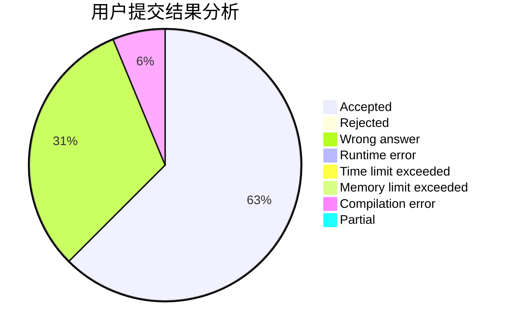
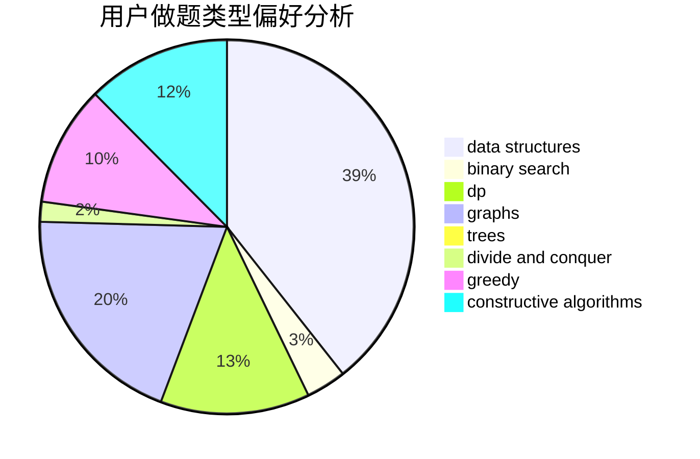

# FullSoulist

<!-- tabs:start -->

#### **用户提交结果分析**

#### **用户做题类型偏好分析**

#### **用户错题知识点分析**

<!-- tabs:end -->
# 推荐题目
[1403B](https://codeforces.com/contest/1403/problem/B)		*special problem,
                        data structures,
                        dfs and similar,
                        graphs,
                        trees		  
[372A](https://codeforces.com/contest/372/problem/A)		binary search,
                        greedy,
                        sortings,
                        two pointers		  
[297A](https://codeforces.com/contest/297/problem/A)		constructive algorithms		  
[297D](https://codeforces.com/contest/297/problem/D)		constructive algorithms		  
[807E](https://codeforces.com/contest/807/problem/E)		dsu,graphs,sortings,trees		  
[237C](https://codeforces.com/contest/237/problem/C)		binary search,
                        number theory,
                        two pointers		  
[1164G](https://codeforces.com/contest/1164/problem/G)		dsu,graphs,sortings,trees		  
[117D](https://codeforces.com/contest/117/problem/D)		divide and conquer,
                        math		  
[704E](https://codeforces.com/contest/704/problem/E)		data structures,
                        geometry,
                        trees		  
[802A](https://codeforces.com/contest/802/problem/A)		greedy		  
