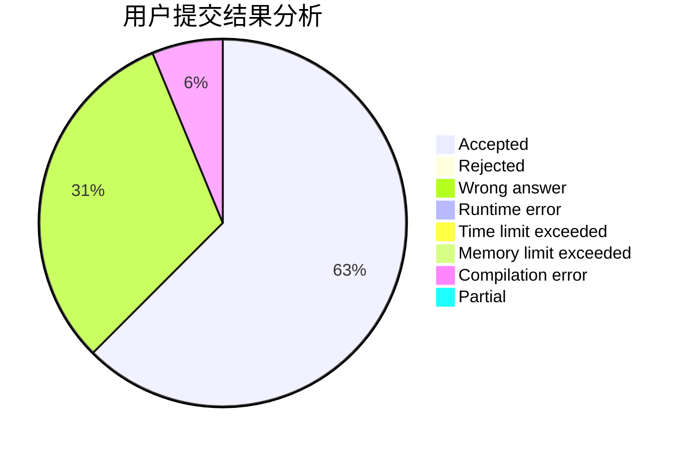
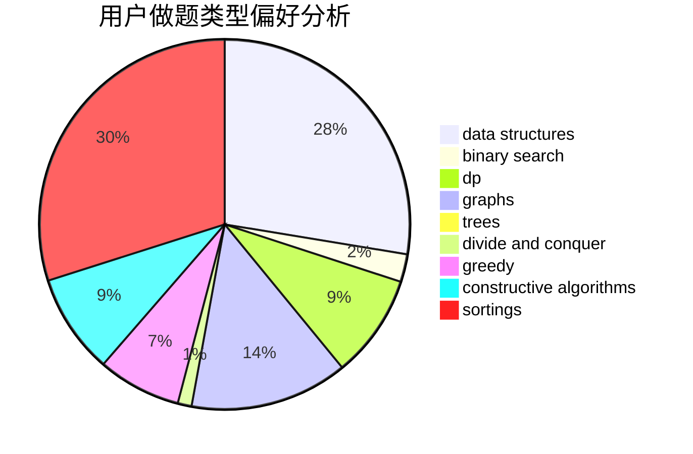

# FullSoulist
<!-- tabs:start -->
#### **用户提交结果分析**

#### **用户做题类型偏好分析**

#### **用户错题知识点分析**

<!-- tabs:end -->
# 推荐题目
[704E](http://codeforces.com/problemset/problem/704/E)		data structures,
                        geometry,
                        trees		  
[1403B](http://codeforces.com/problemset/problem/1403/B)		*special problem,
                        data structures,
                        dfs and similar,
                        graphs,
                        trees		  
[372A](http://codeforces.com/problemset/problem/372/A)		binary search,
                        greedy,
                        sortings,
                        two pointers		  
[792E](http://codeforces.com/problemset/problem/792/E)		greedy,
                        math,
                        number theory		  
[117D](http://codeforces.com/problemset/problem/117/D)		divide and conquer,
                        math		  
[553D](http://codeforces.com/problemset/problem/553/D)		binary search,
                        graphs,
                        greedy		  
[297A](http://codeforces.com/problemset/problem/297/A)		constructive algorithms		  
[297D](http://codeforces.com/problemset/problem/297/D)		constructive algorithms		  
[838E](http://codeforces.com/problemset/problem/838/E)		dp		  
[1269D](https://codeforces.com/contest/1269/problem/D)		dp,
                        greedy,
                        math		  
<!-- tabs:start -->
#### **data structures**
[704E](http://codeforces.com/problemset/problem/704/E)		data structures,
                        geometry,
                        trees		  
[1403B](http://codeforces.com/problemset/problem/1403/B)		*special problem,
                        data structures,
                        dfs and similar,
                        graphs,
                        trees		  
[316E2](http://codeforces.com/problemset/problem/316/E2)		data structures,
                        math		  
[1488F](http://codeforces.com/problemset/problem/1488/F)		*special problem,
                        *special problem,
                        binary search,
                        data structures		  
[700D](http://codeforces.com/problemset/problem/700/D)		data structures,
                        greedy		  
[867E](https://codeforces.com/contest/867/problem/E)		constructive algorithms,
                        data structures,
                        greedy		  
[1056E](http://codeforces.com/problemset/problem/1056/E)		brute force,
                        data structures,
                        hashing,
                        strings		  
[1492C](http://codeforces.com/problemset/problem/1492/C)		binary search,
                        data structures,
                        dp,
                        greedy,
                        two pointers		  
[1490G](http://codeforces.com/problemset/problem/1490/G)		binary search,
                        data structures,
                        math		  
[1479D](http://codeforces.com/problemset/problem/1479/D)		binary search,
                        bitmasks,
                        brute force,
                        data structures,
                        probabilities,
                        trees		  
#### **binary search**
[372A](http://codeforces.com/problemset/problem/372/A)		binary search,
                        greedy,
                        sortings,
                        two pointers		  
[553D](http://codeforces.com/problemset/problem/553/D)		binary search,
                        graphs,
                        greedy		  
[237C](http://codeforces.com/problemset/problem/237/C)		binary search,
                        number theory,
                        two pointers		  
[461E](http://codeforces.com/problemset/problem/461/E)		binary search,
                        shortest paths,
                        strings		  
[807E](https://codeforces.com/contest/807/problem/E)		binary search,
                        constructive algorithms,
                        greedy,
                        math		  
[1488F](http://codeforces.com/problemset/problem/1488/F)		*special problem,
                        *special problem,
                        binary search,
                        data structures		  
[1307E](http://codeforces.com/problemset/problem/1307/E)		binary search,
                        combinatorics,
                        dp,
                        greedy,
                        implementation,
                        math		  
[1114E](http://codeforces.com/problemset/problem/1114/E)		binary search,
                        interactive,
                        number theory,
                        probabilities		  
[1436D](http://codeforces.com/problemset/problem/1436/D)		binary search,
                        dfs and similar,
                        graphs,
                        greedy,
                        trees		  
[1492C](http://codeforces.com/problemset/problem/1492/C)		binary search,
                        data structures,
                        dp,
                        greedy,
                        two pointers		  
#### **dp**
[838E](http://codeforces.com/problemset/problem/838/E)		dp		  
[1269D](https://codeforces.com/contest/1269/problem/D)		dp,
                        greedy,
                        math		  
[866E](https://codeforces.com/contest/866/problem/E)		bitmasks,
                        brute force,
                        dp,
                        graphs		  
[1442A](http://codeforces.com/problemset/problem/1442/A)		constructive algorithms,
                        dp,
                        greedy		  
[855C](http://codeforces.com/problemset/problem/855/C)		dp,
                        trees		  
[1307E](http://codeforces.com/problemset/problem/1307/E)		binary search,
                        combinatorics,
                        dp,
                        greedy,
                        implementation,
                        math		  
[1492C](http://codeforces.com/problemset/problem/1492/C)		binary search,
                        data structures,
                        dp,
                        greedy,
                        two pointers		  
[1457C](https://codeforces.com/contest/1457/problem/C)		brute force,
                        dp,
                        implementation		  
[1491C](http://codeforces.com/problemset/problem/1491/C)		brute force,
                        data structures,
                        dp,
                        greedy,
                        implementation		  
[1437C](http://codeforces.com/problemset/problem/1437/C)		dp,
                        flows,
                        graph matchings,
                        greedy,
                        math,
                        sortings		  
#### **graph**
[1403B](http://codeforces.com/problemset/problem/1403/B)		*special problem,
                        data structures,
                        dfs and similar,
                        graphs,
                        trees		  
[553D](http://codeforces.com/problemset/problem/553/D)		binary search,
                        graphs,
                        greedy		  
[290C](http://codeforces.com/problemset/problem/290/C)		*special problem,
                        graph matchings,
                        implementation,
                        trees		  
[120H](http://codeforces.com/problemset/problem/120/H)		graph matchings		  
[866E](https://codeforces.com/contest/866/problem/E)		bitmasks,
                        brute force,
                        dp,
                        graphs		  
[1392I](http://codeforces.com/problemset/problem/1392/I)		fft,
                        graphs,
                        math		  
[1436D](http://codeforces.com/problemset/problem/1436/D)		binary search,
                        dfs and similar,
                        graphs,
                        greedy,
                        trees		  
[1487C](http://codeforces.com/problemset/problem/1487/C)		brute force,
                        constructive algorithms,
                        dfs and similar,
                        graphs,
                        greedy,
                        implementation,
                        math		  
[1437C](http://codeforces.com/problemset/problem/1437/C)		dp,
                        flows,
                        graph matchings,
                        greedy,
                        math,
                        sortings		  
[1470D](http://codeforces.com/problemset/problem/1470/D)		constructive algorithms,
                        dfs and similar,
                        graph matchings,
                        graphs,
                        greedy		  
#### **trees**
[704E](http://codeforces.com/problemset/problem/704/E)		data structures,
                        geometry,
                        trees		  
[1403B](http://codeforces.com/problemset/problem/1403/B)		*special problem,
                        data structures,
                        dfs and similar,
                        graphs,
                        trees		  
[290C](http://codeforces.com/problemset/problem/290/C)		*special problem,
                        graph matchings,
                        implementation,
                        trees		  
[855C](http://codeforces.com/problemset/problem/855/C)		dp,
                        trees		  
[1436D](http://codeforces.com/problemset/problem/1436/D)		binary search,
                        dfs and similar,
                        graphs,
                        greedy,
                        trees		  
[1479D](http://codeforces.com/problemset/problem/1479/D)		binary search,
                        bitmasks,
                        brute force,
                        data structures,
                        probabilities,
                        trees		  
[1511C](http://codeforces.com/problemset/problem/1511/C)		brute force,
                        data structures,
                        implementation,
                        trees		  
[1499F](http://codeforces.com/problemset/problem/1499/F)		combinatorics,
                        dfs and similar,
                        dp,
                        trees		  
[1491E](http://codeforces.com/problemset/problem/1491/E)		brute force,
                        dfs and similar,
                        divide and conquer,
                        number theory,
                        trees		  
[1466D](http://codeforces.com/problemset/problem/1466/D)		data structures,
                        greedy,
                        sortings,
                        trees		  
#### **divide and conquer**
[117D](http://codeforces.com/problemset/problem/117/D)		divide and conquer,
                        math		  
[1461D](http://codeforces.com/problemset/problem/1461/D)		binary search,
                        brute force,
                        data structures,
                        divide and conquer,
                        implementation,
                        sortings		  
[1466G](http://codeforces.com/problemset/problem/1466/G)		combinatorics,
                        divide and conquer,
                        hashing,
                        math,
                        string suffix structures,
                        strings		  
[1490D](http://codeforces.com/problemset/problem/1490/D)		dfs and similar,
                        divide and conquer,
                        implementation		  
[1483C](https://codeforces.com/contest/1483/problem/C)		data structures,
                        divide and conquer,
                        dp		  
[1491E](http://codeforces.com/problemset/problem/1491/E)		brute force,
                        dfs and similar,
                        divide and conquer,
                        number theory,
                        trees		  
[1303G](http://codeforces.com/problemset/problem/1303/G)		data structures,
                        divide and conquer,
                        geometry,
                        trees		  
[1494D](http://codeforces.com/problemset/problem/1494/D)		constructive algorithms,
                        data structures,
                        dfs and similar,
                        divide and conquer,
                        dsu,
                        greedy,
                        sortings,
                        trees		  
[1482E](http://codeforces.com/problemset/problem/1482/E)		data structures,
                        divide and conquer,
                        dp		  
[566C](http://codeforces.com/problemset/problem/566/C)		dfs and similar,
                        divide and conquer,
                        trees		  
#### **greedy**
[372A](http://codeforces.com/problemset/problem/372/A)		binary search,
                        greedy,
                        sortings,
                        two pointers		  
[792E](http://codeforces.com/problemset/problem/792/E)		greedy,
                        math,
                        number theory		  
[553D](http://codeforces.com/problemset/problem/553/D)		binary search,
                        graphs,
                        greedy		  
[1269D](https://codeforces.com/contest/1269/problem/D)		dp,
                        greedy,
                        math		  
[297B](http://codeforces.com/problemset/problem/297/B)		constructive algorithms,
                        greedy		  
[802A](http://codeforces.com/problemset/problem/802/A)		greedy		  
[1072C](https://codeforces.com/contest/1072/problem/C)		greedy		  
[807E](https://codeforces.com/contest/807/problem/E)		binary search,
                        constructive algorithms,
                        greedy,
                        math		  
[1442A](http://codeforces.com/problemset/problem/1442/A)		constructive algorithms,
                        dp,
                        greedy		  
[1307E](http://codeforces.com/problemset/problem/1307/E)		binary search,
                        combinatorics,
                        dp,
                        greedy,
                        implementation,
                        math		  
#### **constructive algorithms**
[297A](http://codeforces.com/problemset/problem/297/A)		constructive algorithms		  
[297D](http://codeforces.com/problemset/problem/297/D)		constructive algorithms		  
[297B](http://codeforces.com/problemset/problem/297/B)		constructive algorithms,
                        greedy		  
[807E](https://codeforces.com/contest/807/problem/E)		binary search,
                        constructive algorithms,
                        greedy,
                        math		  
[1442A](http://codeforces.com/problemset/problem/1442/A)		constructive algorithms,
                        dp,
                        greedy		  
[820B](http://codeforces.com/problemset/problem/820/B)		constructive algorithms,
                        geometry,
                        math		  
[867E](https://codeforces.com/contest/867/problem/E)		constructive algorithms,
                        data structures,
                        greedy		  
[1493A](http://codeforces.com/problemset/problem/1493/A)		constructive algorithms,
                        greedy		  
[1463D](http://codeforces.com/problemset/problem/1463/D)		binary search,
                        constructive algorithms,
                        greedy,
                        two pointers		  
[1456B](https://codeforces.com/contest/1456/problem/B)		bitmasks,
                        brute force,
                        constructive algorithms		  
#### **sortings**
[372A](http://codeforces.com/problemset/problem/372/A)		binary search,
                        greedy,
                        sortings,
                        two pointers		  
[1496C](https://codeforces.com/contest/1496/problem/C)		geometry,
                        greedy,
                        math,
                        sortings		  
[1495A](http://codeforces.com/problemset/problem/1495/A)		geometry,
                        greedy,
                        math,
                        sortings		  
[1497A](http://codeforces.com/problemset/problem/1497/A)		brute force,
                        data structures,
                        greedy,
                        sortings		  
[1427A](http://codeforces.com/problemset/problem/1427/A)		math,
                        sortings		  
[1461D](http://codeforces.com/problemset/problem/1461/D)		binary search,
                        brute force,
                        data structures,
                        divide and conquer,
                        implementation,
                        sortings		  
[1437C](http://codeforces.com/problemset/problem/1437/C)		dp,
                        flows,
                        graph matchings,
                        greedy,
                        math,
                        sortings		  
[1473A](http://codeforces.com/problemset/problem/1473/A)		greedy,
                        implementation,
                        math,
                        sortings		  
[1486B](http://codeforces.com/problemset/problem/1486/B)		binary search,
                        geometry,
                        shortest paths,
                        sortings		  
[1480B](http://codeforces.com/problemset/problem/1480/B)		greedy,
                        implementation,
                        sortings		  
<!-- tabs:end -->
