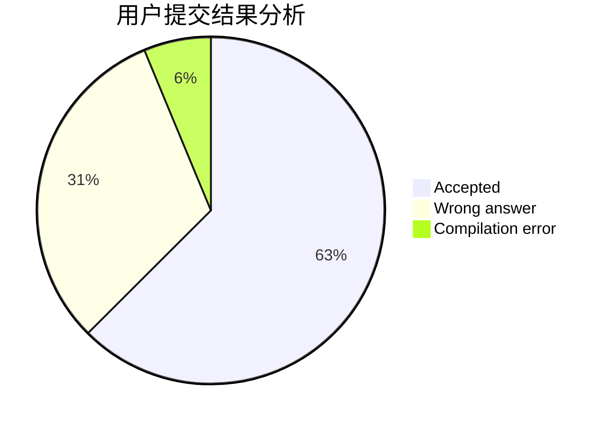
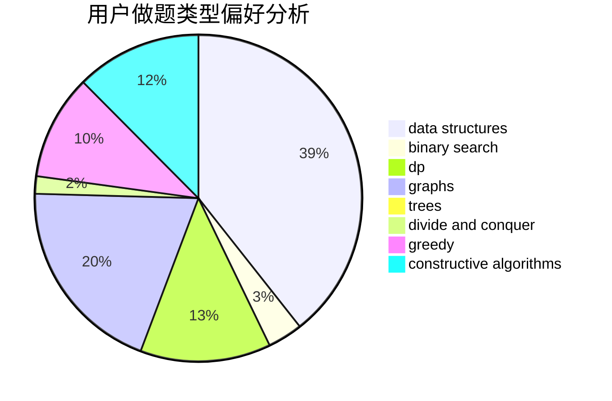

# FullSoulist
<!-- tabs:start -->
#### **用户提交结果分析**

#### **用户做题类型偏好分析**

#### **用户错题知识点分析**

<!-- tabs:end -->
# 推荐题目
[Iron Man](http://codeforces.com/problemset/problem/704/E)		data structures,
                        geometry,
                        trees		  
[Spring cleaning](http://codeforces.com/problemset/problem/1403/B)		*special problem,
                        data structures,
                        dfs and similar,
                        graphs,
                        trees		  
[Counting Kangaroos is Fun](http://codeforces.com/problemset/problem/372/A)		binary search,
                        greedy,
                        sortings,
                        two pointers		  
[Colored Balls](http://codeforces.com/problemset/problem/792/E)		greedy,
                        math,
                        number theory		  
[Not Quick Transformation](http://codeforces.com/problemset/problem/117/D)		divide and conquer,
                        math		  
[Nudist Beach](http://codeforces.com/problemset/problem/553/D)		binary search,
                        graphs,
                        greedy		  
[Parity Game](http://codeforces.com/problemset/problem/297/A)		constructive algorithms		  
[Color the Carpet](http://codeforces.com/problemset/problem/297/D)		constructive algorithms		  
[Convex Countour](http://codeforces.com/problemset/problem/838/E)		dp		  
[Domino for Young](https://codeforces.com/contest/1269/problem/D)		dp,
                        greedy,
                        math		  
<!-- tabs:start -->
#### **data structures**
[Iron Man](http://codeforces.com/problemset/problem/704/E)		data structures,
                        geometry,
                        trees		  
[Spring cleaning](http://codeforces.com/problemset/problem/1403/B)		*special problem,
                        data structures,
                        dfs and similar,
                        graphs,
                        trees		  
[Summer Homework](http://codeforces.com/problemset/problem/316/E2)		data structures,
                        math		  
[Dogecoin](http://codeforces.com/problemset/problem/1488/F)		*special problem,
                        *special problem,
                        binary search,
                        data structures		  
[Huffman Coding on Segment](http://codeforces.com/problemset/problem/700/D)		data structures,
                        greedy		  
[Buy Low Sell High](https://codeforces.com/contest/867/problem/E)		constructive algorithms,
                        data structures,
                        greedy		  
[Check Transcription](http://codeforces.com/problemset/problem/1056/E)		brute force,
                        data structures,
                        hashing,
                        strings		  
[Maximum width](http://codeforces.com/problemset/problem/1492/C)		binary search,
                        data structures,
                        dp,
                        greedy,
                        two pointers		  
[Old Floppy Drive](http://codeforces.com/problemset/problem/1490/G)		binary search,
                        data structures,
                        math		  
[Odd Mineral Resource](http://codeforces.com/problemset/problem/1479/D)		binary search,
                        bitmasks,
                        brute force,
                        data structures,
                        probabilities,
                        trees		  
#### **binary search**
[Counting Kangaroos is Fun](http://codeforces.com/problemset/problem/372/A)		binary search,
                        greedy,
                        sortings,
                        two pointers		  
[Nudist Beach](http://codeforces.com/problemset/problem/553/D)		binary search,
                        graphs,
                        greedy		  
[Primes on Interval](http://codeforces.com/problemset/problem/237/C)		binary search,
                        number theory,
                        two pointers		  
[Appleman and a Game](http://codeforces.com/problemset/problem/461/E)		binary search,
                        shortest paths,
                        strings		  
[Prairie Partition](https://codeforces.com/contest/807/problem/E)		binary search,
                        constructive algorithms,
                        greedy,
                        math		  
[Dogecoin](http://codeforces.com/problemset/problem/1488/F)		*special problem,
                        *special problem,
                        binary search,
                        data structures		  
[Cow and Treats](http://codeforces.com/problemset/problem/1307/E)		binary search,
                        combinatorics,
                        dp,
                        greedy,
                        implementation,
                        math		  
[Arithmetic Progression](http://codeforces.com/problemset/problem/1114/E)		binary search,
                        interactive,
                        number theory,
                        probabilities		  
[Bandit in a City](http://codeforces.com/problemset/problem/1436/D)		binary search,
                        dfs and similar,
                        graphs,
                        greedy,
                        trees		  
[Maximum width](http://codeforces.com/problemset/problem/1492/C)		binary search,
                        data structures,
                        dp,
                        greedy,
                        two pointers		  
#### **dp**
[Convex Countour](http://codeforces.com/problemset/problem/838/E)		dp		  
[Domino for Young](https://codeforces.com/contest/1269/problem/D)		dp,
                        greedy,
                        math		  
[Hex Dyslexia](https://codeforces.com/contest/866/problem/E)		bitmasks,
                        brute force,
                        dp,
                        graphs		  
[Extreme Subtraction](http://codeforces.com/problemset/problem/1442/A)		constructive algorithms,
                        dp,
                        greedy		  
[Helga Hufflepuff's Cup](http://codeforces.com/problemset/problem/855/C)		dp,
                        trees		  
[Cow and Treats](http://codeforces.com/problemset/problem/1307/E)		binary search,
                        combinatorics,
                        dp,
                        greedy,
                        implementation,
                        math		  
[Maximum width](http://codeforces.com/problemset/problem/1492/C)		binary search,
                        data structures,
                        dp,
                        greedy,
                        two pointers		  
[Bouncing Ball](https://codeforces.com/contest/1457/problem/C)		brute force,
                        dp,
                        implementation		  
[Pekora and Trampoline](http://codeforces.com/problemset/problem/1491/C)		brute force,
                        data structures,
                        dp,
                        greedy,
                        implementation		  
[Chef Monocarp](http://codeforces.com/problemset/problem/1437/C)		dp,
                        flows,
                        graph matchings,
                        greedy,
                        math,
                        sortings		  
#### **graph**
[Spring cleaning](http://codeforces.com/problemset/problem/1403/B)		*special problem,
                        data structures,
                        dfs and similar,
                        graphs,
                        trees		  
[Nudist Beach](http://codeforces.com/problemset/problem/553/D)		binary search,
                        graphs,
                        greedy		  
[WTF?](http://codeforces.com/problemset/problem/290/C)		*special problem,
                        graph matchings,
                        implementation,
                        trees		  
[Brevity is Soul of Wit](http://codeforces.com/problemset/problem/120/H)		graph matchings		  
[Hex Dyslexia](https://codeforces.com/contest/866/problem/E)		bitmasks,
                        brute force,
                        dp,
                        graphs		  
[Kevin and Grid](http://codeforces.com/problemset/problem/1392/I)		fft,
                        graphs,
                        math		  
[Bandit in a City](http://codeforces.com/problemset/problem/1436/D)		binary search,
                        dfs and similar,
                        graphs,
                        greedy,
                        trees		  
[Minimum Ties](http://codeforces.com/problemset/problem/1487/C)		brute force,
                        constructive algorithms,
                        dfs and similar,
                        graphs,
                        greedy,
                        implementation,
                        math		  
[Chef Monocarp](http://codeforces.com/problemset/problem/1437/C)		dp,
                        flows,
                        graph matchings,
                        greedy,
                        math,
                        sortings		  
[Strange Housing](http://codeforces.com/problemset/problem/1470/D)		constructive algorithms,
                        dfs and similar,
                        graph matchings,
                        graphs,
                        greedy		  
#### **trees**
[Iron Man](http://codeforces.com/problemset/problem/704/E)		data structures,
                        geometry,
                        trees		  
[Spring cleaning](http://codeforces.com/problemset/problem/1403/B)		*special problem,
                        data structures,
                        dfs and similar,
                        graphs,
                        trees		  
[WTF?](http://codeforces.com/problemset/problem/290/C)		*special problem,
                        graph matchings,
                        implementation,
                        trees		  
[Helga Hufflepuff's Cup](http://codeforces.com/problemset/problem/855/C)		dp,
                        trees		  
[Bandit in a City](http://codeforces.com/problemset/problem/1436/D)		binary search,
                        dfs and similar,
                        graphs,
                        greedy,
                        trees		  
[Odd Mineral Resource](http://codeforces.com/problemset/problem/1479/D)		binary search,
                        bitmasks,
                        brute force,
                        data structures,
                        probabilities,
                        trees		  
[Yet Another Card Deck](http://codeforces.com/problemset/problem/1511/C)		brute force,
                        data structures,
                        implementation,
                        trees		  
[Diameter Cuts](http://codeforces.com/problemset/problem/1499/F)		combinatorics,
                        dfs and similar,
                        dp,
                        trees		  
[Fib-tree](http://codeforces.com/problemset/problem/1491/E)		brute force,
                        dfs and similar,
                        divide and conquer,
                        number theory,
                        trees		  
[13th Labour of Heracles](http://codeforces.com/problemset/problem/1466/D)		data structures,
                        greedy,
                        sortings,
                        trees		  
#### **divide and conquer**
[Not Quick Transformation](http://codeforces.com/problemset/problem/117/D)		divide and conquer,
                        math		  
[Divide and Summarize](http://codeforces.com/problemset/problem/1461/D)		binary search,
                        brute force,
                        data structures,
                        divide and conquer,
                        implementation,
                        sortings		  
[Song of the Sirens](http://codeforces.com/problemset/problem/1466/G)		combinatorics,
                        divide and conquer,
                        hashing,
                        math,
                        string suffix structures,
                        strings		  
[Permutation Transformation](http://codeforces.com/problemset/problem/1490/D)		dfs and similar,
                        divide and conquer,
                        implementation		  
[Skyline Photo](https://codeforces.com/contest/1483/problem/C)		data structures,
                        divide and conquer,
                        dp		  
[Fib-tree](http://codeforces.com/problemset/problem/1491/E)		brute force,
                        dfs and similar,
                        divide and conquer,
                        number theory,
                        trees		  
[Sum of Prefix Sums](http://codeforces.com/problemset/problem/1303/G)		data structures,
                        divide and conquer,
                        geometry,
                        trees		  
[Dogeforces](http://codeforces.com/problemset/problem/1494/D)		constructive algorithms,
                        data structures,
                        dfs and similar,
                        divide and conquer,
                        dsu,
                        greedy,
                        sortings,
                        trees		  
[Logistical Questions](http://codeforces.com/problemset/problem/566/C)		dfs and similar,
                        divide and conquer,
                        trees		  
[Fruit Sequences](http://codeforces.com/problemset/problem/1428/F)		binary search,
                        data structures,
                        divide and conquer,
                        dp,
                        two pointers		  
#### **greedy**
[Counting Kangaroos is Fun](http://codeforces.com/problemset/problem/372/A)		binary search,
                        greedy,
                        sortings,
                        two pointers		  
[Colored Balls](http://codeforces.com/problemset/problem/792/E)		greedy,
                        math,
                        number theory		  
[Nudist Beach](http://codeforces.com/problemset/problem/553/D)		binary search,
                        graphs,
                        greedy		  
[Domino for Young](https://codeforces.com/contest/1269/problem/D)		dp,
                        greedy,
                        math		  
[Fish Weight](http://codeforces.com/problemset/problem/297/B)		constructive algorithms,
                        greedy		  
[Heidi and Library (easy)](http://codeforces.com/problemset/problem/802/A)		greedy		  
[Cram Time](https://codeforces.com/contest/1072/problem/C)		greedy		  
[Prairie Partition](https://codeforces.com/contest/807/problem/E)		binary search,
                        constructive algorithms,
                        greedy,
                        math		  
[Extreme Subtraction](http://codeforces.com/problemset/problem/1442/A)		constructive algorithms,
                        dp,
                        greedy		  
[Cow and Treats](http://codeforces.com/problemset/problem/1307/E)		binary search,
                        combinatorics,
                        dp,
                        greedy,
                        implementation,
                        math		  
#### **constructive algorithms**
[Parity Game](http://codeforces.com/problemset/problem/297/A)		constructive algorithms		  
[Color the Carpet](http://codeforces.com/problemset/problem/297/D)		constructive algorithms		  
[Fish Weight](http://codeforces.com/problemset/problem/297/B)		constructive algorithms,
                        greedy		  
[Prairie Partition](https://codeforces.com/contest/807/problem/E)		binary search,
                        constructive algorithms,
                        greedy,
                        math		  
[Extreme Subtraction](http://codeforces.com/problemset/problem/1442/A)		constructive algorithms,
                        dp,
                        greedy		  
[Mister B and Angle in Polygon](http://codeforces.com/problemset/problem/820/B)		constructive algorithms,
                        geometry,
                        math		  
[Buy Low Sell High](https://codeforces.com/contest/867/problem/E)		constructive algorithms,
                        data structures,
                        greedy		  
[Anti-knapsack](http://codeforces.com/problemset/problem/1493/A)		constructive algorithms,
                        greedy		  
[Pairs](http://codeforces.com/problemset/problem/1463/D)		binary search,
                        constructive algorithms,
                        greedy,
                        two pointers		  
[XOR-gun](https://codeforces.com/contest/1456/problem/B)		bitmasks,
                        brute force,
                        constructive algorithms		  
#### **sortings**
[Counting Kangaroos is Fun](http://codeforces.com/problemset/problem/372/A)		binary search,
                        greedy,
                        sortings,
                        two pointers		  
[Diamond Miner](https://codeforces.com/contest/1496/problem/C)		geometry,
                        greedy,
                        math,
                        sortings		  
[Meximization](http://codeforces.com/problemset/problem/1497/A)		brute force,
                        data structures,
                        greedy,
                        sortings		  
[Avoiding Zero](http://codeforces.com/problemset/problem/1427/A)		math,
                        sortings		  
[Divide and Summarize](http://codeforces.com/problemset/problem/1461/D)		binary search,
                        brute force,
                        data structures,
                        divide and conquer,
                        implementation,
                        sortings		  
[Chef Monocarp](http://codeforces.com/problemset/problem/1437/C)		dp,
                        flows,
                        graph matchings,
                        greedy,
                        math,
                        sortings		  
[Replacing Elements](http://codeforces.com/problemset/problem/1473/A)		greedy,
                        implementation,
                        math,
                        sortings		  
[Eastern Exhibition](http://codeforces.com/problemset/problem/1486/B)		binary search,
                        geometry,
                        shortest paths,
                        sortings		  
[The Great Hero](http://codeforces.com/problemset/problem/1480/B)		greedy,
                        implementation,
                        sortings		  
[Rescue Nibel!](http://codeforces.com/problemset/problem/1420/D)		combinatorics,
                        data structures,
                        sortings		  
<!-- tabs:end -->
