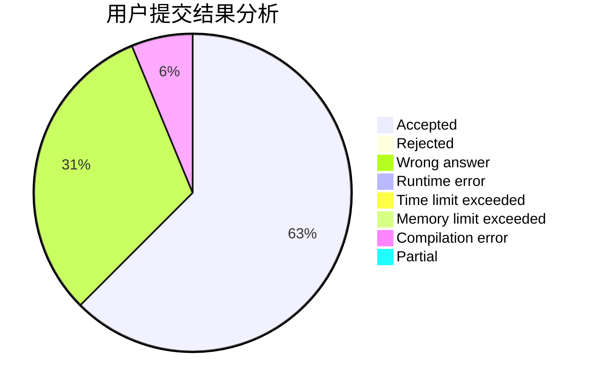
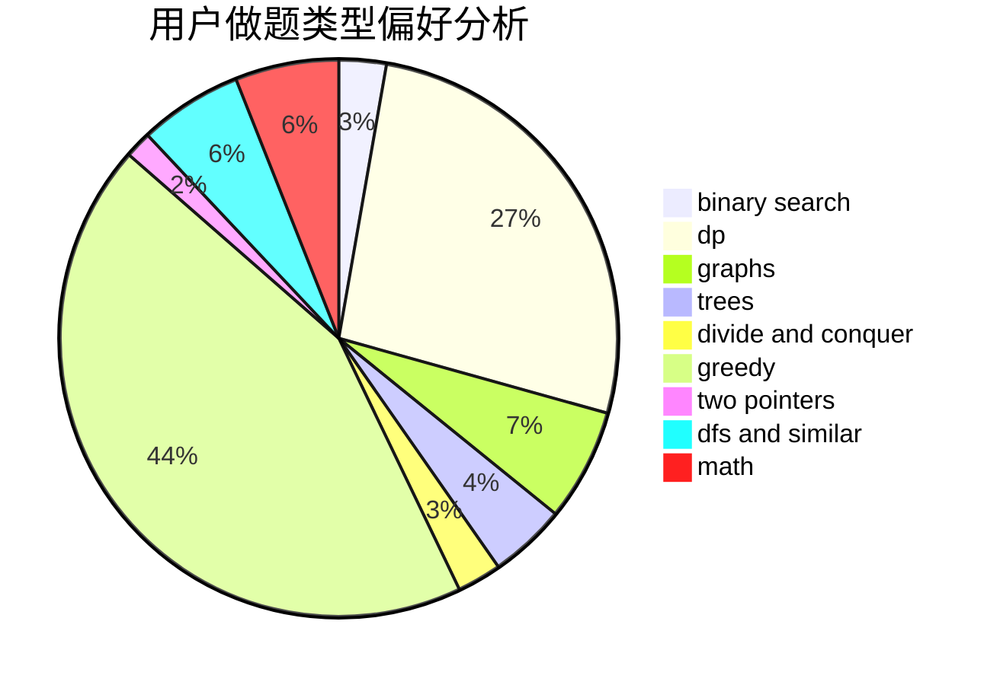

# FullSoulist

<!-- tabs:start -->

#### **用户提交结果分析**

#### **用户做题类型偏好分析**

<!-- tabs:end -->
# 推荐题目
[1415A](https://codeforces.com/contest/1415/problem/A)
[402A](https://codeforces.com/contest/402/problem/A)
[313E](https://codeforces.com/contest/313/problem/E)
[314C](https://codeforces.com/contest/314/problem/C)
[822E](https://codeforces.com/contest/822/problem/E)
[25C](https://codeforces.com/contest/25/problem/C)
[1165D](https://codeforces.com/contest/1165/problem/D)
[1182F](https://codeforces.com/contest/1182/problem/F)
[723E](https://codeforces.com/contest/723/problem/E)
[816E](https://codeforces.com/contest/816/problem/E)
