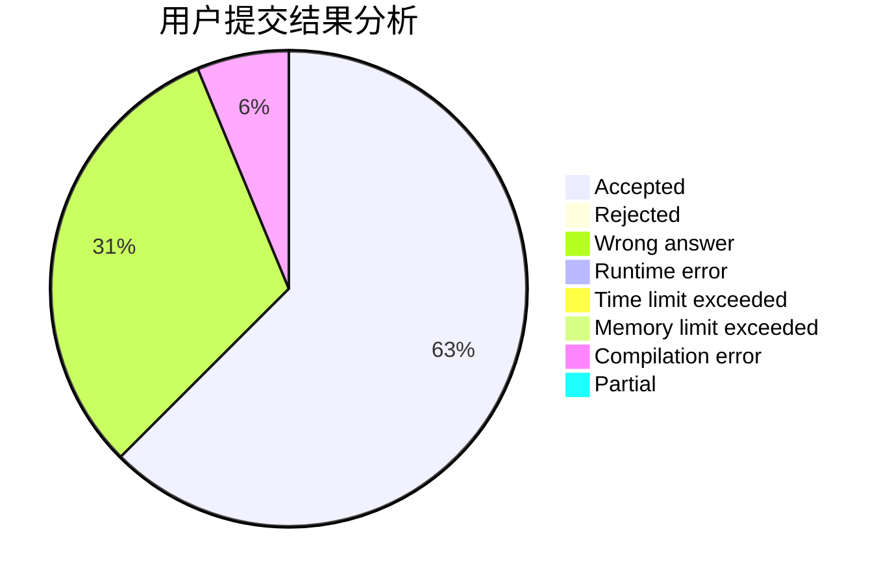
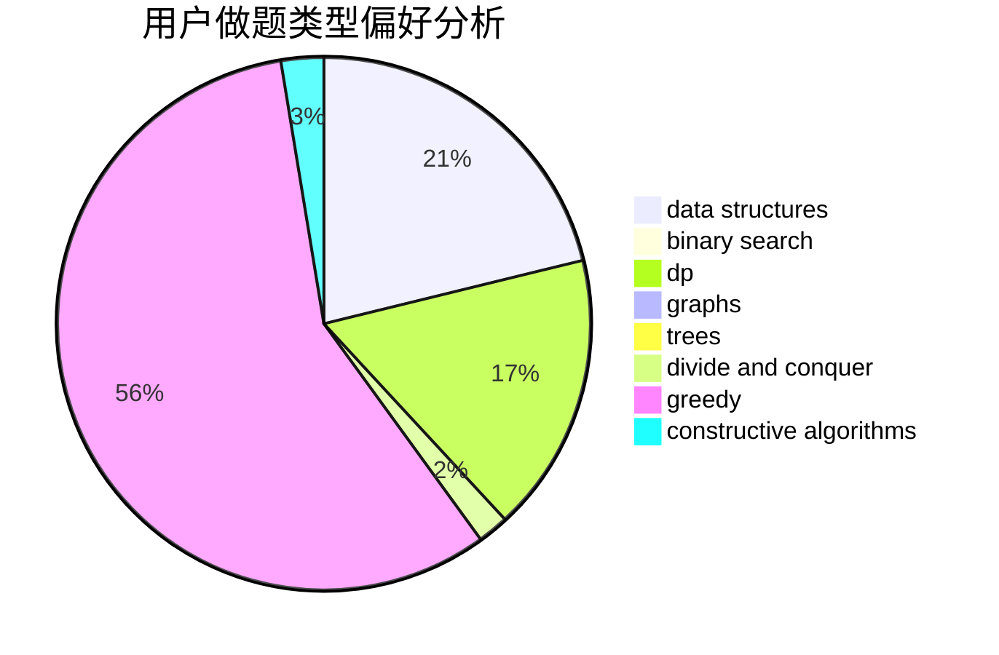

# FullSoulist

<!-- tabs:start -->

#### **用户提交结果分析**

#### **用户做题类型偏好分析**

#### **用户错题知识点分析**

<!-- tabs:end -->
# 推荐题目
[1415A](https://codeforces.com/contest/1415/problem/A)		brute force,
                        math		  
[402A](https://codeforces.com/contest/402/problem/A)		greedy,
                        math		  
[313E](https://codeforces.com/contest/313/problem/E)		constructive algorithms,
                        data structures,
                        dsu,
                        greedy		  
[314C](https://codeforces.com/contest/314/problem/C)		data structures,
                        dp		  
[822E](https://codeforces.com/contest/822/problem/E)		binary search,
                        dp,
                        hashing,
                        string suffix structures		  
[25C](https://codeforces.com/contest/25/problem/C)		graphs,
                        shortest paths		  
[1165D](https://codeforces.com/contest/1165/problem/D)		math,
                        number theory		  
[1182F](https://codeforces.com/contest/1182/problem/F)		binary search,
                        data structures,
                        number theory		  
[723E](https://codeforces.com/contest/723/problem/E)		constructive algorithms,
                        dfs and similar,
                        flows,
                        graphs,
                        greedy		  
[816E](https://codeforces.com/contest/816/problem/E)		dsu,graphs,sortings,trees		  
