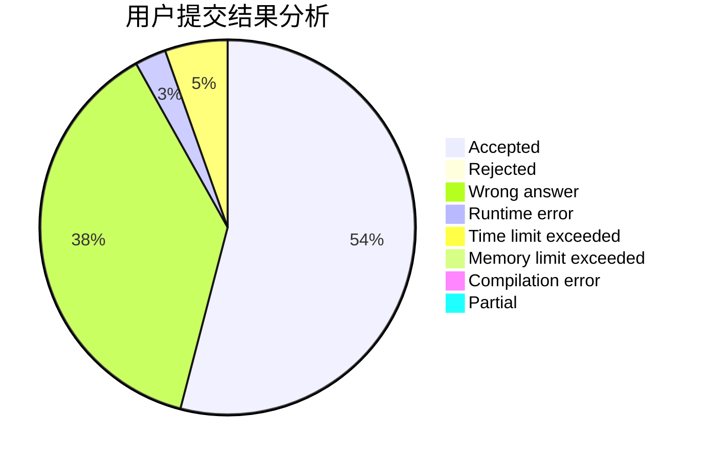
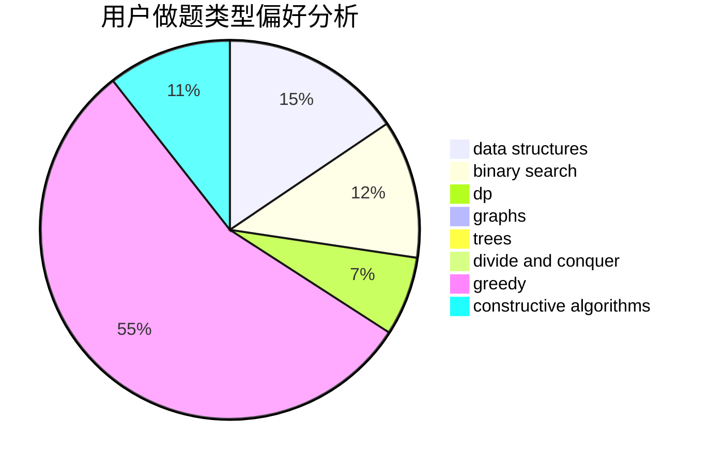
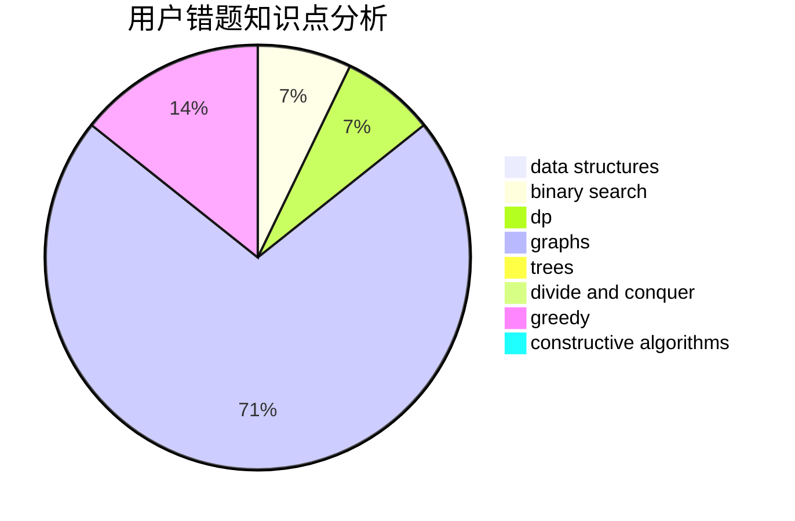

# FuminoTXDYOvO

<!-- tabs:start -->

#### **用户提交结果分析**

#### **用户做题类型偏好分析**

#### **用户错题知识点分析**

<!-- tabs:end -->
# 推荐题目
[1421A](https://codeforces.com/contest/1421/problem/A)		bitmasks,
                        greedy,
                        math		  
[1157E](https://codeforces.com/contest/1157/problem/E)		binary search,
                        data structures,
                        greedy		  
[7D](https://codeforces.com/contest/7/problem/D)		hashing,
                        strings		  
[13821](https://codeforces.com/contest/1382/problem/1)		dsu,graphs,sortings,trees		  
[1325A](https://codeforces.com/contest/1325/problem/A)		constructive algorithms,
                        greedy,
                        number theory		  
[762C](https://codeforces.com/contest/762/problem/C)		binary search,
                        hashing,
                        strings,
                        two pointers		  
[1170E](https://codeforces.com/contest/1170/problem/E)		*special problem,
                        binary search		  
[550E](https://codeforces.com/contest/550/problem/E)		constructive algorithms,
                        greedy,
                        implementation,
                        math		  
[1228C](https://codeforces.com/contest/1228/problem/C)		math,
                        number theory		  
[594D](https://codeforces.com/contest/594/problem/D)		data structures,
                        number theory		  
