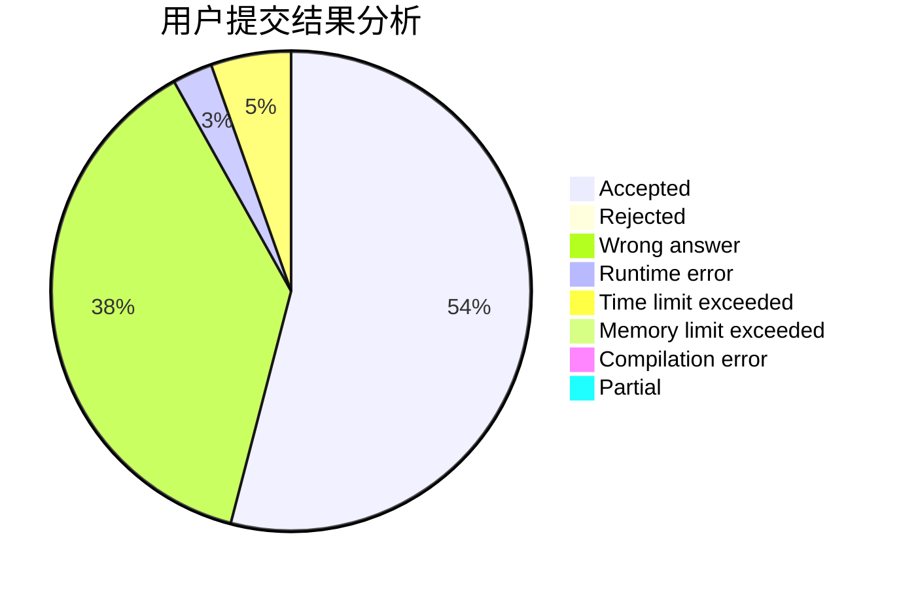
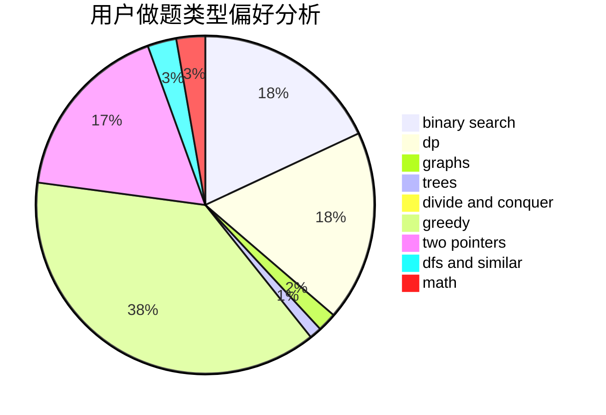

# FuminoTXDYOvO

<!-- tabs:start -->

#### **用户提交结果分析**

#### **用户做题类型偏好分析**

<!-- tabs:end -->
# 推荐题目
[1421A](https://codeforces.com/contest/1421/problem/A)
[1157E](https://codeforces.com/contest/1157/problem/E)
[7D](https://codeforces.com/contest/7/problem/D)
[13821](https://codeforces.com/contest/1382/problem/1)
[1325A](https://codeforces.com/contest/1325/problem/A)
[762C](https://codeforces.com/contest/762/problem/C)
[1170E](https://codeforces.com/contest/1170/problem/E)
[550E](https://codeforces.com/contest/550/problem/E)
[1228C](https://codeforces.com/contest/1228/problem/C)
[594D](https://codeforces.com/contest/594/problem/D)
