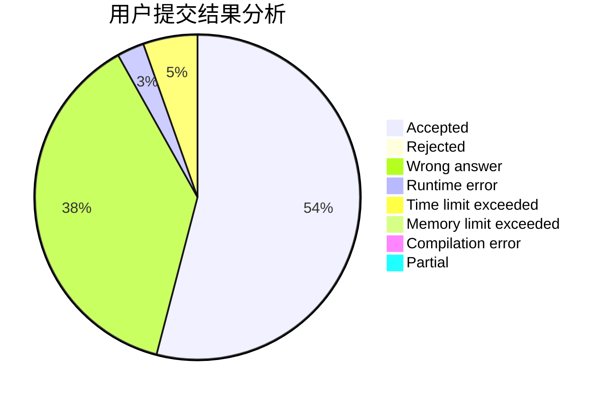
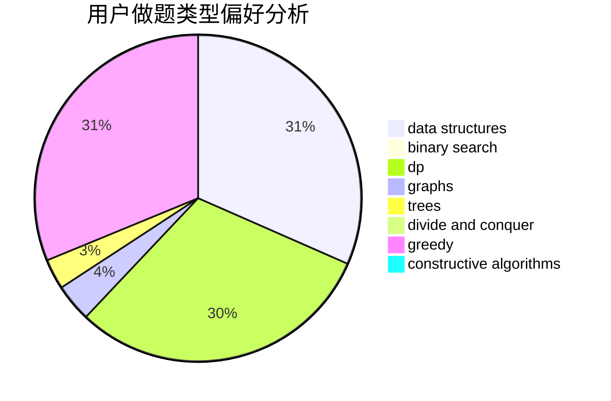
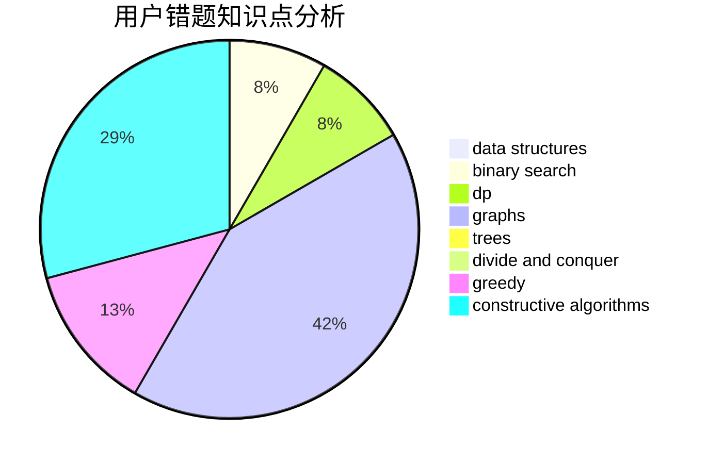

# FuminoTXDYOvO

<!-- tabs:start -->

#### **用户提交结果分析**

#### **用户做题类型偏好分析**

#### **用户错题知识点分析**

<!-- tabs:end -->
# 推荐题目
[140E](https://codeforces.com/contest/140/problem/E)		combinatorics,
                        dp		  
[1155F](https://codeforces.com/contest/1155/problem/F)		brute force,
                        dp,
                        graphs		  
[781F](https://codeforces.com/contest/781/problem/F)		dsu,graphs,sortings,trees		  
[1373C](https://codeforces.com/contest/1373/problem/C)		math		  
[1315B](https://codeforces.com/contest/1315/problem/B)		binary search,
                        dp,
                        greedy,
                        strings		  
[741C](https://codeforces.com/contest/741/problem/C)		constructive algorithms,
                        dfs and similar,
                        graphs		  
[1167A](https://codeforces.com/contest/1167/problem/A)		brute force,
                        greedy,
                        strings		  
[526F](https://codeforces.com/contest/526/problem/F)		data structures,
                        divide and conquer		  
[1220C](https://codeforces.com/contest/1220/problem/C)		games,
                        greedy,
                        strings		  
[574C](https://codeforces.com/contest/574/problem/C)		dsu,graphs,sortings,trees		  
