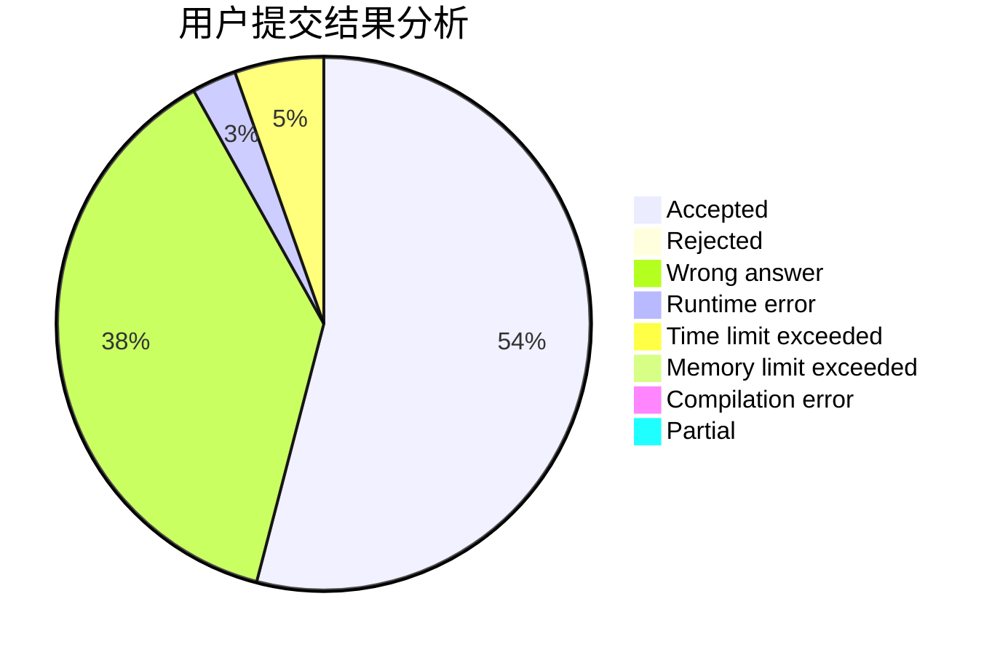
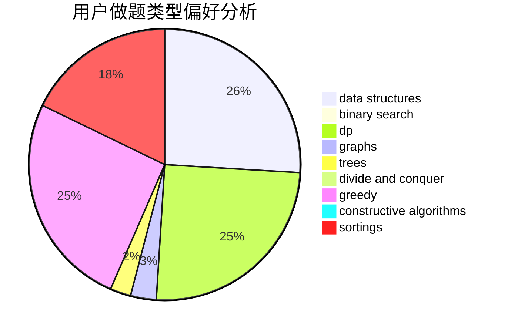
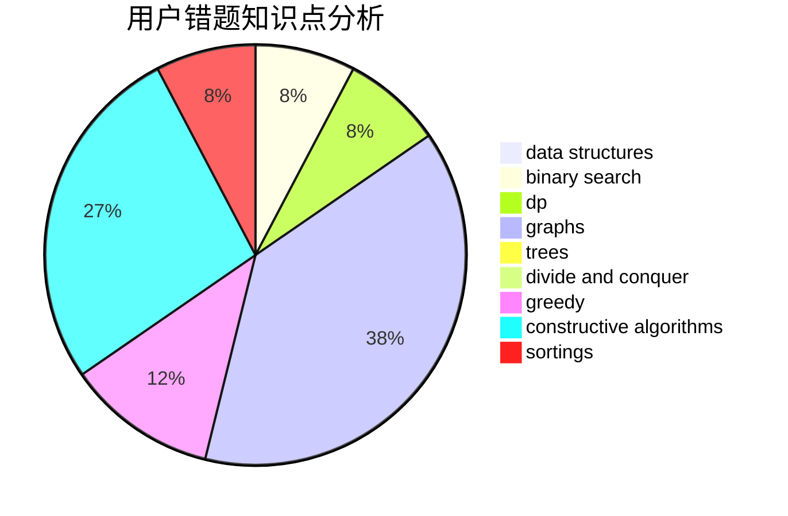

# FuminoTXDYOvO
<!-- tabs:start -->
#### **用户提交结果分析**

#### **用户做题类型偏好分析**

#### **用户错题知识点分析**

<!-- tabs:end -->
# 推荐题目
[1373C](http://codeforces.com/problemset/problem/1373/C)		math		  
[448C](http://codeforces.com/problemset/problem/448/C)		divide and conquer,
                        dp,
                        greedy		  
[739E](http://codeforces.com/problemset/problem/739/E)		brute force,
                        data structures,
                        dp,
                        flows,
                        math,
                        probabilities,
                        sortings		  
[781F](https://codeforces.com/contest/781/problem/F)		binary search,
                        geometry,
                        implementation,
                        two pointers		  
[1315B](http://codeforces.com/problemset/problem/1315/B)		binary search,
                        dp,
                        greedy,
                        strings		  
[840D](http://codeforces.com/problemset/problem/840/D)		data structures,
                        probabilities		  
[759A](https://codeforces.com/contest/759/problem/A)		constructive algorithms,
                        dfs and similar		  
[1220C](http://codeforces.com/problemset/problem/1220/C)		games,
                        greedy,
                        strings		  
[1434E](http://codeforces.com/problemset/problem/1434/E)		dsu,
                        games		  
[574C](https://codeforces.com/contest/574/problem/C)		implementation,
                        math,
                        number theory		  
<!-- tabs:start -->
#### **data structures**
[739E](http://codeforces.com/problemset/problem/739/E)		brute force,
                        data structures,
                        dp,
                        flows,
                        math,
                        probabilities,
                        sortings		  
[840D](http://codeforces.com/problemset/problem/840/D)		data structures,
                        probabilities		  
[311D](http://codeforces.com/problemset/problem/311/D)		data structures,
                        math		  
[144D](http://codeforces.com/problemset/problem/144/D)		data structures,
                        dfs and similar,
                        graphs,
                        shortest paths		  
[576E](http://codeforces.com/problemset/problem/576/E)		binary search,
                        data structures		  
[1263F](http://codeforces.com/problemset/problem/1263/F)		data structures,
                        dfs and similar,
                        dp,
                        flows,
                        graphs,
                        trees		  
[13E](http://codeforces.com/problemset/problem/13/E)		data structures,
                        dsu		  
[526F](http://codeforces.com/problemset/problem/526/F)		data structures,
                        divide and conquer		  
[1383E](http://codeforces.com/problemset/problem/1383/E)		combinatorics,
                        data structures,
                        dp		  
[727E](http://codeforces.com/problemset/problem/727/E)		data structures,
                        hashing,
                        string suffix structures,
                        strings		  
#### **binary search**
[781F](https://codeforces.com/contest/781/problem/F)		binary search,
                        geometry,
                        implementation,
                        two pointers		  
[1315B](http://codeforces.com/problemset/problem/1315/B)		binary search,
                        dp,
                        greedy,
                        strings		  
[576E](http://codeforces.com/problemset/problem/576/E)		binary search,
                        data structures		  
[570D](http://codeforces.com/problemset/problem/570/D)		binary search,
                        bitmasks,
                        constructive algorithms,
                        dfs and similar,
                        graphs,
                        trees		  
[1492C](http://codeforces.com/problemset/problem/1492/C)		binary search,
                        data structures,
                        dp,
                        greedy,
                        two pointers		  
[1463D](http://codeforces.com/problemset/problem/1463/D)		binary search,
                        constructive algorithms,
                        greedy,
                        two pointers		  
[1490G](http://codeforces.com/problemset/problem/1490/G)		binary search,
                        data structures,
                        math		  
[1479D](http://codeforces.com/problemset/problem/1479/D)		binary search,
                        bitmasks,
                        brute force,
                        data structures,
                        probabilities,
                        trees		  
[1436E](http://codeforces.com/problemset/problem/1436/E)		binary search,
                        data structures,
                        two pointers		  
[1461D](http://codeforces.com/problemset/problem/1461/D)		binary search,
                        brute force,
                        data structures,
                        divide and conquer,
                        implementation,
                        sortings		  
#### **dp**
[448C](http://codeforces.com/problemset/problem/448/C)		divide and conquer,
                        dp,
                        greedy		  
[739E](http://codeforces.com/problemset/problem/739/E)		brute force,
                        data structures,
                        dp,
                        flows,
                        math,
                        probabilities,
                        sortings		  
[1315B](http://codeforces.com/problemset/problem/1315/B)		binary search,
                        dp,
                        greedy,
                        strings		  
[1155F](http://codeforces.com/problemset/problem/1155/F)		brute force,
                        dp,
                        graphs		  
[140E](http://codeforces.com/problemset/problem/140/E)		combinatorics,
                        dp		  
[852E](http://codeforces.com/problemset/problem/852/E)		dp		  
[1263F](http://codeforces.com/problemset/problem/1263/F)		data structures,
                        dfs and similar,
                        dp,
                        flows,
                        graphs,
                        trees		  
[721C](http://codeforces.com/problemset/problem/721/C)		dp,
                        graphs		  
[1336A](http://codeforces.com/problemset/problem/1336/A)		dfs and similar,
                        dp,
                        greedy,
                        sortings,
                        trees		  
[868C](http://codeforces.com/problemset/problem/868/C)		bitmasks,
                        brute force,
                        constructive algorithms,
                        dp		  
#### **graph**
[1155F](http://codeforces.com/problemset/problem/1155/F)		brute force,
                        dp,
                        graphs		  
[144D](http://codeforces.com/problemset/problem/144/D)		data structures,
                        dfs and similar,
                        graphs,
                        shortest paths		  
[741C](http://codeforces.com/problemset/problem/741/C)		constructive algorithms,
                        dfs and similar,
                        graphs		  
[1263F](http://codeforces.com/problemset/problem/1263/F)		data structures,
                        dfs and similar,
                        dp,
                        flows,
                        graphs,
                        trees		  
[721C](http://codeforces.com/problemset/problem/721/C)		dp,
                        graphs		  
[570D](http://codeforces.com/problemset/problem/570/D)		binary search,
                        bitmasks,
                        constructive algorithms,
                        dfs and similar,
                        graphs,
                        trees		  
[1510B](http://codeforces.com/problemset/problem/1510/B)		flows,
                        graph matchings,
                        graphs		  
[1392I](http://codeforces.com/problemset/problem/1392/I)		fft,
                        graphs,
                        math		  
[868E](http://codeforces.com/problemset/problem/868/E)		dp,
                        graphs,
                        trees		  
[1487C](http://codeforces.com/problemset/problem/1487/C)		brute force,
                        constructive algorithms,
                        dfs and similar,
                        graphs,
                        greedy,
                        implementation,
                        math		  
#### **trees**
[1263F](http://codeforces.com/problemset/problem/1263/F)		data structures,
                        dfs and similar,
                        dp,
                        flows,
                        graphs,
                        trees		  
[1336A](http://codeforces.com/problemset/problem/1336/A)		dfs and similar,
                        dp,
                        greedy,
                        sortings,
                        trees		  
[570D](http://codeforces.com/problemset/problem/570/D)		binary search,
                        bitmasks,
                        constructive algorithms,
                        dfs and similar,
                        graphs,
                        trees		  
[1388C](http://codeforces.com/problemset/problem/1388/C)		dfs and similar,
                        greedy,
                        math,
                        trees		  
[868E](http://codeforces.com/problemset/problem/868/E)		dp,
                        graphs,
                        trees		  
[1479D](http://codeforces.com/problemset/problem/1479/D)		binary search,
                        bitmasks,
                        brute force,
                        data structures,
                        probabilities,
                        trees		  
[1511C](http://codeforces.com/problemset/problem/1511/C)		brute force,
                        data structures,
                        implementation,
                        trees		  
[1499F](http://codeforces.com/problemset/problem/1499/F)		combinatorics,
                        dfs and similar,
                        dp,
                        trees		  
[1491E](http://codeforces.com/problemset/problem/1491/E)		brute force,
                        dfs and similar,
                        divide and conquer,
                        number theory,
                        trees		  
[1466D](http://codeforces.com/problemset/problem/1466/D)		data structures,
                        greedy,
                        sortings,
                        trees		  
#### **divide and conquer**
[448C](http://codeforces.com/problemset/problem/448/C)		divide and conquer,
                        dp,
                        greedy		  
[526F](http://codeforces.com/problemset/problem/526/F)		data structures,
                        divide and conquer		  
[868F](http://codeforces.com/problemset/problem/868/F)		divide and conquer,
                        dp		  
[1461D](http://codeforces.com/problemset/problem/1461/D)		binary search,
                        brute force,
                        data structures,
                        divide and conquer,
                        implementation,
                        sortings		  
[1466G](http://codeforces.com/problemset/problem/1466/G)		combinatorics,
                        divide and conquer,
                        hashing,
                        math,
                        string suffix structures,
                        strings		  
[1490D](http://codeforces.com/problemset/problem/1490/D)		dfs and similar,
                        divide and conquer,
                        implementation		  
[1483C](https://codeforces.com/contest/1483/problem/C)		data structures,
                        divide and conquer,
                        dp		  
[1491E](http://codeforces.com/problemset/problem/1491/E)		brute force,
                        dfs and similar,
                        divide and conquer,
                        number theory,
                        trees		  
[1303G](http://codeforces.com/problemset/problem/1303/G)		data structures,
                        divide and conquer,
                        geometry,
                        trees		  
[1494D](http://codeforces.com/problemset/problem/1494/D)		constructive algorithms,
                        data structures,
                        dfs and similar,
                        divide and conquer,
                        dsu,
                        greedy,
                        sortings,
                        trees		  
#### **greedy**
[448C](http://codeforces.com/problemset/problem/448/C)		divide and conquer,
                        dp,
                        greedy		  
[1315B](http://codeforces.com/problemset/problem/1315/B)		binary search,
                        dp,
                        greedy,
                        strings		  
[1220C](http://codeforces.com/problemset/problem/1220/C)		games,
                        greedy,
                        strings		  
[859A](http://codeforces.com/problemset/problem/859/A)		greedy,
                        implementation		  
[1215C](http://codeforces.com/problemset/problem/1215/C)		constructive algorithms,
                        greedy		  
[1465E](https://codeforces.com/contest/1465/problem/E)		bitmasks,
                        greedy,
                        math,
                        strings		  
[1139B](http://codeforces.com/problemset/problem/1139/B)		greedy,
                        implementation		  
[1167A](http://codeforces.com/problemset/problem/1167/A)		brute force,
                        greedy,
                        strings		  
[316A1](http://codeforces.com/problemset/problem/316/A1)		greedy		  
[1336A](http://codeforces.com/problemset/problem/1336/A)		dfs and similar,
                        dp,
                        greedy,
                        sortings,
                        trees		  
#### **constructive algorithms**
[759A](https://codeforces.com/contest/759/problem/A)		constructive algorithms,
                        dfs and similar		  
[741C](http://codeforces.com/problemset/problem/741/C)		constructive algorithms,
                        dfs and similar,
                        graphs		  
[1215C](http://codeforces.com/problemset/problem/1215/C)		constructive algorithms,
                        greedy		  
[868C](http://codeforces.com/problemset/problem/868/C)		bitmasks,
                        brute force,
                        constructive algorithms,
                        dp		  
[570D](http://codeforces.com/problemset/problem/570/D)		binary search,
                        bitmasks,
                        constructive algorithms,
                        dfs and similar,
                        graphs,
                        trees		  
[1493A](http://codeforces.com/problemset/problem/1493/A)		constructive algorithms,
                        greedy		  
[1463D](http://codeforces.com/problemset/problem/1463/D)		binary search,
                        constructive algorithms,
                        greedy,
                        two pointers		  
[1456B](https://codeforces.com/contest/1456/problem/B)		bitmasks,
                        brute force,
                        constructive algorithms		  
[1492D](http://codeforces.com/problemset/problem/1492/D)		bitmasks,
                        constructive algorithms,
                        greedy,
                        math		  
[1504D](https://codeforces.com/contest/1504/problem/D)		constructive algorithms,
                        games,
                        interactive		  
#### **sortings**
[739E](http://codeforces.com/problemset/problem/739/E)		brute force,
                        data structures,
                        dp,
                        flows,
                        math,
                        probabilities,
                        sortings		  
[1336A](http://codeforces.com/problemset/problem/1336/A)		dfs and similar,
                        dp,
                        greedy,
                        sortings,
                        trees		  
[1430B](http://codeforces.com/problemset/problem/1430/B)		greedy,
                        implementation,
                        sortings		  
[1496C](https://codeforces.com/contest/1496/problem/C)		geometry,
                        greedy,
                        math,
                        sortings		  
[1495A](http://codeforces.com/problemset/problem/1495/A)		geometry,
                        greedy,
                        math,
                        sortings		  
[1497A](http://codeforces.com/problemset/problem/1497/A)		brute force,
                        data structures,
                        greedy,
                        sortings		  
[1427A](http://codeforces.com/problemset/problem/1427/A)		math,
                        sortings		  
[1461D](http://codeforces.com/problemset/problem/1461/D)		binary search,
                        brute force,
                        data structures,
                        divide and conquer,
                        implementation,
                        sortings		  
[1437C](http://codeforces.com/problemset/problem/1437/C)		dp,
                        flows,
                        graph matchings,
                        greedy,
                        math,
                        sortings		  
[1473A](http://codeforces.com/problemset/problem/1473/A)		greedy,
                        implementation,
                        math,
                        sortings		  
<!-- tabs:end -->
