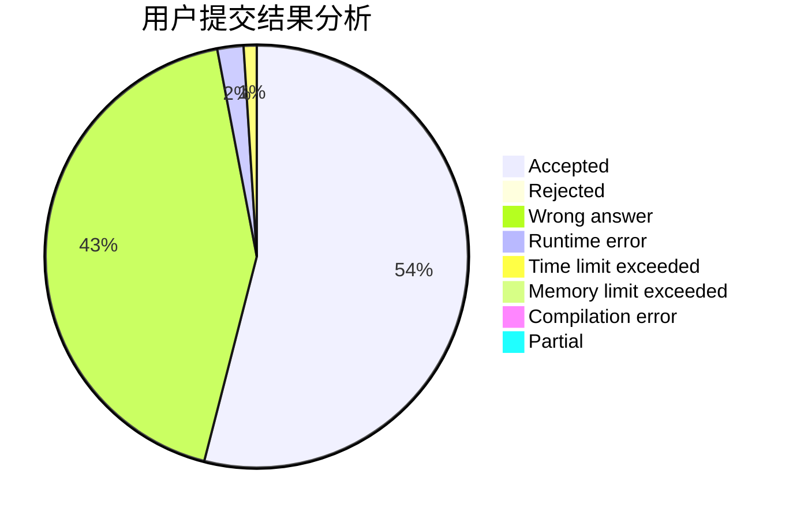
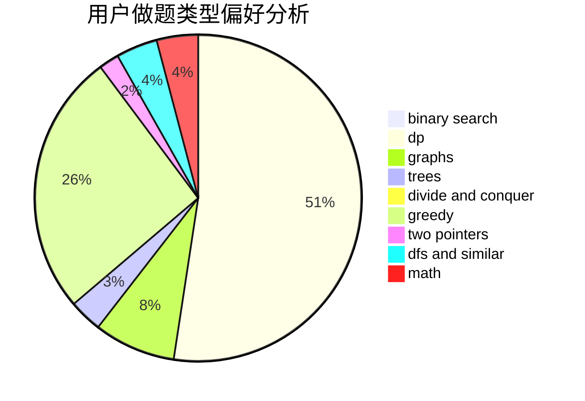

# 2019G_wumulong_jsuacm

<!-- tabs:start -->

#### **用户提交结果分析**

#### **用户做题类型偏好分析**

<!-- tabs:end -->
# 推荐题目
[1283D](https://codeforces.com/contest/1283/problem/D)
[12821](https://codeforces.com/contest/1282/problem/1)
[1282C](https://codeforces.com/contest/1282/problem/C)
[12822](https://codeforces.com/contest/1282/problem/2)
[1280E](https://codeforces.com/contest/1280/problem/E)
[1280F](https://codeforces.com/contest/1280/problem/F)
[1220A](https://codeforces.com/contest/1220/problem/A)
[1281A](https://codeforces.com/contest/1281/problem/A)
[1283A](https://codeforces.com/contest/1283/problem/A)
[1281E](https://codeforces.com/contest/1281/problem/E)
