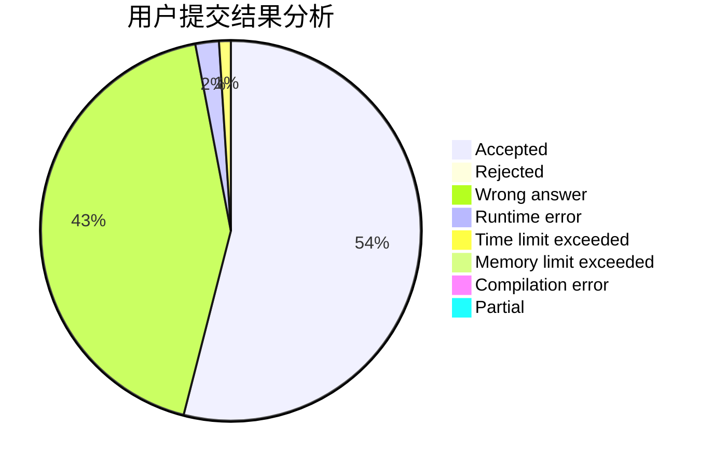
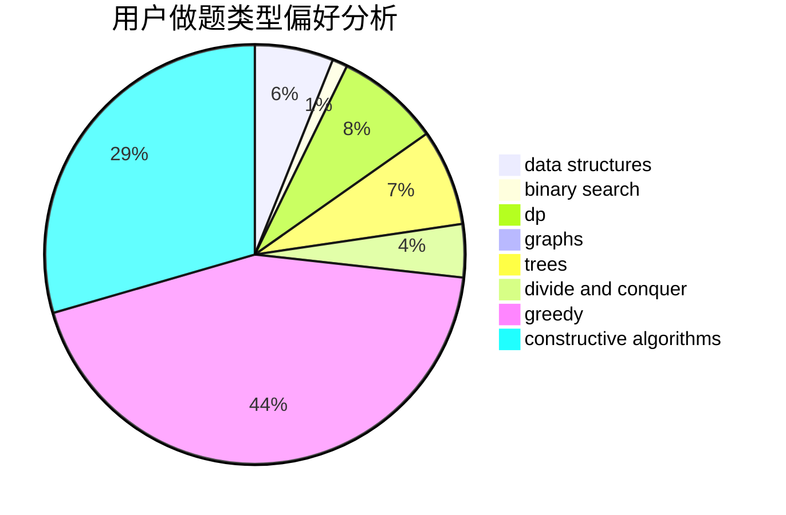
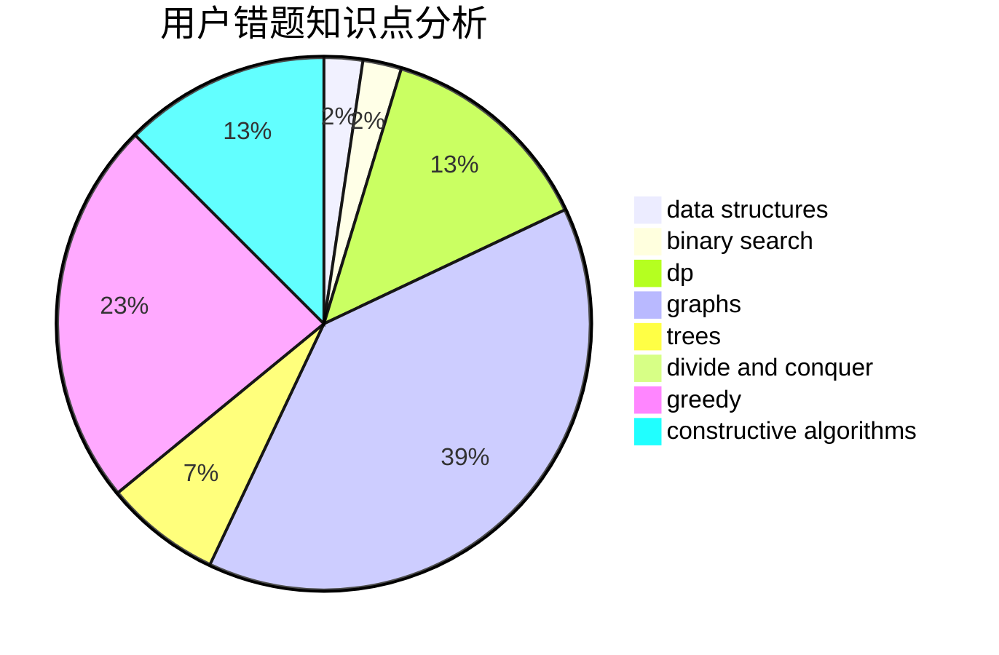

# 2019G_wumulong_jsuacm

<!-- tabs:start -->

#### **用户提交结果分析**

#### **用户做题类型偏好分析**

#### **用户错题知识点分析**

<!-- tabs:end -->
# 推荐题目
[1277B](https://codeforces.com/contest/1277/problem/B)		greedy,
                        number theory		  
[1272E](https://codeforces.com/contest/1272/problem/E)		dfs and similar,
                        graphs,
                        shortest paths		  
[1276B](https://codeforces.com/contest/1276/problem/B)		combinatorics,
                        dfs and similar,
                        dsu,
                        graphs		  
[1272F](https://codeforces.com/contest/1272/problem/F)		dp,
                        strings,
                        two pointers		  
[1271C](https://codeforces.com/contest/1271/problem/C)		brute force,
                        geometry,
                        greedy,
                        implementation		  
[1271D](https://codeforces.com/contest/1271/problem/D)		data structures,
                        dp,
                        greedy,
                        implementation,
                        sortings		  
[1214E](https://codeforces.com/contest/1214/problem/E)		constructive algorithms,
                        graphs,
                        math,
                        sortings,
                        trees		  
[1271E](https://codeforces.com/contest/1271/problem/E)		binary search,
                        combinatorics,
                        dp,
                        math		  
[1276E](https://codeforces.com/contest/1276/problem/E)		constructive algorithms		  
[1272C](https://codeforces.com/contest/1272/problem/C)		combinatorics,
                        dp,
                        implementation		  
