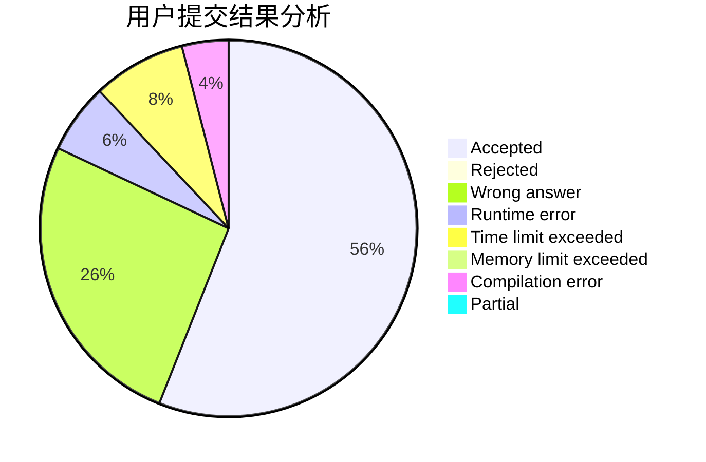
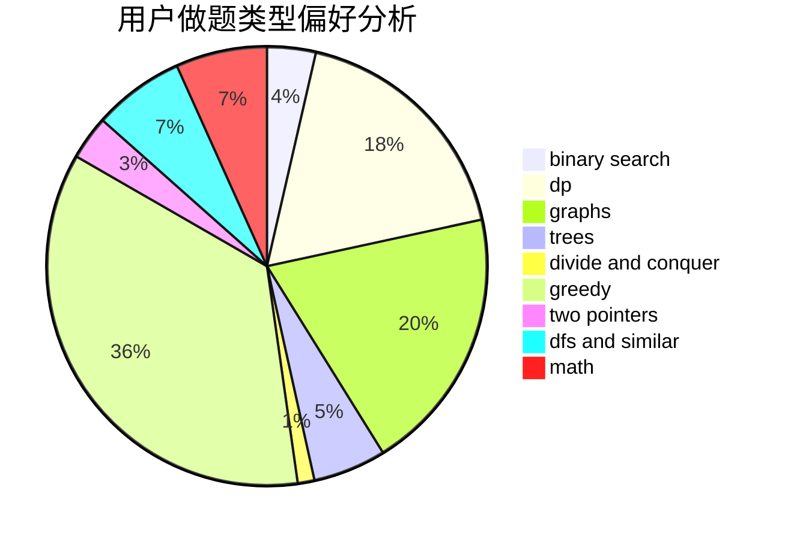

# FuruyaRei

<!-- tabs:start -->

#### **用户提交结果分析**

#### **用户做题类型偏好分析**

<!-- tabs:end -->
# 推荐题目
[868D](https://codeforces.com/contest/868/problem/D)
[471D](https://codeforces.com/contest/471/problem/D)
[682D](https://codeforces.com/contest/682/problem/D)
[1141D](https://codeforces.com/contest/1141/problem/D)
[1100A](https://codeforces.com/contest/1100/problem/A)
[1277F](https://codeforces.com/contest/1277/problem/F)
[466D](https://codeforces.com/contest/466/problem/D)
[1047D](https://codeforces.com/contest/1047/problem/D)
[284E](https://codeforces.com/contest/284/problem/E)
[357B](https://codeforces.com/contest/357/problem/B)
