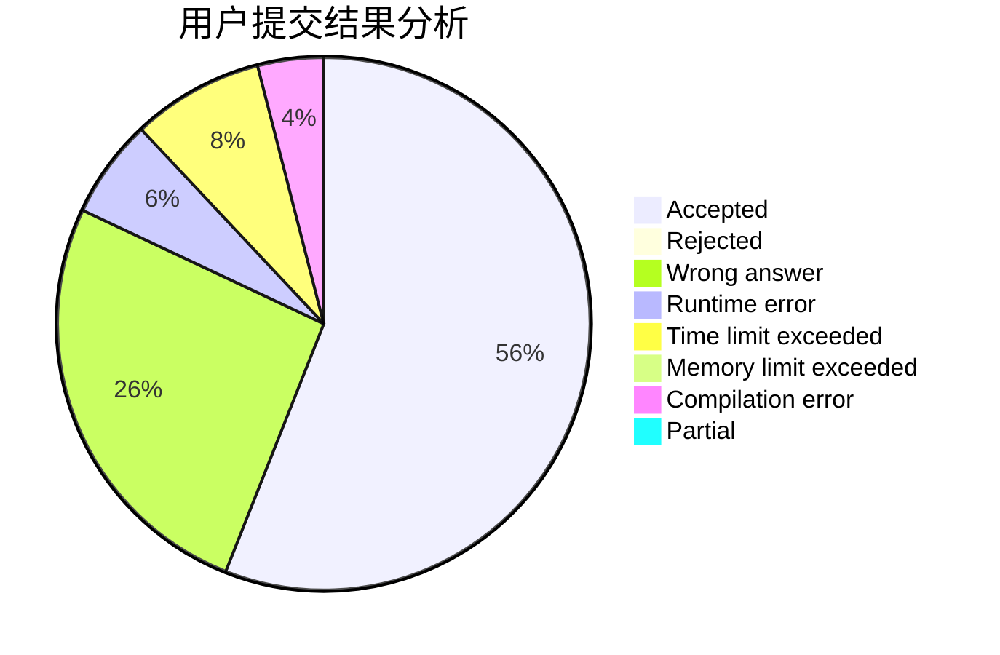
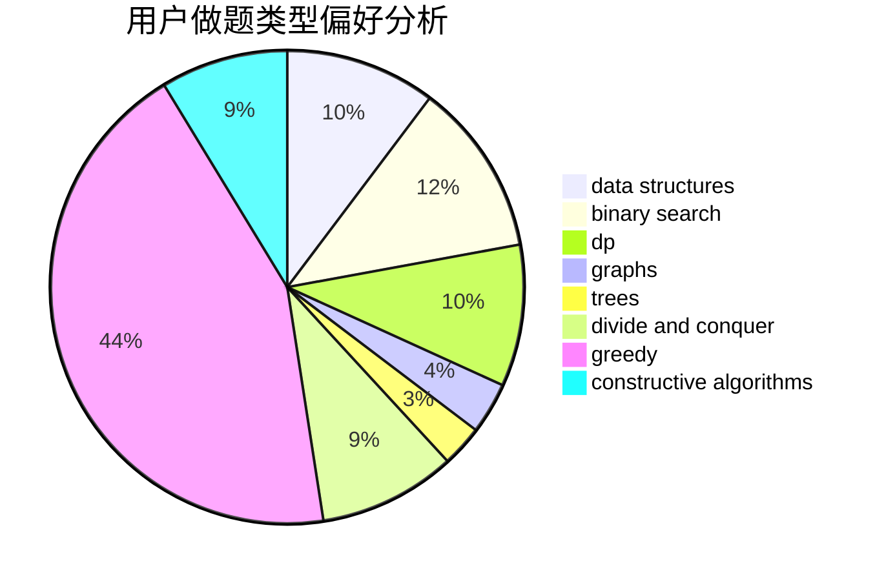
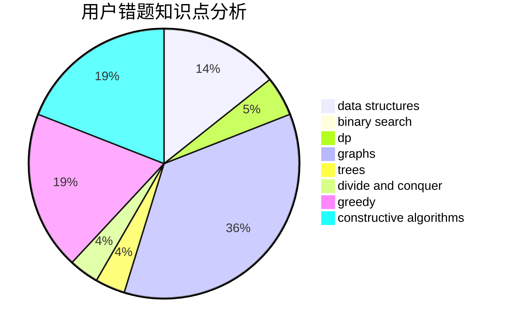

# FuruyaRei

<!-- tabs:start -->

#### **用户提交结果分析**

#### **用户做题类型偏好分析**

#### **用户错题知识点分析**

<!-- tabs:end -->
# 推荐题目
[849B](https://codeforces.com/contest/849/problem/B)		brute force,
                        geometry		  
[44E](https://codeforces.com/contest/44/problem/E)		dp		  
[662D](https://codeforces.com/contest/662/problem/D)		constructive algorithms,
                        greedy,
                        implementation,
                        math		  
[113D](https://codeforces.com/contest/113/problem/D)		math,
                        matrices,
                        probabilities		  
[10C](https://codeforces.com/contest/10/problem/C)		number theory		  
[1268E](https://codeforces.com/contest/1268/problem/E)		dp		  
[446C](https://codeforces.com/contest/446/problem/C)		data structures,
                        math,
                        number theory		  
[1047A](https://codeforces.com/contest/1047/problem/A)		math		  
[269B](https://codeforces.com/contest/269/problem/B)		dp		  
[329E](https://codeforces.com/contest/329/problem/E)		math		  
