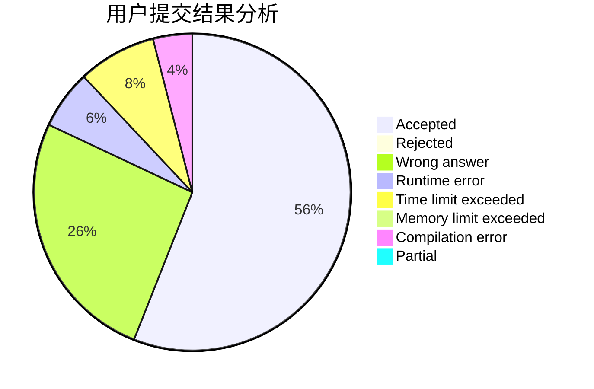
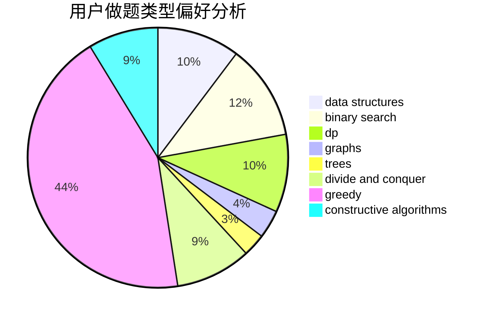
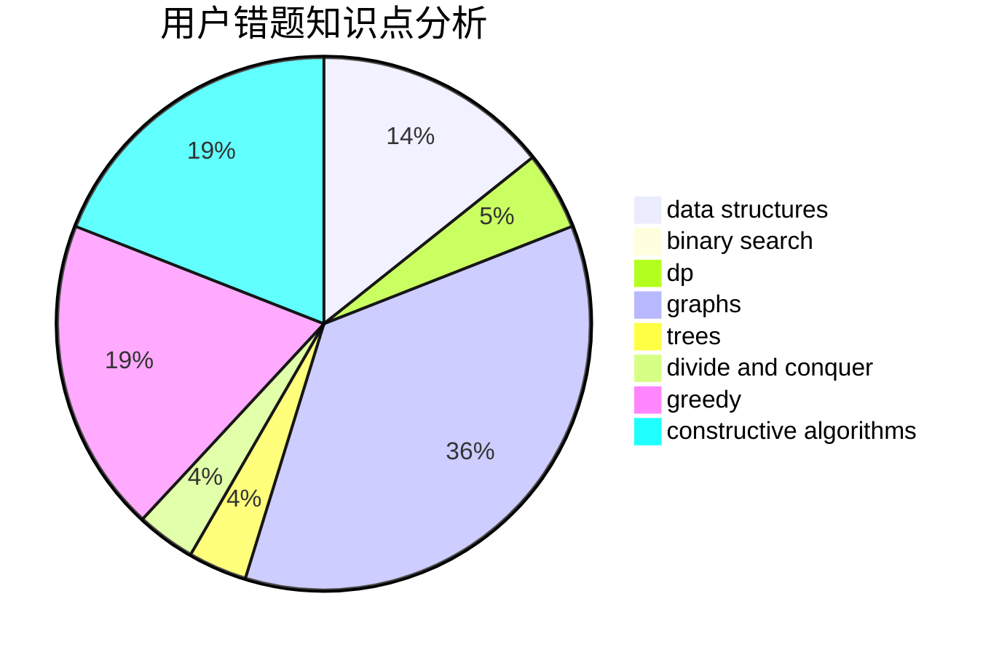

# FuruyaRei
<!-- tabs:start -->
#### **用户提交结果分析**

#### **用户做题类型偏好分析**

#### **用户错题知识点分析**

<!-- tabs:end -->
# 推荐题目
[Minimax Problem](http://codeforces.com/problemset/problem/1288/D)		binary search,
                        bitmasks,
                        dp		  
[DZY Loves Fibonacci Numbers](http://codeforces.com/problemset/problem/446/C)		data structures,
                        math,
                        number theory		  
[Anton and Letters](http://codeforces.com/problemset/problem/443/A)		constructive algorithms,
                        implementation		  
[Greenhouse Effect](http://codeforces.com/problemset/problem/269/B)		dp		  
[International Olympiad](http://codeforces.com/problemset/problem/662/D)		constructive algorithms,
                        greedy,
                        implementation,
                        math		  
[Isolation](http://codeforces.com/problemset/problem/1129/D)		data structures,
                        dp		  
[Digital Root](http://codeforces.com/problemset/problem/10/C)		number theory		  
[Bubble Cup hypothesis](https://codeforces.com/contest/1424/problem/I)		bitmasks,
                        constructive algorithms,
                        dp,
                        math		  
[Tell Your World](http://codeforces.com/problemset/problem/849/B)		brute force,
                        geometry		  
[Inna and Pink Pony](http://codeforces.com/problemset/problem/374/A)		greedy,
                        implementation		  
<!-- tabs:start -->
#### **data structures**
[DZY Loves Fibonacci Numbers](http://codeforces.com/problemset/problem/446/C)		data structures,
                        math,
                        number theory		  
[Isolation](http://codeforces.com/problemset/problem/1129/D)		data structures,
                        dp		  
[Wi-Fi](http://codeforces.com/problemset/problem/1216/F)		data structures,
                        dp,
                        greedy		  
[Kay and Snowflake](https://codeforces.com/contest/686/problem/D)		data structures,
                        dfs and similar,
                        dp,
                        trees		  
[Pashmak and Parmida's problem](http://codeforces.com/problemset/problem/459/D)		data structures,
                        divide and conquer,
                        sortings		  
[Bakery](http://codeforces.com/problemset/problem/1468/B)		data structures,
                        dsu		  
[Maximum Xor Secondary](http://codeforces.com/problemset/problem/280/B)		data structures,
                        implementation,
                        two pointers		  
[The Bakery](http://codeforces.com/problemset/problem/833/B)		binary search,
                        data structures,
                        divide and conquer,
                        dp,
                        two pointers		  
[Maximum width](http://codeforces.com/problemset/problem/1492/C)		binary search,
                        data structures,
                        dp,
                        greedy,
                        two pointers		  
[Old Floppy Drive](http://codeforces.com/problemset/problem/1490/G)		binary search,
                        data structures,
                        math		  
#### **binary search**
[Minimax Problem](http://codeforces.com/problemset/problem/1288/D)		binary search,
                        bitmasks,
                        dp		  
[Smile House](http://codeforces.com/problemset/problem/147/B)		binary search,
                        graphs,
                        matrices		  
[Rest In The Shades](http://codeforces.com/problemset/problem/1016/E)		binary search,
                        geometry		  
[The Hidden Pair (Hard Version)](http://codeforces.com/problemset/problem/1370/F2)		binary search,
                        dfs and similar,
                        graphs,
                        interactive,
                        shortest paths,
                        trees		  
[The Bakery](http://codeforces.com/problemset/problem/833/B)		binary search,
                        data structures,
                        divide and conquer,
                        dp,
                        two pointers		  
[Maximum width](http://codeforces.com/problemset/problem/1492/C)		binary search,
                        data structures,
                        dp,
                        greedy,
                        two pointers		  
[Pairs](http://codeforces.com/problemset/problem/1463/D)		binary search,
                        constructive algorithms,
                        greedy,
                        two pointers		  
[Old Floppy Drive](http://codeforces.com/problemset/problem/1490/G)		binary search,
                        data structures,
                        math		  
[Odd Mineral Resource](http://codeforces.com/problemset/problem/1479/D)		binary search,
                        bitmasks,
                        brute force,
                        data structures,
                        probabilities,
                        trees		  
[Complicated Computations](http://codeforces.com/problemset/problem/1436/E)		binary search,
                        data structures,
                        two pointers		  
#### **dp**
[Minimax Problem](http://codeforces.com/problemset/problem/1288/D)		binary search,
                        bitmasks,
                        dp		  
[Greenhouse Effect](http://codeforces.com/problemset/problem/269/B)		dp		  
[Isolation](http://codeforces.com/problemset/problem/1129/D)		data structures,
                        dp		  
[Bubble Cup hypothesis](https://codeforces.com/contest/1424/problem/I)		bitmasks,
                        constructive algorithms,
                        dp,
                        math		  
[Anfisa the Monkey](http://codeforces.com/problemset/problem/44/E)		dp		  
[Counting Rectangles is Fun](http://codeforces.com/problemset/problem/372/B)		brute force,
                        divide and conquer,
                        dp		  
[Wi-Fi](http://codeforces.com/problemset/problem/1216/F)		data structures,
                        dp,
                        greedy		  
[Kay and Snowflake](https://codeforces.com/contest/686/problem/D)		data structures,
                        dfs and similar,
                        dp,
                        trees		  
[Sweets Eating](http://codeforces.com/problemset/problem/1253/C)		dp,
                        greedy,
                        math,
                        sortings		  
[Happy Cactus](http://codeforces.com/problemset/problem/1268/E)		dp		  
#### **graph**
[Cover it!](http://codeforces.com/problemset/problem/1176/E)		dfs and similar,
                        dsu,
                        graphs,
                        shortest paths,
                        trees		  
[Smile House](http://codeforces.com/problemset/problem/147/B)		binary search,
                        graphs,
                        matrices		  
[Labyrinth](http://codeforces.com/problemset/problem/1063/B)		graphs,
                        shortest paths		  
[Little C Loves 3 II](https://codeforces.com/contest/1047/problem/D)		brute force,
                        constructive algorithms,
                        flows,
                        graph matchings		  
[George and Interesting Graph](http://codeforces.com/problemset/problem/387/D)		graph matchings		  
[The Hidden Pair (Hard Version)](http://codeforces.com/problemset/problem/1370/F2)		binary search,
                        dfs and similar,
                        graphs,
                        interactive,
                        shortest paths,
                        trees		  
[Minimum Ties](http://codeforces.com/problemset/problem/1487/C)		brute force,
                        constructive algorithms,
                        dfs and similar,
                        graphs,
                        greedy,
                        implementation,
                        math		  
[Chef Monocarp](http://codeforces.com/problemset/problem/1437/C)		dp,
                        flows,
                        graph matchings,
                        greedy,
                        math,
                        sortings		  
[Strange Housing](http://codeforces.com/problemset/problem/1470/D)		constructive algorithms,
                        dfs and similar,
                        graph matchings,
                        graphs,
                        greedy		  
[Longest Simple Cycle](http://codeforces.com/problemset/problem/1476/C)		dp,
                        graphs,
                        greedy		  
#### **trees**
[Cover it!](http://codeforces.com/problemset/problem/1176/E)		dfs and similar,
                        dsu,
                        graphs,
                        shortest paths,
                        trees		  
[Kay and Snowflake](https://codeforces.com/contest/686/problem/D)		data structures,
                        dfs and similar,
                        dp,
                        trees		  
[The Hidden Pair (Hard Version)](http://codeforces.com/problemset/problem/1370/F2)		binary search,
                        dfs and similar,
                        graphs,
                        interactive,
                        shortest paths,
                        trees		  
[Odd Mineral Resource](http://codeforces.com/problemset/problem/1479/D)		binary search,
                        bitmasks,
                        brute force,
                        data structures,
                        probabilities,
                        trees		  
[Yet Another Card Deck](http://codeforces.com/problemset/problem/1511/C)		brute force,
                        data structures,
                        implementation,
                        trees		  
[Diameter Cuts](http://codeforces.com/problemset/problem/1499/F)		combinatorics,
                        dfs and similar,
                        dp,
                        trees		  
[Fib-tree](http://codeforces.com/problemset/problem/1491/E)		brute force,
                        dfs and similar,
                        divide and conquer,
                        number theory,
                        trees		  
[13th Labour of Heracles](http://codeforces.com/problemset/problem/1466/D)		data structures,
                        greedy,
                        sortings,
                        trees		  
[BFS Trees](http://codeforces.com/problemset/problem/1495/D)		combinatorics,
                        dfs and similar,
                        graphs,
                        math,
                        shortest paths,
                        trees		  
[Sum of Prefix Sums](http://codeforces.com/problemset/problem/1303/G)		data structures,
                        divide and conquer,
                        geometry,
                        trees		  
#### **divide and conquer**
[Counting Rectangles is Fun](http://codeforces.com/problemset/problem/372/B)		brute force,
                        divide and conquer,
                        dp		  
[Pashmak and Parmida's problem](http://codeforces.com/problemset/problem/459/D)		data structures,
                        divide and conquer,
                        sortings		  
[The Bakery](http://codeforces.com/problemset/problem/833/B)		binary search,
                        data structures,
                        divide and conquer,
                        dp,
                        two pointers		  
[Divide and Summarize](http://codeforces.com/problemset/problem/1461/D)		binary search,
                        brute force,
                        data structures,
                        divide and conquer,
                        implementation,
                        sortings		  
[Song of the Sirens](http://codeforces.com/problemset/problem/1466/G)		combinatorics,
                        divide and conquer,
                        hashing,
                        math,
                        string suffix structures,
                        strings		  
[Permutation Transformation](http://codeforces.com/problemset/problem/1490/D)		dfs and similar,
                        divide and conquer,
                        implementation		  
[Skyline Photo](https://codeforces.com/contest/1483/problem/C)		data structures,
                        divide and conquer,
                        dp		  
[Fib-tree](http://codeforces.com/problemset/problem/1491/E)		brute force,
                        dfs and similar,
                        divide and conquer,
                        number theory,
                        trees		  
[Sum of Prefix Sums](http://codeforces.com/problemset/problem/1303/G)		data structures,
                        divide and conquer,
                        geometry,
                        trees		  
[Dogeforces](http://codeforces.com/problemset/problem/1494/D)		constructive algorithms,
                        data structures,
                        dfs and similar,
                        divide and conquer,
                        dsu,
                        greedy,
                        sortings,
                        trees		  
#### **greedy**
[International Olympiad](http://codeforces.com/problemset/problem/662/D)		constructive algorithms,
                        greedy,
                        implementation,
                        math		  
[Inna and Pink Pony](http://codeforces.com/problemset/problem/374/A)		greedy,
                        implementation		  
[Weird Game](http://codeforces.com/problemset/problem/293/A)		games,
                        greedy		  
[Wi-Fi](http://codeforces.com/problemset/problem/1216/F)		data structures,
                        dp,
                        greedy		  
[Sweets Eating](http://codeforces.com/problemset/problem/1253/C)		dp,
                        greedy,
                        math,
                        sortings		  
[Mislove Has Lost an Array](http://codeforces.com/problemset/problem/1204/B)		greedy,
                        math		  
[Battle Lemmings](http://codeforces.com/problemset/problem/1420/E)		dp,
                        greedy		  
[Maximum width](http://codeforces.com/problemset/problem/1492/C)		binary search,
                        data structures,
                        dp,
                        greedy,
                        two pointers		  
[Diamond Miner](https://codeforces.com/contest/1496/problem/C)		geometry,
                        greedy,
                        math,
                        sortings		  
[Anti-knapsack](http://codeforces.com/problemset/problem/1493/A)		constructive algorithms,
                        greedy		  
#### **constructive algorithms**
[Anton and Letters](http://codeforces.com/problemset/problem/443/A)		constructive algorithms,
                        implementation		  
[International Olympiad](http://codeforces.com/problemset/problem/662/D)		constructive algorithms,
                        greedy,
                        implementation,
                        math		  
[Bubble Cup hypothesis](https://codeforces.com/contest/1424/problem/I)		bitmasks,
                        constructive algorithms,
                        dp,
                        math		  
[Oranges and Apples](http://codeforces.com/problemset/problem/23/C)		constructive algorithms,
                        sortings		  
[Odd Federalization](http://codeforces.com/problemset/problem/1070/L)		constructive algorithms		  
[Little C Loves 3 II](https://codeforces.com/contest/1047/problem/D)		brute force,
                        constructive algorithms,
                        flows,
                        graph matchings		  
[Farewell Party](http://codeforces.com/problemset/problem/1081/B)		constructive algorithms,
                        implementation		  
[Permutation Forgery](http://codeforces.com/problemset/problem/1405/A)		constructive algorithms		  
[Anti-knapsack](http://codeforces.com/problemset/problem/1493/A)		constructive algorithms,
                        greedy		  
[Pairs](http://codeforces.com/problemset/problem/1463/D)		binary search,
                        constructive algorithms,
                        greedy,
                        two pointers		  
#### **sortings**
[Oranges and Apples](http://codeforces.com/problemset/problem/23/C)		constructive algorithms,
                        sortings		  
[Pashmak and Parmida's problem](http://codeforces.com/problemset/problem/459/D)		data structures,
                        divide and conquer,
                        sortings		  
[Sweets Eating](http://codeforces.com/problemset/problem/1253/C)		dp,
                        greedy,
                        math,
                        sortings		  
[Diamond Miner](https://codeforces.com/contest/1496/problem/C)		geometry,
                        greedy,
                        math,
                        sortings		  
[Meximization](http://codeforces.com/problemset/problem/1497/A)		brute force,
                        data structures,
                        greedy,
                        sortings		  
[Avoiding Zero](http://codeforces.com/problemset/problem/1427/A)		math,
                        sortings		  
[Divide and Summarize](http://codeforces.com/problemset/problem/1461/D)		binary search,
                        brute force,
                        data structures,
                        divide and conquer,
                        implementation,
                        sortings		  
[Chef Monocarp](http://codeforces.com/problemset/problem/1437/C)		dp,
                        flows,
                        graph matchings,
                        greedy,
                        math,
                        sortings		  
[Replacing Elements](http://codeforces.com/problemset/problem/1473/A)		greedy,
                        implementation,
                        math,
                        sortings		  
[Eastern Exhibition](http://codeforces.com/problemset/problem/1486/B)		binary search,
                        geometry,
                        shortest paths,
                        sortings		  
<!-- tabs:end -->
