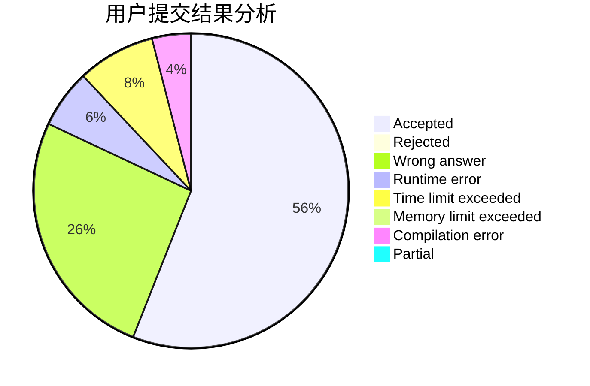
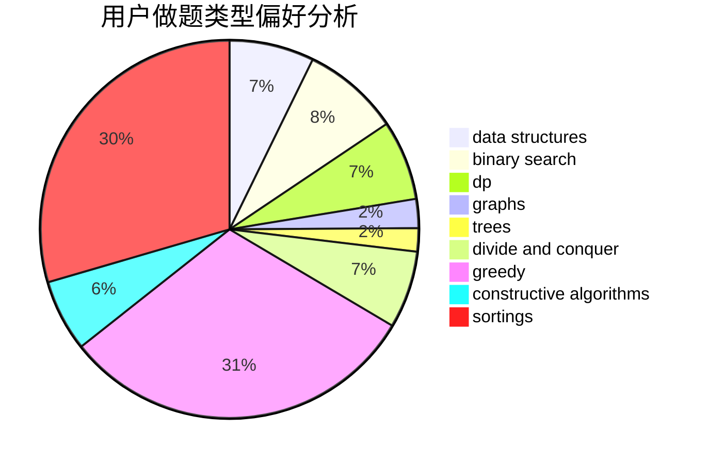
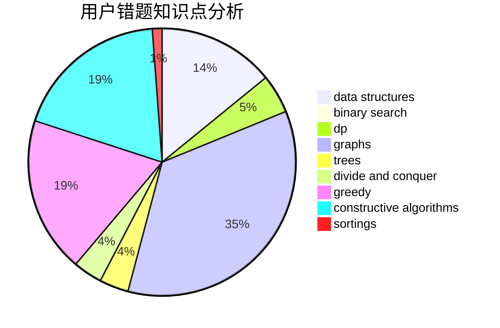

# FuruyaRei
<!-- tabs:start -->
#### **用户提交结果分析**

#### **用户做题类型偏好分析**

#### **用户错题知识点分析**

<!-- tabs:end -->
# 推荐题目
[1288D](http://codeforces.com/problemset/problem/1288/D)		binary search,
                        bitmasks,
                        dp		  
[446C](http://codeforces.com/problemset/problem/446/C)		data structures,
                        math,
                        number theory		  
[443A](http://codeforces.com/problemset/problem/443/A)		constructive algorithms,
                        implementation		  
[269B](http://codeforces.com/problemset/problem/269/B)		dp		  
[662D](http://codeforces.com/problemset/problem/662/D)		constructive algorithms,
                        greedy,
                        implementation,
                        math		  
[1129D](http://codeforces.com/problemset/problem/1129/D)		data structures,
                        dp		  
[10C](http://codeforces.com/problemset/problem/10/C)		number theory		  
[1424I](https://codeforces.com/contest/1424/problem/I)		bitmasks,
                        constructive algorithms,
                        dp,
                        math		  
[849B](http://codeforces.com/problemset/problem/849/B)		brute force,
                        geometry		  
[374A](http://codeforces.com/problemset/problem/374/A)		greedy,
                        implementation		  
<!-- tabs:start -->
#### **data structures**
[446C](http://codeforces.com/problemset/problem/446/C)		data structures,
                        math,
                        number theory		  
[1129D](http://codeforces.com/problemset/problem/1129/D)		data structures,
                        dp		  
[1216F](http://codeforces.com/problemset/problem/1216/F)		data structures,
                        dp,
                        greedy		  
[686D](https://codeforces.com/contest/686/problem/D)		data structures,
                        dfs and similar,
                        dp,
                        trees		  
[459D](http://codeforces.com/problemset/problem/459/D)		data structures,
                        divide and conquer,
                        sortings		  
[1468B](http://codeforces.com/problemset/problem/1468/B)		data structures,
                        dsu		  
[280B](http://codeforces.com/problemset/problem/280/B)		data structures,
                        implementation,
                        two pointers		  
[833B](http://codeforces.com/problemset/problem/833/B)		binary search,
                        data structures,
                        divide and conquer,
                        dp,
                        two pointers		  
[1492C](http://codeforces.com/problemset/problem/1492/C)		binary search,
                        data structures,
                        dp,
                        greedy,
                        two pointers		  
[1490G](http://codeforces.com/problemset/problem/1490/G)		binary search,
                        data structures,
                        math		  
#### **binary search**
[1288D](http://codeforces.com/problemset/problem/1288/D)		binary search,
                        bitmasks,
                        dp		  
[147B](http://codeforces.com/problemset/problem/147/B)		binary search,
                        graphs,
                        matrices		  
[1016E](http://codeforces.com/problemset/problem/1016/E)		binary search,
                        geometry		  
[1370F2](http://codeforces.com/problemset/problem/1370/F2)		binary search,
                        dfs and similar,
                        graphs,
                        interactive,
                        shortest paths,
                        trees		  
[833B](http://codeforces.com/problemset/problem/833/B)		binary search,
                        data structures,
                        divide and conquer,
                        dp,
                        two pointers		  
[1492C](http://codeforces.com/problemset/problem/1492/C)		binary search,
                        data structures,
                        dp,
                        greedy,
                        two pointers		  
[1463D](http://codeforces.com/problemset/problem/1463/D)		binary search,
                        constructive algorithms,
                        greedy,
                        two pointers		  
[1490G](http://codeforces.com/problemset/problem/1490/G)		binary search,
                        data structures,
                        math		  
[1479D](http://codeforces.com/problemset/problem/1479/D)		binary search,
                        bitmasks,
                        brute force,
                        data structures,
                        probabilities,
                        trees		  
[1436E](http://codeforces.com/problemset/problem/1436/E)		binary search,
                        data structures,
                        two pointers		  
#### **dp**
[1288D](http://codeforces.com/problemset/problem/1288/D)		binary search,
                        bitmasks,
                        dp		  
[269B](http://codeforces.com/problemset/problem/269/B)		dp		  
[1129D](http://codeforces.com/problemset/problem/1129/D)		data structures,
                        dp		  
[1424I](https://codeforces.com/contest/1424/problem/I)		bitmasks,
                        constructive algorithms,
                        dp,
                        math		  
[44E](http://codeforces.com/problemset/problem/44/E)		dp		  
[372B](http://codeforces.com/problemset/problem/372/B)		brute force,
                        divide and conquer,
                        dp		  
[1216F](http://codeforces.com/problemset/problem/1216/F)		data structures,
                        dp,
                        greedy		  
[686D](https://codeforces.com/contest/686/problem/D)		data structures,
                        dfs and similar,
                        dp,
                        trees		  
[1253C](http://codeforces.com/problemset/problem/1253/C)		dp,
                        greedy,
                        math,
                        sortings		  
[1268E](http://codeforces.com/problemset/problem/1268/E)		dp		  
#### **graph**
[1176E](http://codeforces.com/problemset/problem/1176/E)		dfs and similar,
                        dsu,
                        graphs,
                        shortest paths,
                        trees		  
[147B](http://codeforces.com/problemset/problem/147/B)		binary search,
                        graphs,
                        matrices		  
[1063B](http://codeforces.com/problemset/problem/1063/B)		graphs,
                        shortest paths		  
[1047D](https://codeforces.com/contest/1047/problem/D)		brute force,
                        constructive algorithms,
                        flows,
                        graph matchings		  
[387D](http://codeforces.com/problemset/problem/387/D)		graph matchings		  
[1370F2](http://codeforces.com/problemset/problem/1370/F2)		binary search,
                        dfs and similar,
                        graphs,
                        interactive,
                        shortest paths,
                        trees		  
[1487C](http://codeforces.com/problemset/problem/1487/C)		brute force,
                        constructive algorithms,
                        dfs and similar,
                        graphs,
                        greedy,
                        implementation,
                        math		  
[1437C](http://codeforces.com/problemset/problem/1437/C)		dp,
                        flows,
                        graph matchings,
                        greedy,
                        math,
                        sortings		  
[1470D](http://codeforces.com/problemset/problem/1470/D)		constructive algorithms,
                        dfs and similar,
                        graph matchings,
                        graphs,
                        greedy		  
[1476C](http://codeforces.com/problemset/problem/1476/C)		dp,
                        graphs,
                        greedy		  
#### **trees**
[1176E](http://codeforces.com/problemset/problem/1176/E)		dfs and similar,
                        dsu,
                        graphs,
                        shortest paths,
                        trees		  
[686D](https://codeforces.com/contest/686/problem/D)		data structures,
                        dfs and similar,
                        dp,
                        trees		  
[1370F2](http://codeforces.com/problemset/problem/1370/F2)		binary search,
                        dfs and similar,
                        graphs,
                        interactive,
                        shortest paths,
                        trees		  
[1479D](http://codeforces.com/problemset/problem/1479/D)		binary search,
                        bitmasks,
                        brute force,
                        data structures,
                        probabilities,
                        trees		  
[1511C](http://codeforces.com/problemset/problem/1511/C)		brute force,
                        data structures,
                        implementation,
                        trees		  
[1499F](http://codeforces.com/problemset/problem/1499/F)		combinatorics,
                        dfs and similar,
                        dp,
                        trees		  
[1491E](http://codeforces.com/problemset/problem/1491/E)		brute force,
                        dfs and similar,
                        divide and conquer,
                        number theory,
                        trees		  
[1466D](http://codeforces.com/problemset/problem/1466/D)		data structures,
                        greedy,
                        sortings,
                        trees		  
[1495D](http://codeforces.com/problemset/problem/1495/D)		combinatorics,
                        dfs and similar,
                        graphs,
                        math,
                        shortest paths,
                        trees		  
[1303G](http://codeforces.com/problemset/problem/1303/G)		data structures,
                        divide and conquer,
                        geometry,
                        trees		  
#### **divide and conquer**
[372B](http://codeforces.com/problemset/problem/372/B)		brute force,
                        divide and conquer,
                        dp		  
[459D](http://codeforces.com/problemset/problem/459/D)		data structures,
                        divide and conquer,
                        sortings		  
[833B](http://codeforces.com/problemset/problem/833/B)		binary search,
                        data structures,
                        divide and conquer,
                        dp,
                        two pointers		  
[1461D](http://codeforces.com/problemset/problem/1461/D)		binary search,
                        brute force,
                        data structures,
                        divide and conquer,
                        implementation,
                        sortings		  
[1466G](http://codeforces.com/problemset/problem/1466/G)		combinatorics,
                        divide and conquer,
                        hashing,
                        math,
                        string suffix structures,
                        strings		  
[1490D](http://codeforces.com/problemset/problem/1490/D)		dfs and similar,
                        divide and conquer,
                        implementation		  
[1483C](https://codeforces.com/contest/1483/problem/C)		data structures,
                        divide and conquer,
                        dp		  
[1491E](http://codeforces.com/problemset/problem/1491/E)		brute force,
                        dfs and similar,
                        divide and conquer,
                        number theory,
                        trees		  
[1303G](http://codeforces.com/problemset/problem/1303/G)		data structures,
                        divide and conquer,
                        geometry,
                        trees		  
[1494D](http://codeforces.com/problemset/problem/1494/D)		constructive algorithms,
                        data structures,
                        dfs and similar,
                        divide and conquer,
                        dsu,
                        greedy,
                        sortings,
                        trees		  
#### **greedy**
[662D](http://codeforces.com/problemset/problem/662/D)		constructive algorithms,
                        greedy,
                        implementation,
                        math		  
[374A](http://codeforces.com/problemset/problem/374/A)		greedy,
                        implementation		  
[293A](http://codeforces.com/problemset/problem/293/A)		games,
                        greedy		  
[1216F](http://codeforces.com/problemset/problem/1216/F)		data structures,
                        dp,
                        greedy		  
[1253C](http://codeforces.com/problemset/problem/1253/C)		dp,
                        greedy,
                        math,
                        sortings		  
[1204B](http://codeforces.com/problemset/problem/1204/B)		greedy,
                        math		  
[1420E](http://codeforces.com/problemset/problem/1420/E)		dp,
                        greedy		  
[1492C](http://codeforces.com/problemset/problem/1492/C)		binary search,
                        data structures,
                        dp,
                        greedy,
                        two pointers		  
[1496C](https://codeforces.com/contest/1496/problem/C)		geometry,
                        greedy,
                        math,
                        sortings		  
[1493A](http://codeforces.com/problemset/problem/1493/A)		constructive algorithms,
                        greedy		  
#### **constructive algorithms**
[443A](http://codeforces.com/problemset/problem/443/A)		constructive algorithms,
                        implementation		  
[662D](http://codeforces.com/problemset/problem/662/D)		constructive algorithms,
                        greedy,
                        implementation,
                        math		  
[1424I](https://codeforces.com/contest/1424/problem/I)		bitmasks,
                        constructive algorithms,
                        dp,
                        math		  
[23C](http://codeforces.com/problemset/problem/23/C)		constructive algorithms,
                        sortings		  
[1070L](http://codeforces.com/problemset/problem/1070/L)		constructive algorithms		  
[1047D](https://codeforces.com/contest/1047/problem/D)		brute force,
                        constructive algorithms,
                        flows,
                        graph matchings		  
[1081B](http://codeforces.com/problemset/problem/1081/B)		constructive algorithms,
                        implementation		  
[1405A](http://codeforces.com/problemset/problem/1405/A)		constructive algorithms		  
[1493A](http://codeforces.com/problemset/problem/1493/A)		constructive algorithms,
                        greedy		  
[1463D](http://codeforces.com/problemset/problem/1463/D)		binary search,
                        constructive algorithms,
                        greedy,
                        two pointers		  
#### **sortings**
[23C](http://codeforces.com/problemset/problem/23/C)		constructive algorithms,
                        sortings		  
[459D](http://codeforces.com/problemset/problem/459/D)		data structures,
                        divide and conquer,
                        sortings		  
[1253C](http://codeforces.com/problemset/problem/1253/C)		dp,
                        greedy,
                        math,
                        sortings		  
[1496C](https://codeforces.com/contest/1496/problem/C)		geometry,
                        greedy,
                        math,
                        sortings		  
[1495A](http://codeforces.com/problemset/problem/1495/A)		geometry,
                        greedy,
                        math,
                        sortings		  
[1497A](http://codeforces.com/problemset/problem/1497/A)		brute force,
                        data structures,
                        greedy,
                        sortings		  
[1427A](http://codeforces.com/problemset/problem/1427/A)		math,
                        sortings		  
[1461D](http://codeforces.com/problemset/problem/1461/D)		binary search,
                        brute force,
                        data structures,
                        divide and conquer,
                        implementation,
                        sortings		  
[1437C](http://codeforces.com/problemset/problem/1437/C)		dp,
                        flows,
                        graph matchings,
                        greedy,
                        math,
                        sortings		  
[1473A](http://codeforces.com/problemset/problem/1473/A)		greedy,
                        implementation,
                        math,
                        sortings		  
<!-- tabs:end -->
