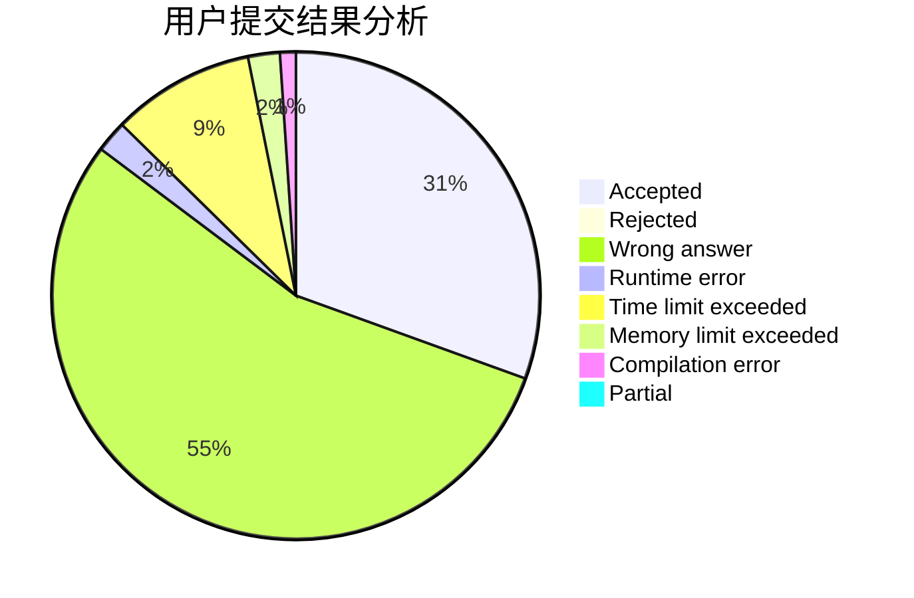
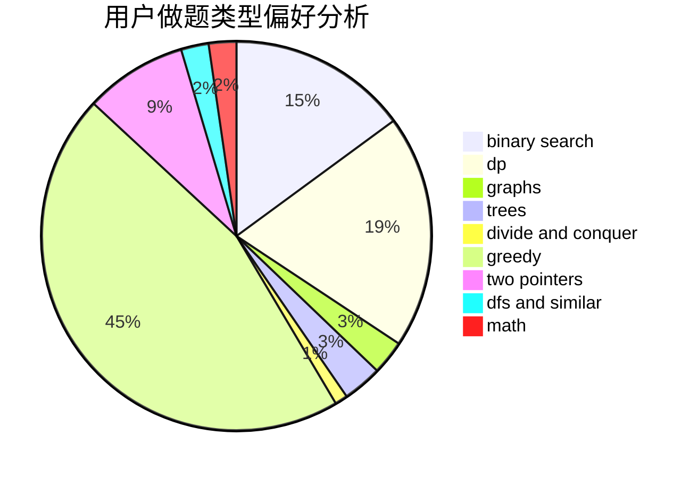

# Fuyuki

<!-- tabs:start -->

#### **用户提交结果分析**

#### **用户做题类型偏好分析**

<!-- tabs:end -->
# 推荐题目
[1480B](https://codeforces.com/contest/1480/problem/B)
[1486B](https://codeforces.com/contest/1486/problem/B)
[1070H](https://codeforces.com/contest/1070/problem/H)
[794G](https://codeforces.com/contest/794/problem/G)
[1093B](https://codeforces.com/contest/1093/problem/B)
[3D](https://codeforces.com/contest/3/problem/D)
[314C](https://codeforces.com/contest/314/problem/C)
[246B](https://codeforces.com/contest/246/problem/B)
[11082](https://codeforces.com/contest/1108/problem/2)
[766D](https://codeforces.com/contest/766/problem/D)
