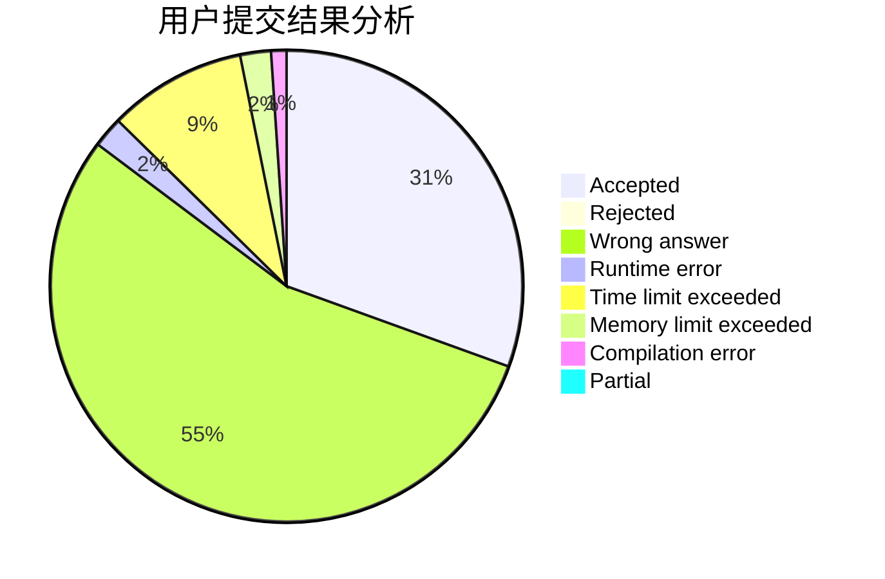
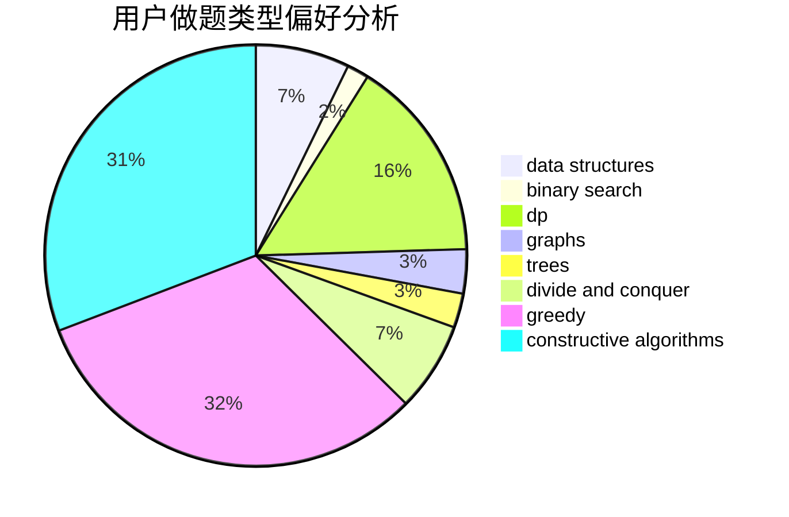
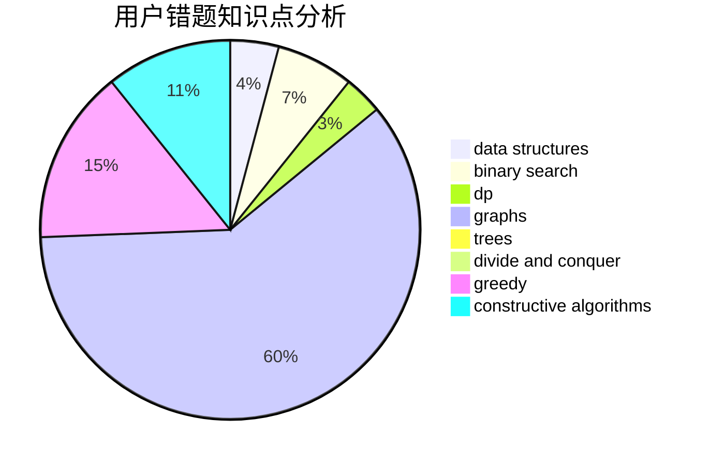

# Fuyuki

<!-- tabs:start -->

#### **用户提交结果分析**

#### **用户做题类型偏好分析**

#### **用户错题知识点分析**

<!-- tabs:end -->
# 推荐题目
[1472B](https://codeforces.com/contest/1472/problem/B)		dp,
                        greedy,
                        math		  
[1477E](https://codeforces.com/contest/1477/problem/E)		data structures,
                        greedy		  
[1070E](https://codeforces.com/contest/1070/problem/E)		binary search,
                        data structures		  
[777A](https://codeforces.com/contest/777/problem/A)		constructive algorithms,
                        implementation,
                        math		  
[1092E](https://codeforces.com/contest/1092/problem/E)		constructive algorithms,
                        dfs and similar,
                        greedy,
                        trees		  
[370B](https://codeforces.com/contest/370/problem/B)		implementation		  
[297D](https://codeforces.com/contest/297/problem/D)		constructive algorithms		  
[227A](https://codeforces.com/contest/227/problem/A)		geometry		  
[1107E](https://codeforces.com/contest/1107/problem/E)		dp		  
[747A](https://codeforces.com/contest/747/problem/A)		brute force,
                        math		  
