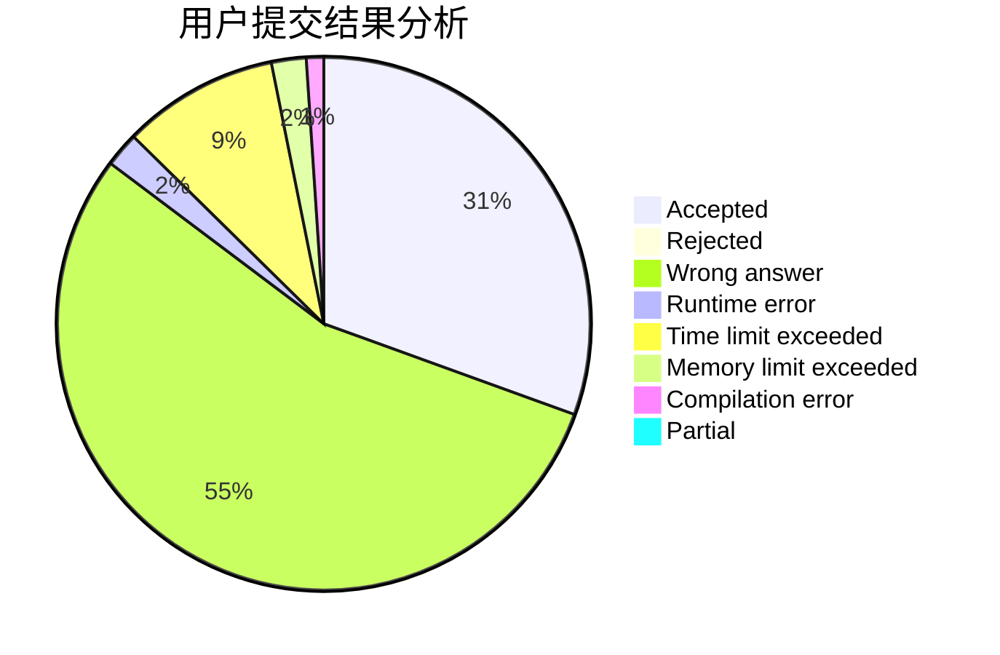
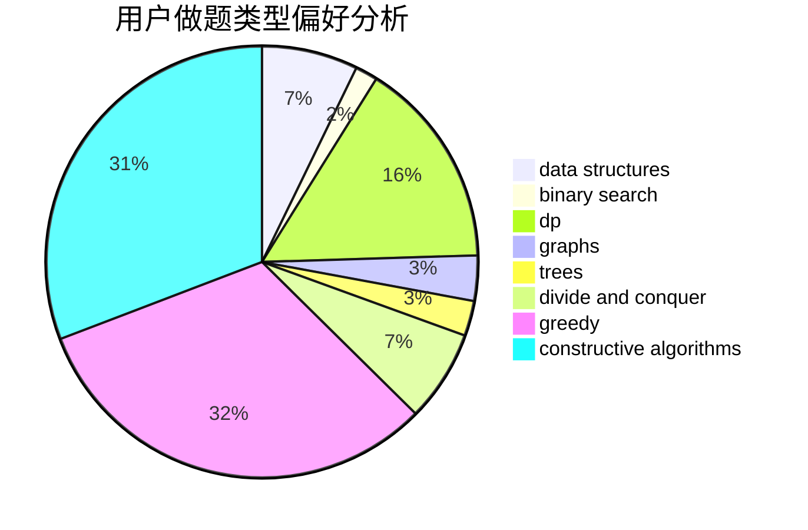
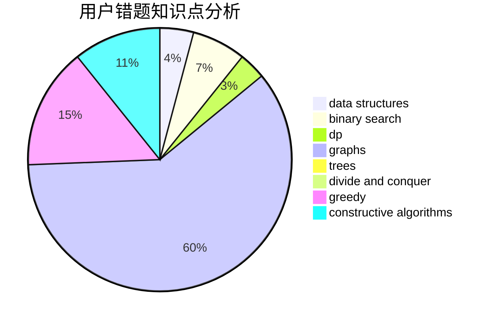

# Fuyuki
<!-- tabs:start -->
#### **用户提交结果分析**

#### **用户做题类型偏好分析**

#### **用户错题知识点分析**

<!-- tabs:end -->
# 推荐题目
[Flip the Cards](http://codeforces.com/problemset/problem/1503/D)		2-sat,
                        constructive algorithms,
                        data structures,
                        greedy,
                        sortings,
                        two pointers		  
[Required Remainder](http://codeforces.com/problemset/problem/1374/A)		math		  
[Tetris revisited](http://codeforces.com/problemset/problem/86/B)		constructive algorithms,
                        graph matchings,
                        greedy,
                        math		  
[Shell Game](http://codeforces.com/problemset/problem/777/A)		constructive algorithms,
                        implementation,
                        math		  
[Getting Deals Done](http://codeforces.com/problemset/problem/1070/E)		binary search,
                        data structures		  
[Evil](http://codeforces.com/problemset/problem/329/E)		math		  
[Substrings Sort](https://codeforces.com/contest/1489/problem/D)		sortings,
                        strings		  
[Minimal Diameter Forest](http://codeforces.com/problemset/problem/1092/E)		constructive algorithms,
                        dfs and similar,
                        greedy,
                        trees		  
[Where do I Turn?](http://codeforces.com/problemset/problem/227/A)		geometry		  
[Ilya and Two Numbers](http://codeforces.com/problemset/problem/313/E)		constructive algorithms,
                        data structures,
                        dsu,
                        greedy		  
<!-- tabs:start -->
#### **data structures**
[Flip the Cards](http://codeforces.com/problemset/problem/1503/D)		2-sat,
                        constructive algorithms,
                        data structures,
                        greedy,
                        sortings,
                        two pointers		  
[Required Remainder](http://codeforces.com/problemset/problem/1070/E)		binary search,
                        data structures		  
[Tetris revisited](http://codeforces.com/problemset/problem/313/E)		constructive algorithms,
                        data structures,
                        dsu,
                        greedy		  
[Shell Game](http://codeforces.com/problemset/problem/869/E)		data structures,
                        hashing		  
[Getting Deals Done](http://codeforces.com/problemset/problem/641/E)		data structures		  
[Evil](http://codeforces.com/problemset/problem/29/C)		data structures,
                        dfs and similar,
                        graphs,
                        implementation		  
[Substrings Sort](http://codeforces.com/problemset/problem/1290/E)		data structures		  
[Minimal Diameter Forest](http://codeforces.com/problemset/problem/817/F)		binary search,
                        data structures,
                        trees		  
[Where do I Turn?](http://codeforces.com/problemset/problem/862/E)		binary search,
                        data structures,
                        sortings		  
[Ilya and Two Numbers](http://codeforces.com/problemset/problem/1477/E)		data structures,
                        greedy		  
#### **binary search**
[Flip the Cards](http://codeforces.com/problemset/problem/1070/E)		binary search,
                        data structures		  
[Required Remainder](http://codeforces.com/problemset/problem/360/B)		binary search,
                        dp		  
[Tetris revisited](http://codeforces.com/problemset/problem/444/D)		binary search,
                        hashing,
                        strings,
                        two pointers		  
[Shell Game](http://codeforces.com/problemset/problem/817/F)		binary search,
                        data structures,
                        trees		  
[Getting Deals Done](http://codeforces.com/problemset/problem/862/E)		binary search,
                        data structures,
                        sortings		  
[Evil](http://codeforces.com/problemset/problem/1486/C2)		binary search,
                        interactive		  
[Substrings Sort](http://codeforces.com/problemset/problem/1279/B)		binary search,
                        brute force,
                        implementation		  
[Minimal Diameter Forest](http://codeforces.com/problemset/problem/1453/E)		binary search,
                        dfs and similar,
                        dp,
                        greedy,
                        trees		  
[Where do I Turn?](http://codeforces.com/problemset/problem/1492/C)		binary search,
                        data structures,
                        dp,
                        greedy,
                        two pointers		  
[Ilya and Two Numbers](http://codeforces.com/problemset/problem/1463/D)		binary search,
                        constructive algorithms,
                        greedy,
                        two pointers		  
#### **dp**
[Flip the Cards](http://codeforces.com/problemset/problem/869/C)		combinatorics,
                        dp,
                        math		  
[Required Remainder](http://codeforces.com/problemset/problem/238/E)		dp,
                        graphs,
                        shortest paths		  
[Tetris revisited](http://codeforces.com/problemset/problem/1107/E)		dp		  
[Shell Game](http://codeforces.com/problemset/problem/360/B)		binary search,
                        dp		  
[Getting Deals Done](http://codeforces.com/problemset/problem/1146/G)		dp,
                        flows,
                        graphs		  
[Evil](http://codeforces.com/problemset/problem/1032/F)		dp,
                        trees		  
[Substrings Sort](http://codeforces.com/problemset/problem/86/C)		dp,
                        string suffix structures,
                        trees		  
[Minimal Diameter Forest](http://codeforces.com/problemset/problem/1472/B)		dp,
                        greedy,
                        math		  
[Where do I Turn?](http://codeforces.com/problemset/problem/235/B)		dp,
                        math,
                        probabilities		  
[Ilya and Two Numbers](http://codeforces.com/problemset/problem/1453/E)		binary search,
                        dfs and similar,
                        dp,
                        greedy,
                        trees		  
#### **graph**
[Flip the Cards](http://codeforces.com/problemset/problem/86/B)		constructive algorithms,
                        graph matchings,
                        greedy,
                        math		  
[Required Remainder](http://codeforces.com/problemset/problem/869/D)		brute force,
                        dfs and similar,
                        graphs		  
[Tetris revisited](http://codeforces.com/problemset/problem/238/E)		dp,
                        graphs,
                        shortest paths		  
[Shell Game](https://codeforces.com/contest/1345/problem/D)		constructive algorithms,
                        dfs and similar,
                        dsu,
                        graphs		  
[Getting Deals Done](http://codeforces.com/problemset/problem/1146/G)		dp,
                        flows,
                        graphs		  
[Evil](http://codeforces.com/problemset/problem/29/C)		data structures,
                        dfs and similar,
                        graphs,
                        implementation		  
[Substrings Sort](http://codeforces.com/problemset/problem/788/C)		dfs and similar,
                        graphs,
                        shortest paths		  
[Minimal Diameter Forest](http://codeforces.com/problemset/problem/1242/B)		dfs and similar,
                        dsu,
                        graphs,
                        sortings		  
[Where do I Turn?](http://codeforces.com/problemset/problem/1487/C)		brute force,
                        constructive algorithms,
                        dfs and similar,
                        graphs,
                        greedy,
                        implementation,
                        math		  
[Ilya and Two Numbers](http://codeforces.com/problemset/problem/1437/C)		dp,
                        flows,
                        graph matchings,
                        greedy,
                        math,
                        sortings		  
#### **trees**
[Flip the Cards](http://codeforces.com/problemset/problem/1092/E)		constructive algorithms,
                        dfs and similar,
                        greedy,
                        trees		  
[Required Remainder](https://codeforces.com/contest/1086/problem/B)		constructive algorithms,
                        implementation,
                        trees		  
[Tetris revisited](http://codeforces.com/problemset/problem/1032/F)		dp,
                        trees		  
[Shell Game](http://codeforces.com/problemset/problem/86/C)		dp,
                        string suffix structures,
                        trees		  
[Getting Deals Done](http://codeforces.com/problemset/problem/817/F)		binary search,
                        data structures,
                        trees		  
[Evil](http://codeforces.com/problemset/problem/1453/E)		binary search,
                        dfs and similar,
                        dp,
                        greedy,
                        trees		  
[Substrings Sort](http://codeforces.com/problemset/problem/1479/D)		binary search,
                        bitmasks,
                        brute force,
                        data structures,
                        probabilities,
                        trees		  
[Minimal Diameter Forest](http://codeforces.com/problemset/problem/1511/C)		brute force,
                        data structures,
                        implementation,
                        trees		  
[Where do I Turn?](http://codeforces.com/problemset/problem/1499/F)		combinatorics,
                        dfs and similar,
                        dp,
                        trees		  
[Ilya and Two Numbers](http://codeforces.com/problemset/problem/1491/E)		brute force,
                        dfs and similar,
                        divide and conquer,
                        number theory,
                        trees		  
#### **divide and conquer**
[Flip the Cards](http://codeforces.com/problemset/problem/1461/D)		binary search,
                        brute force,
                        data structures,
                        divide and conquer,
                        implementation,
                        sortings		  
[Required Remainder](http://codeforces.com/problemset/problem/1466/G)		combinatorics,
                        divide and conquer,
                        hashing,
                        math,
                        string suffix structures,
                        strings		  
[Tetris revisited](http://codeforces.com/problemset/problem/1490/D)		dfs and similar,
                        divide and conquer,
                        implementation		  
[Shell Game](https://codeforces.com/contest/1483/problem/C)		data structures,
                        divide and conquer,
                        dp		  
[Getting Deals Done](http://codeforces.com/problemset/problem/1491/E)		brute force,
                        dfs and similar,
                        divide and conquer,
                        number theory,
                        trees		  
[Evil](http://codeforces.com/problemset/problem/1303/G)		data structures,
                        divide and conquer,
                        geometry,
                        trees		  
[Substrings Sort](http://codeforces.com/problemset/problem/1494/D)		constructive algorithms,
                        data structures,
                        dfs and similar,
                        divide and conquer,
                        dsu,
                        greedy,
                        sortings,
                        trees		  
[Minimal Diameter Forest](http://codeforces.com/problemset/problem/1482/E)		data structures,
                        divide and conquer,
                        dp		  
[Where do I Turn?](http://codeforces.com/problemset/problem/566/C)		dfs and similar,
                        divide and conquer,
                        trees		  
[Ilya and Two Numbers](http://codeforces.com/problemset/problem/1428/F)		binary search,
                        data structures,
                        divide and conquer,
                        dp,
                        two pointers		  
#### **greedy**
[Flip the Cards](http://codeforces.com/problemset/problem/1503/D)		2-sat,
                        constructive algorithms,
                        data structures,
                        greedy,
                        sortings,
                        two pointers		  
[Required Remainder](http://codeforces.com/problemset/problem/86/B)		constructive algorithms,
                        graph matchings,
                        greedy,
                        math		  
[Tetris revisited](http://codeforces.com/problemset/problem/1092/E)		constructive algorithms,
                        dfs and similar,
                        greedy,
                        trees		  
[Shell Game](http://codeforces.com/problemset/problem/313/E)		constructive algorithms,
                        data structures,
                        dsu,
                        greedy		  
[Getting Deals Done](http://codeforces.com/problemset/problem/478/B)		combinatorics,
                        constructive algorithms,
                        greedy,
                        math		  
[Evil](http://codeforces.com/problemset/problem/1062/B)		greedy,
                        math,
                        number theory		  
[Substrings Sort](https://codeforces.com/contest/443/problem/D)		greedy,
                        math,
                        probabilities		  
[Minimal Diameter Forest](http://codeforces.com/problemset/problem/1060/B)		greedy		  
[Where do I Turn?](http://codeforces.com/problemset/problem/1472/B)		dp,
                        greedy,
                        math		  
[Ilya and Two Numbers](http://codeforces.com/problemset/problem/1453/E)		binary search,
                        dfs and similar,
                        dp,
                        greedy,
                        trees		  
#### **constructive algorithms**
[Flip the Cards](http://codeforces.com/problemset/problem/1503/D)		2-sat,
                        constructive algorithms,
                        data structures,
                        greedy,
                        sortings,
                        two pointers		  
[Required Remainder](http://codeforces.com/problemset/problem/86/B)		constructive algorithms,
                        graph matchings,
                        greedy,
                        math		  
[Tetris revisited](http://codeforces.com/problemset/problem/777/A)		constructive algorithms,
                        implementation,
                        math		  
[Shell Game](http://codeforces.com/problemset/problem/1092/E)		constructive algorithms,
                        dfs and similar,
                        greedy,
                        trees		  
[Getting Deals Done](http://codeforces.com/problemset/problem/313/E)		constructive algorithms,
                        data structures,
                        dsu,
                        greedy		  
[Evil](http://codeforces.com/problemset/problem/297/D)		constructive algorithms		  
[Substrings Sort](http://codeforces.com/problemset/problem/478/B)		combinatorics,
                        constructive algorithms,
                        greedy,
                        math		  
[Minimal Diameter Forest](https://codeforces.com/contest/1086/problem/B)		constructive algorithms,
                        implementation,
                        trees		  
[Where do I Turn?](http://codeforces.com/problemset/problem/286/A)		constructive algorithms,
                        math		  
[Ilya and Two Numbers](https://codeforces.com/contest/1345/problem/D)		constructive algorithms,
                        dfs and similar,
                        dsu,
                        graphs		  
#### **sortings**
[Flip the Cards](http://codeforces.com/problemset/problem/1503/D)		2-sat,
                        constructive algorithms,
                        data structures,
                        greedy,
                        sortings,
                        two pointers		  
[Required Remainder](https://codeforces.com/contest/1489/problem/D)		sortings,
                        strings		  
[Tetris revisited](http://codeforces.com/problemset/problem/1133/C)		sortings,
                        two pointers		  
[Shell Game](http://codeforces.com/problemset/problem/862/E)		binary search,
                        data structures,
                        sortings		  
[Getting Deals Done](http://codeforces.com/problemset/problem/1374/E1)		data structures,
                        greedy,
                        sortings		  
[Evil](http://codeforces.com/problemset/problem/1242/B)		dfs and similar,
                        dsu,
                        graphs,
                        sortings		  
[Substrings Sort](https://codeforces.com/contest/1496/problem/C)		geometry,
                        greedy,
                        math,
                        sortings		  
[Minimal Diameter Forest](http://codeforces.com/problemset/problem/1495/A)		geometry,
                        greedy,
                        math,
                        sortings		  
[Where do I Turn?](http://codeforces.com/problemset/problem/1497/A)		brute force,
                        data structures,
                        greedy,
                        sortings		  
[Ilya and Two Numbers](http://codeforces.com/problemset/problem/1427/A)		math,
                        sortings		  
<!-- tabs:end -->
