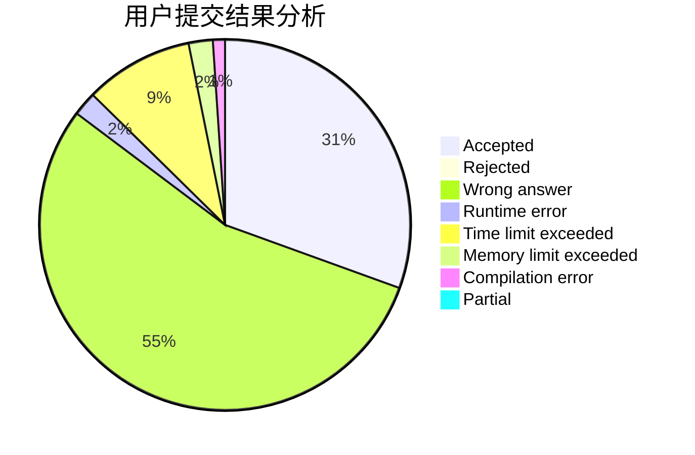
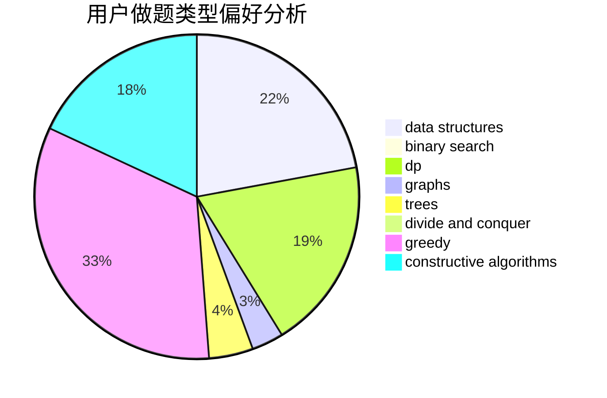
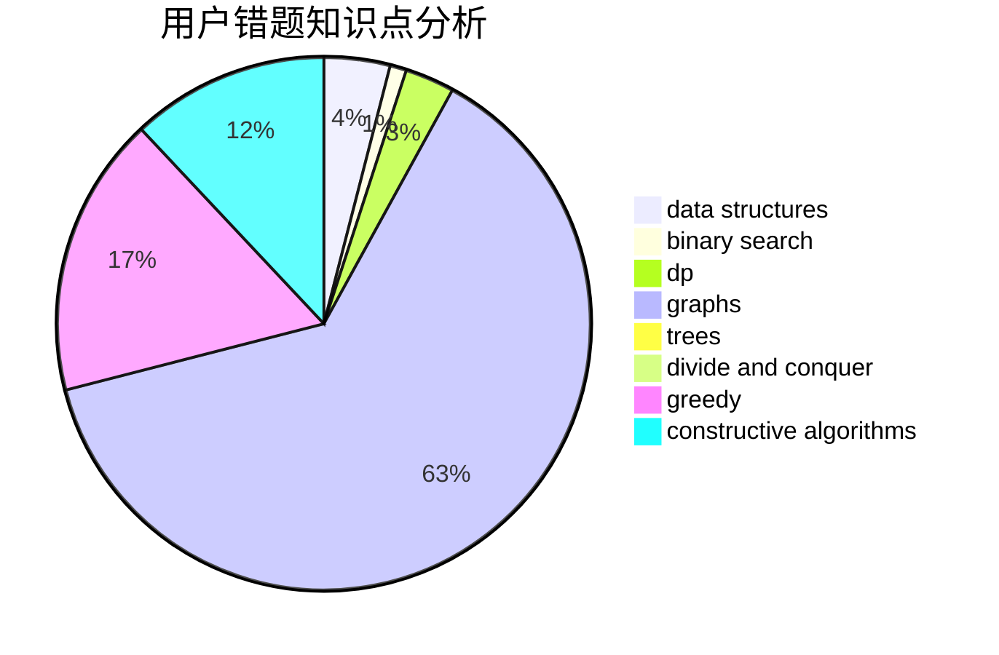

# Fuyuki

<!-- tabs:start -->

#### **用户提交结果分析**

#### **用户做题类型偏好分析**

#### **用户错题知识点分析**

<!-- tabs:end -->
# 推荐题目
[1480B](https://codeforces.com/contest/1480/problem/B)		greedy,
                        implementation,
                        sortings		  
[1486B](https://codeforces.com/contest/1486/problem/B)		binary search,
                        geometry,
                        shortest paths,
                        sortings		  
[1070H](https://codeforces.com/contest/1070/problem/H)		brute force,
                        implementation		  
[794G](https://codeforces.com/contest/794/problem/G)		combinatorics,
                        dp,
                        math		  
[1093B](https://codeforces.com/contest/1093/problem/B)		constructive algorithms,
                        greedy,
                        sortings,
                        strings		  
[3D](https://codeforces.com/contest/3/problem/D)		greedy		  
[314C](https://codeforces.com/contest/314/problem/C)		data structures,
                        dp		  
[246B](https://codeforces.com/contest/246/problem/B)		greedy,
                        math		  
[11082](https://codeforces.com/contest/1108/problem/2)		dsu,graphs,sortings,trees		  
[766D](https://codeforces.com/contest/766/problem/D)		data structures,
                        dfs and similar,
                        dp,
                        dsu,
                        graphs		  
