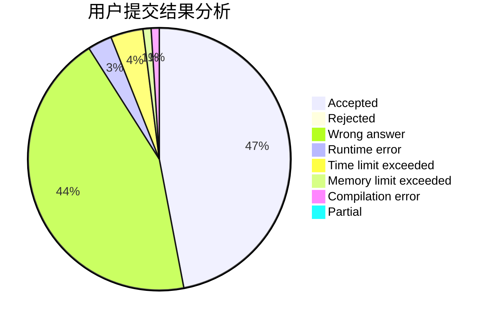
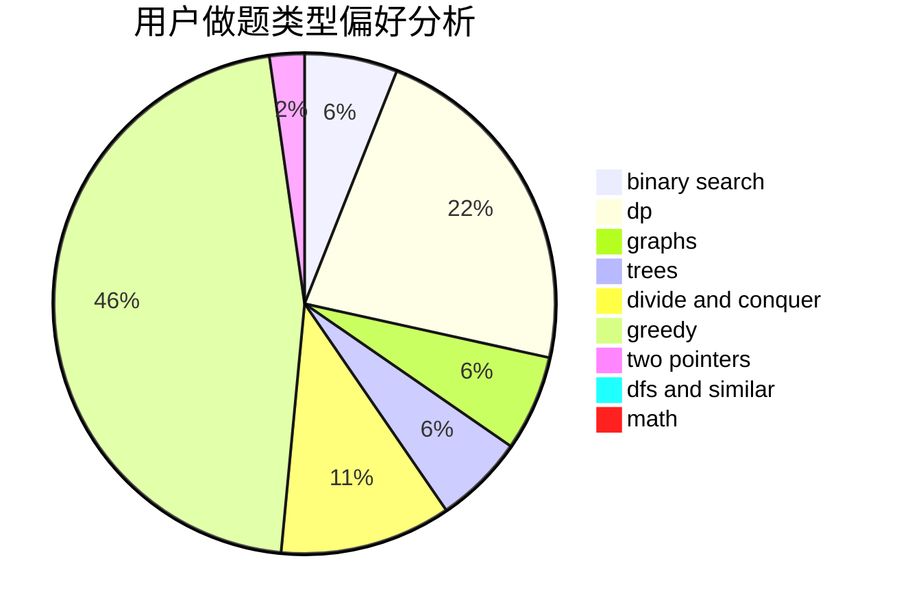

# Fyind

<!-- tabs:start -->

#### **用户提交结果分析**

#### **用户做题类型偏好分析**

<!-- tabs:end -->
# 推荐题目
[1504F](https://codeforces.com/contest/1504/problem/F)
[534B](https://codeforces.com/contest/534/problem/B)
[1151F](https://codeforces.com/contest/1151/problem/F)
[890B](https://codeforces.com/contest/890/problem/B)
[171H](https://codeforces.com/contest/171/problem/H)
[1161E](https://codeforces.com/contest/1161/problem/E)
[11412](https://codeforces.com/contest/1141/problem/2)
[1008D](https://codeforces.com/contest/1008/problem/D)
[1099E](https://codeforces.com/contest/1099/problem/E)
[1091E](https://codeforces.com/contest/1091/problem/E)
