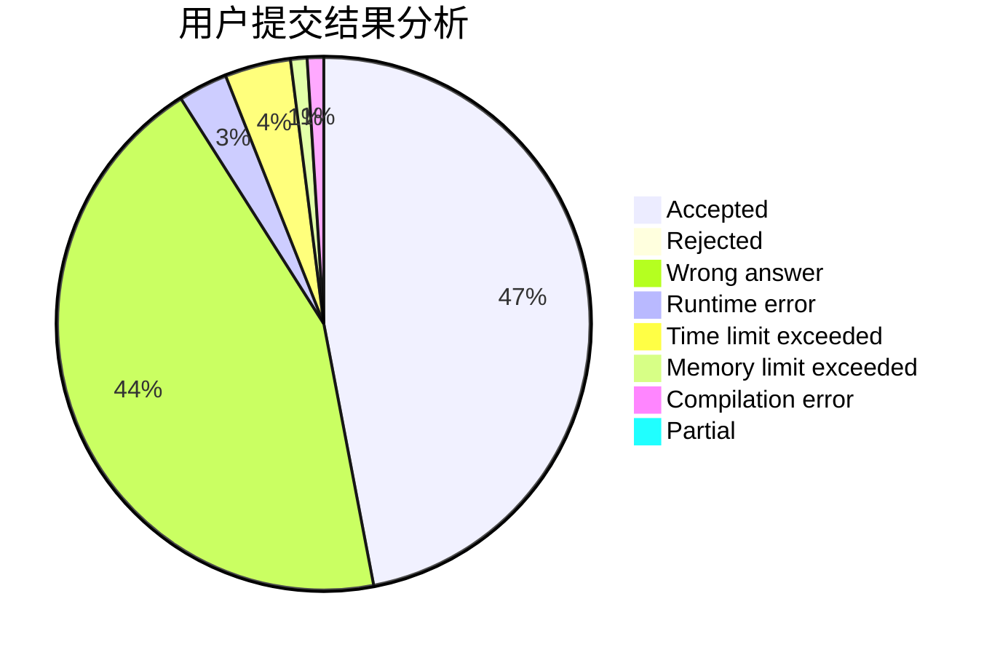
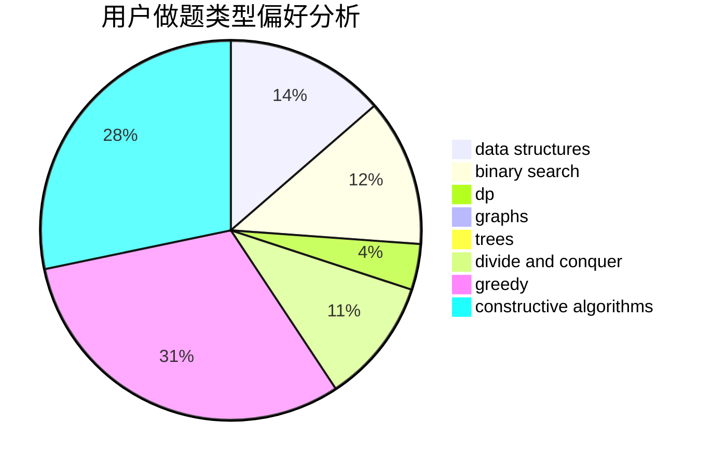

# Fyind

<!-- tabs:start -->

#### **用户提交结果分析**

#### **用户做题类型偏好分析**

#### **用户错题知识点分析**

<!-- tabs:end -->
# 推荐题目
[1495F](https://codeforces.com/contest/1495/problem/F)		constructive algorithms,
                        data structures,
                        dp,
                        graphs,
                        trees		  
[510D](https://codeforces.com/contest/510/problem/D)		bitmasks,
                        brute force,
                        dp,
                        math		  
[114C](https://codeforces.com/contest/114/problem/C)		dsu,graphs,sortings,trees		  
[870A](https://codeforces.com/contest/870/problem/A)		brute force,
                        implementation		  
[1513A](https://codeforces.com/contest/1513/problem/A)		constructive algorithms,
                        implementation		  
[1159A](https://codeforces.com/contest/1159/problem/A)		implementation,
                        math		  
[1139E](https://codeforces.com/contest/1139/problem/E)		flows,
                        graph matchings,
                        graphs		  
[1008A](https://codeforces.com/contest/1008/problem/A)		implementation,
                        strings		  
[1099B](https://codeforces.com/contest/1099/problem/B)		binary search,
                        constructive algorithms,
                        math		  
[1091B](https://codeforces.com/contest/1091/problem/B)		brute force,
                        constructive algorithms,
                        greedy,
                        implementation		  
