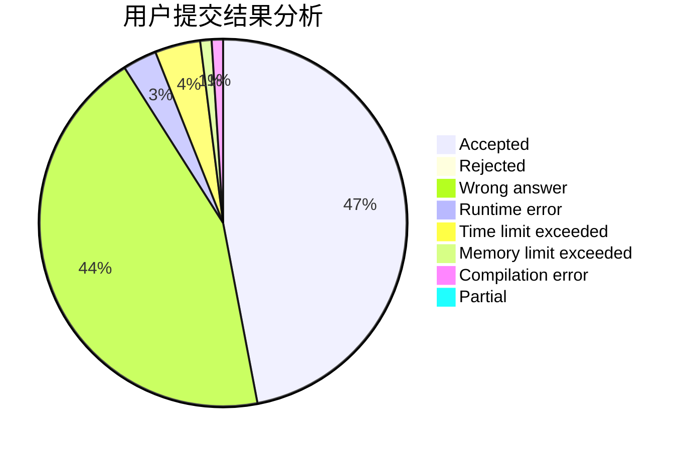
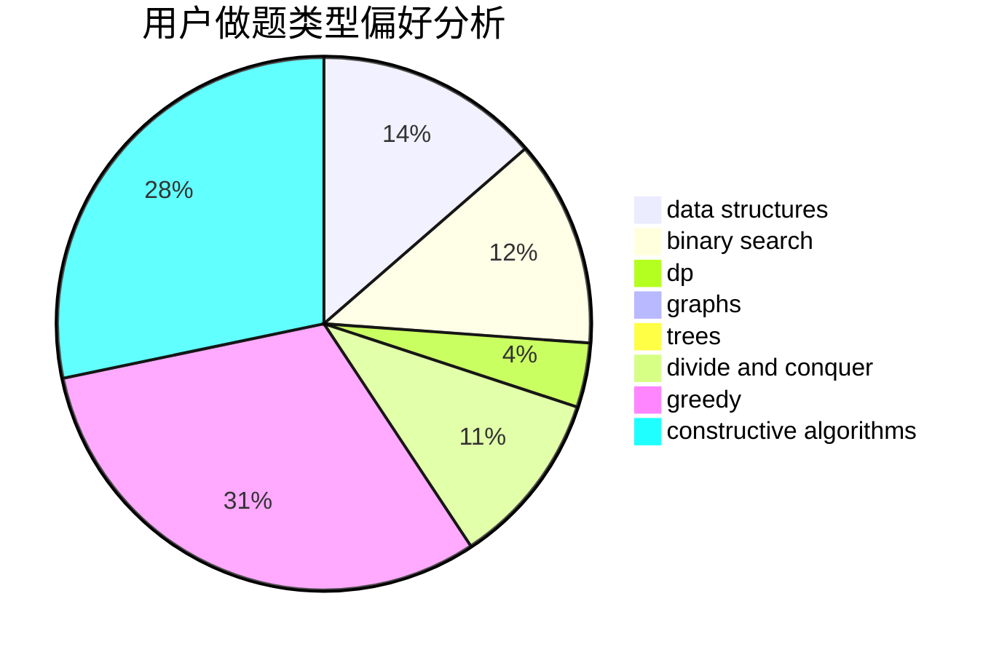

# Fyind
<!-- tabs:start -->
#### **用户提交结果分析**

#### **用户做题类型偏好分析**

#### **用户错题知识点分析**

<!-- tabs:end -->
# 推荐题目
[New Year and the Treasure Geolocation](http://codeforces.com/problemset/problem/1091/B)		brute force,
                        constructive algorithms,
                        greedy,
                        implementation		  
[Cool Slogans](http://codeforces.com/problemset/problem/700/E)		string suffix structures,
                        strings		  
[Powerful array](http://codeforces.com/problemset/problem/86/D)		data structures,
                        implementation,
                        math,
                        two pointers		  
[Right-Left Cipher](https://codeforces.com/contest/1087/problem/A)		implementation,
                        strings		  
[Max Mex](http://codeforces.com/problemset/problem/1083/C)		data structures,
                        trees		  
[Tourism](http://codeforces.com/problemset/problem/1220/E)		dfs and similar,
                        dp,
                        dsu,
                        graphs,
                        greedy,
                        trees		  
[Squares and Segments](http://codeforces.com/problemset/problem/1099/B)		binary search,
                        constructive algorithms,
                        math		  
[Caterpillar](http://codeforces.com/problemset/problem/51/F)		dfs and similar,
                        dp,
                        graphs,
                        trees		  
[Far Relative’s Birthday Cake](http://codeforces.com/problemset/problem/629/A)		brute force,
                        combinatorics,
                        constructive algorithms,
                        implementation		  
[Cloud of Hashtags](http://codeforces.com/problemset/problem/777/D)		binary search,
                        greedy,
                        implementation,
                        strings		  
<!-- tabs:start -->
#### **data structures**
[New Year and the Treasure Geolocation](http://codeforces.com/problemset/problem/86/D)		data structures,
                        implementation,
                        math,
                        two pointers		  
[Cool Slogans](http://codeforces.com/problemset/problem/1083/C)		data structures,
                        trees		  
[Powerful array](http://codeforces.com/problemset/problem/12/D)		data structures,
                        sortings		  
[Right-Left Cipher](http://codeforces.com/problemset/problem/1495/F)		constructive algorithms,
                        data structures,
                        dp,
                        graphs,
                        trees		  
[Max Mex](http://codeforces.com/problemset/problem/1492/C)		binary search,
                        data structures,
                        dp,
                        greedy,
                        two pointers		  
[Tourism](http://codeforces.com/problemset/problem/1490/G)		binary search,
                        data structures,
                        math		  
[Squares and Segments](http://codeforces.com/problemset/problem/1479/D)		binary search,
                        bitmasks,
                        brute force,
                        data structures,
                        probabilities,
                        trees		  
[Caterpillar](http://codeforces.com/problemset/problem/1497/A)		brute force,
                        data structures,
                        greedy,
                        sortings		  
[Far Relative’s Birthday Cake](http://codeforces.com/problemset/problem/1491/C)		brute force,
                        data structures,
                        dp,
                        greedy,
                        implementation		  
[Cloud of Hashtags](http://codeforces.com/problemset/problem/1492/B)		data structures,
                        greedy,
                        math		  
#### **binary search**
[New Year and the Treasure Geolocation](http://codeforces.com/problemset/problem/1099/B)		binary search,
                        constructive algorithms,
                        math		  
[Cool Slogans](http://codeforces.com/problemset/problem/777/D)		binary search,
                        greedy,
                        implementation,
                        strings		  
[Powerful array](https://codeforces.com/contest/801/problem/C)		binary search,
                        math		  
[Right-Left Cipher](http://codeforces.com/problemset/problem/201/E)		binary search,
                        combinatorics		  
[Max Mex](https://codeforces.com/contest/1011/problem/D)		binary search,
                        interactive		  
[Tourism](http://codeforces.com/problemset/problem/1492/C)		binary search,
                        data structures,
                        dp,
                        greedy,
                        two pointers		  
[Squares and Segments](http://codeforces.com/problemset/problem/1463/D)		binary search,
                        constructive algorithms,
                        greedy,
                        two pointers		  
[Caterpillar](http://codeforces.com/problemset/problem/1490/G)		binary search,
                        data structures,
                        math		  
[Far Relative’s Birthday Cake](http://codeforces.com/problemset/problem/1479/D)		binary search,
                        bitmasks,
                        brute force,
                        data structures,
                        probabilities,
                        trees		  
[Cloud of Hashtags](http://codeforces.com/problemset/problem/1436/E)		binary search,
                        data structures,
                        two pointers		  
#### **dp**
[New Year and the Treasure Geolocation](http://codeforces.com/problemset/problem/1220/E)		dfs and similar,
                        dp,
                        dsu,
                        graphs,
                        greedy,
                        trees		  
[Cool Slogans](http://codeforces.com/problemset/problem/51/F)		dfs and similar,
                        dp,
                        graphs,
                        trees		  
[Powerful array](http://codeforces.com/problemset/problem/1172/C2)		dp,
                        probabilities		  
[Right-Left Cipher](http://codeforces.com/problemset/problem/510/D)		bitmasks,
                        brute force,
                        dp,
                        math		  
[Max Mex](http://codeforces.com/problemset/problem/337/D)		dfs and similar,
                        divide and conquer,
                        dp,
                        trees		  
[Tourism](http://codeforces.com/problemset/problem/1469/B)		dp,
                        greedy		  
[Squares and Segments](http://codeforces.com/problemset/problem/1495/F)		constructive algorithms,
                        data structures,
                        dp,
                        graphs,
                        trees		  
[Caterpillar](http://codeforces.com/problemset/problem/729/F)		dp		  
[Far Relative’s Birthday Cake](http://codeforces.com/problemset/problem/1492/C)		binary search,
                        data structures,
                        dp,
                        greedy,
                        two pointers		  
[Cloud of Hashtags](https://codeforces.com/contest/1457/problem/C)		brute force,
                        dp,
                        implementation		  
#### **graph**
[New Year and the Treasure Geolocation](http://codeforces.com/problemset/problem/1220/E)		dfs and similar,
                        dp,
                        dsu,
                        graphs,
                        greedy,
                        trees		  
[Cool Slogans](http://codeforces.com/problemset/problem/51/F)		dfs and similar,
                        dp,
                        graphs,
                        trees		  
[Powerful array](http://codeforces.com/problemset/problem/842/C)		dfs and similar,
                        graphs,
                        math,
                        number theory,
                        trees		  
[Right-Left Cipher](http://codeforces.com/problemset/problem/1139/E)		flows,
                        graph matchings,
                        graphs		  
[Max Mex](http://codeforces.com/problemset/problem/1495/F)		constructive algorithms,
                        data structures,
                        dp,
                        graphs,
                        trees		  
[Tourism](http://codeforces.com/problemset/problem/1487/C)		brute force,
                        constructive algorithms,
                        dfs and similar,
                        graphs,
                        greedy,
                        implementation,
                        math		  
[Squares and Segments](http://codeforces.com/problemset/problem/1437/C)		dp,
                        flows,
                        graph matchings,
                        greedy,
                        math,
                        sortings		  
[Caterpillar](http://codeforces.com/problemset/problem/1470/D)		constructive algorithms,
                        dfs and similar,
                        graph matchings,
                        graphs,
                        greedy		  
[Far Relative’s Birthday Cake](http://codeforces.com/problemset/problem/1476/C)		dp,
                        graphs,
                        greedy		  
[Cloud of Hashtags](http://codeforces.com/problemset/problem/1304/D)		constructive algorithms,
                        graphs,
                        greedy,
                        two pointers		  
#### **trees**
[New Year and the Treasure Geolocation](http://codeforces.com/problemset/problem/1083/C)		data structures,
                        trees		  
[Cool Slogans](http://codeforces.com/problemset/problem/1220/E)		dfs and similar,
                        dp,
                        dsu,
                        graphs,
                        greedy,
                        trees		  
[Powerful array](http://codeforces.com/problemset/problem/51/F)		dfs and similar,
                        dp,
                        graphs,
                        trees		  
[Right-Left Cipher](http://codeforces.com/problemset/problem/842/C)		dfs and similar,
                        graphs,
                        math,
                        number theory,
                        trees		  
[Max Mex](http://codeforces.com/problemset/problem/337/D)		dfs and similar,
                        divide and conquer,
                        dp,
                        trees		  
[Tourism](http://codeforces.com/problemset/problem/1495/F)		constructive algorithms,
                        data structures,
                        dp,
                        graphs,
                        trees		  
[Squares and Segments](http://codeforces.com/problemset/problem/1479/D)		binary search,
                        bitmasks,
                        brute force,
                        data structures,
                        probabilities,
                        trees		  
[Caterpillar](http://codeforces.com/problemset/problem/1511/C)		brute force,
                        data structures,
                        implementation,
                        trees		  
[Far Relative’s Birthday Cake](http://codeforces.com/problemset/problem/1499/F)		combinatorics,
                        dfs and similar,
                        dp,
                        trees		  
[Cloud of Hashtags](http://codeforces.com/problemset/problem/1491/E)		brute force,
                        dfs and similar,
                        divide and conquer,
                        number theory,
                        trees		  
#### **divide and conquer**
[New Year and the Treasure Geolocation](http://codeforces.com/problemset/problem/337/D)		dfs and similar,
                        divide and conquer,
                        dp,
                        trees		  
[Cool Slogans](http://codeforces.com/problemset/problem/1461/D)		binary search,
                        brute force,
                        data structures,
                        divide and conquer,
                        implementation,
                        sortings		  
[Powerful array](http://codeforces.com/problemset/problem/1466/G)		combinatorics,
                        divide and conquer,
                        hashing,
                        math,
                        string suffix structures,
                        strings		  
[Right-Left Cipher](http://codeforces.com/problemset/problem/1490/D)		dfs and similar,
                        divide and conquer,
                        implementation		  
[Max Mex](https://codeforces.com/contest/1483/problem/C)		data structures,
                        divide and conquer,
                        dp		  
[Tourism](http://codeforces.com/problemset/problem/1491/E)		brute force,
                        dfs and similar,
                        divide and conquer,
                        number theory,
                        trees		  
[Squares and Segments](http://codeforces.com/problemset/problem/1303/G)		data structures,
                        divide and conquer,
                        geometry,
                        trees		  
[Caterpillar](http://codeforces.com/problemset/problem/1494/D)		constructive algorithms,
                        data structures,
                        dfs and similar,
                        divide and conquer,
                        dsu,
                        greedy,
                        sortings,
                        trees		  
[Far Relative’s Birthday Cake](http://codeforces.com/problemset/problem/1482/E)		data structures,
                        divide and conquer,
                        dp		  
[Cloud of Hashtags](http://codeforces.com/problemset/problem/566/C)		dfs and similar,
                        divide and conquer,
                        trees		  
#### **greedy**
[New Year and the Treasure Geolocation](http://codeforces.com/problemset/problem/1091/B)		brute force,
                        constructive algorithms,
                        greedy,
                        implementation		  
[Cool Slogans](http://codeforces.com/problemset/problem/1220/E)		dfs and similar,
                        dp,
                        dsu,
                        graphs,
                        greedy,
                        trees		  
[Powerful array](http://codeforces.com/problemset/problem/777/D)		binary search,
                        greedy,
                        implementation,
                        strings		  
[Right-Left Cipher](http://codeforces.com/problemset/problem/1144/D)		constructive algorithms,
                        greedy		  
[Max Mex](http://codeforces.com/problemset/problem/1469/B)		dp,
                        greedy		  
[Tourism](http://codeforces.com/problemset/problem/1148/A)		greedy		  
[Squares and Segments](http://codeforces.com/problemset/problem/1492/C)		binary search,
                        data structures,
                        dp,
                        greedy,
                        two pointers		  
[Caterpillar](https://codeforces.com/contest/1496/problem/C)		geometry,
                        greedy,
                        math,
                        sortings		  
[Far Relative’s Birthday Cake](http://codeforces.com/problemset/problem/1493/A)		constructive algorithms,
                        greedy		  
[Cloud of Hashtags](http://codeforces.com/problemset/problem/1463/D)		binary search,
                        constructive algorithms,
                        greedy,
                        two pointers		  
#### **constructive algorithms**
[New Year and the Treasure Geolocation](http://codeforces.com/problemset/problem/1091/B)		brute force,
                        constructive algorithms,
                        greedy,
                        implementation		  
[Cool Slogans](http://codeforces.com/problemset/problem/1099/B)		binary search,
                        constructive algorithms,
                        math		  
[Powerful array](http://codeforces.com/problemset/problem/629/A)		brute force,
                        combinatorics,
                        constructive algorithms,
                        implementation		  
[Right-Left Cipher](http://codeforces.com/problemset/problem/1513/A)		constructive algorithms,
                        implementation		  
[Max Mex](http://codeforces.com/problemset/problem/1144/D)		constructive algorithms,
                        greedy		  
[Tourism](http://codeforces.com/problemset/problem/1495/F)		constructive algorithms,
                        data structures,
                        dp,
                        graphs,
                        trees		  
[Squares and Segments](http://codeforces.com/problemset/problem/1366/D)		constructive algorithms,
                        math,
                        number theory		  
[Caterpillar](http://codeforces.com/problemset/problem/1493/A)		constructive algorithms,
                        greedy		  
[Far Relative’s Birthday Cake](http://codeforces.com/problemset/problem/1463/D)		binary search,
                        constructive algorithms,
                        greedy,
                        two pointers		  
[Cloud of Hashtags](https://codeforces.com/contest/1456/problem/B)		bitmasks,
                        brute force,
                        constructive algorithms		  
#### **sortings**
[New Year and the Treasure Geolocation](http://codeforces.com/problemset/problem/12/D)		data structures,
                        sortings		  
[Cool Slogans](https://codeforces.com/contest/1496/problem/C)		geometry,
                        greedy,
                        math,
                        sortings		  
[Powerful array](http://codeforces.com/problemset/problem/1495/A)		geometry,
                        greedy,
                        math,
                        sortings		  
[Right-Left Cipher](http://codeforces.com/problemset/problem/1497/A)		brute force,
                        data structures,
                        greedy,
                        sortings		  
[Max Mex](http://codeforces.com/problemset/problem/1427/A)		math,
                        sortings		  
[Tourism](http://codeforces.com/problemset/problem/1461/D)		binary search,
                        brute force,
                        data structures,
                        divide and conquer,
                        implementation,
                        sortings		  
[Squares and Segments](http://codeforces.com/problemset/problem/1437/C)		dp,
                        flows,
                        graph matchings,
                        greedy,
                        math,
                        sortings		  
[Caterpillar](http://codeforces.com/problemset/problem/1473/A)		greedy,
                        implementation,
                        math,
                        sortings		  
[Far Relative’s Birthday Cake](http://codeforces.com/problemset/problem/1486/B)		binary search,
                        geometry,
                        shortest paths,
                        sortings		  
[Cloud of Hashtags](http://codeforces.com/problemset/problem/1480/B)		greedy,
                        implementation,
                        sortings		  
<!-- tabs:end -->
