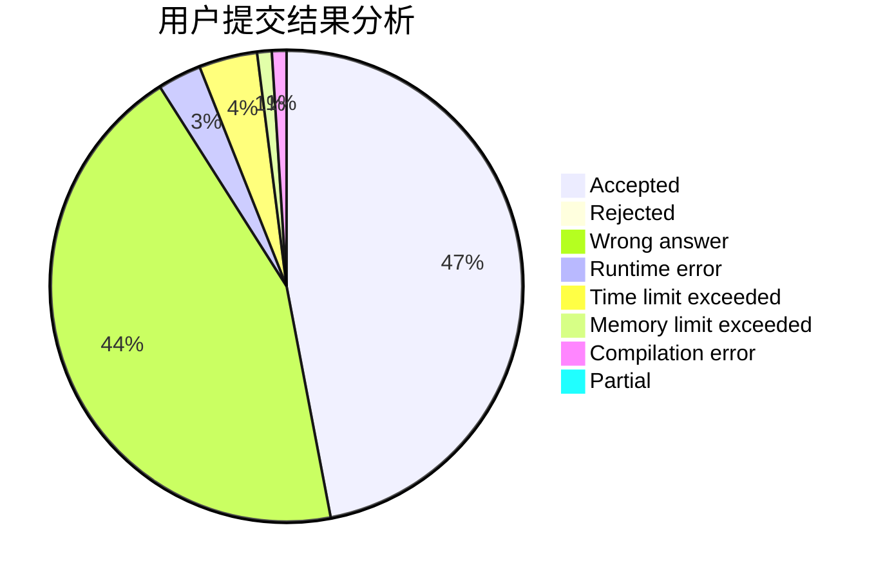
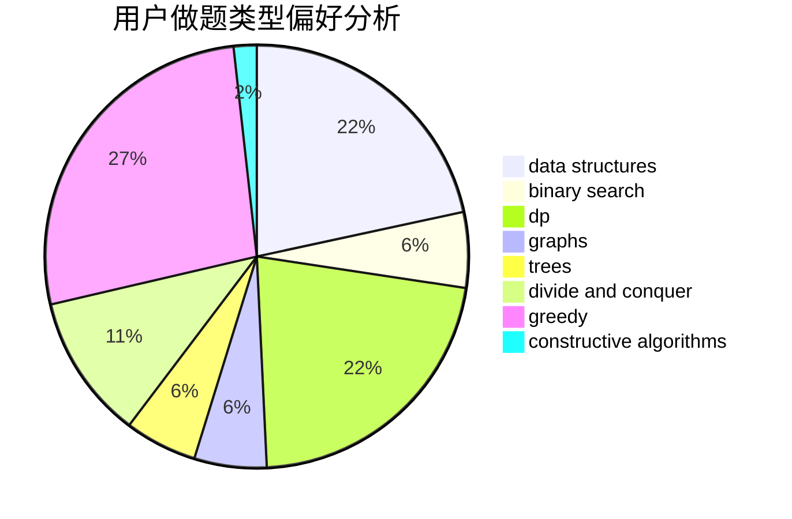
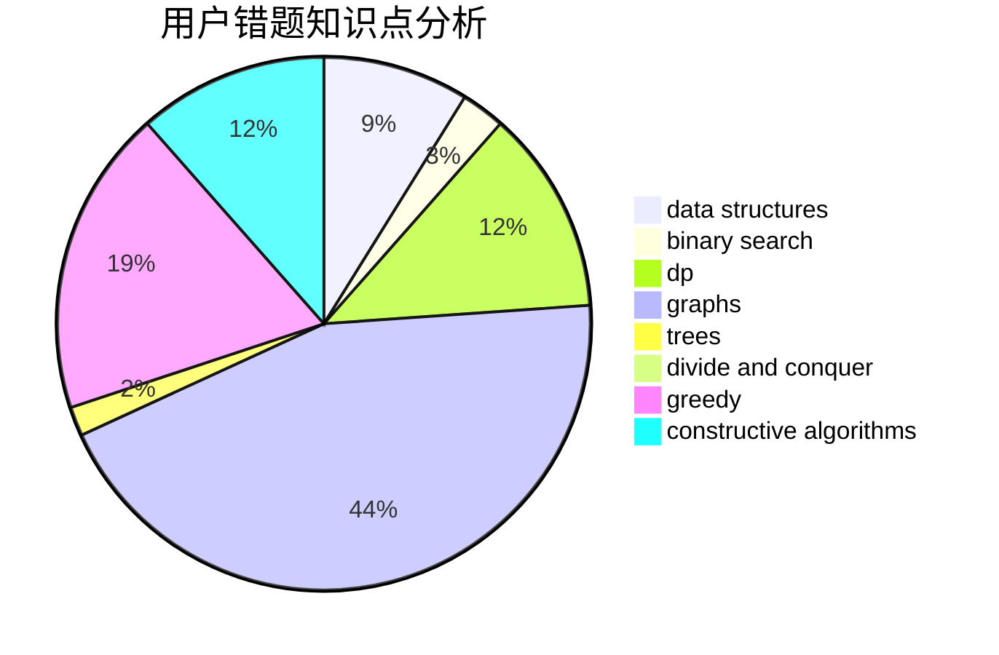

# Fyind

<!-- tabs:start -->

#### **用户提交结果分析**

#### **用户做题类型偏好分析**

#### **用户错题知识点分析**

<!-- tabs:end -->
# 推荐题目
[1504F](https://codeforces.com/contest/1504/problem/F)		dsu,graphs,sortings,trees		  
[534B](https://codeforces.com/contest/534/problem/B)		dp,
                        greedy,
                        math		  
[1151F](https://codeforces.com/contest/1151/problem/F)		combinatorics,
                        dp,
                        matrices,
                        probabilities		  
[890B](https://codeforces.com/contest/890/problem/B)		dsu,graphs,sortings,trees		  
[171H](https://codeforces.com/contest/171/problem/H)		*special problem,
                        implementation		  
[1161E](https://codeforces.com/contest/1161/problem/E)		dsu,graphs,sortings,trees		  
[11412](https://codeforces.com/contest/1141/problem/2)		dsu,graphs,sortings,trees		  
[1008D](https://codeforces.com/contest/1008/problem/D)		dsu,graphs,sortings,trees		  
[1099E](https://codeforces.com/contest/1099/problem/E)		dsu,graphs,sortings,trees		  
[1091E](https://codeforces.com/contest/1091/problem/E)		binary search,
                        data structures,
                        graphs,
                        greedy,
                        implementation,
                        math,
                        sortings		  
