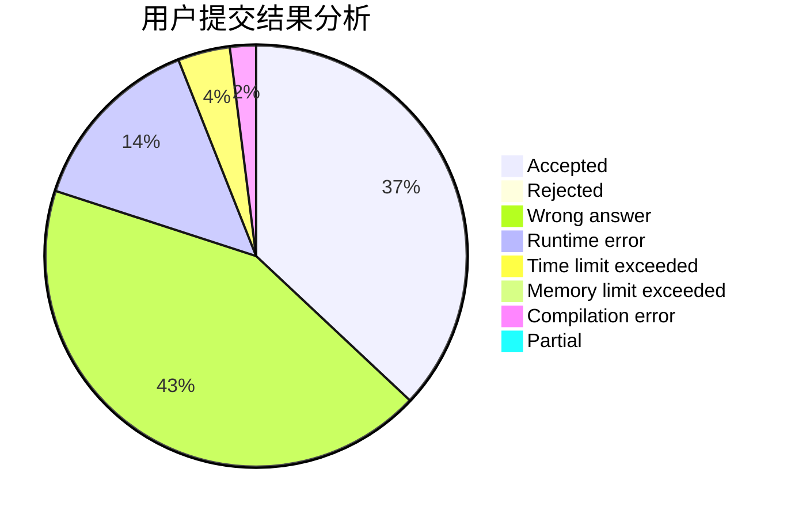
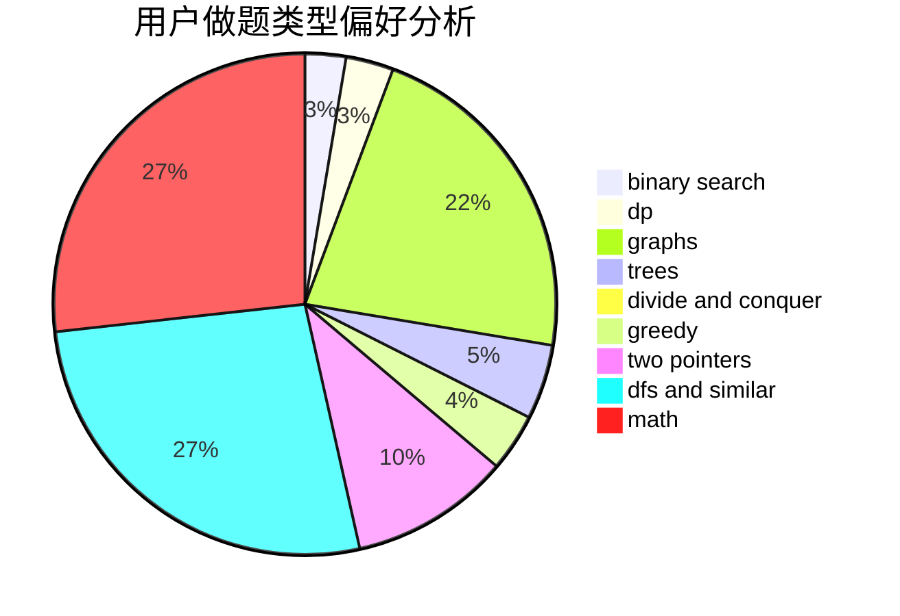

# GCR

<!-- tabs:start -->

#### **用户提交结果分析**

#### **用户做题类型偏好分析**

<!-- tabs:end -->
# 推荐题目
[860B](https://codeforces.com/contest/860/problem/B)
[354D](https://codeforces.com/contest/354/problem/D)
[346A](https://codeforces.com/contest/346/problem/A)
[1246F](https://codeforces.com/contest/1246/problem/F)
[264D](https://codeforces.com/contest/264/problem/D)
[1198C](https://codeforces.com/contest/1198/problem/C)
[669A](https://codeforces.com/contest/669/problem/A)
[887F](https://codeforces.com/contest/887/problem/F)
[1100D](https://codeforces.com/contest/1100/problem/D)
[400E](https://codeforces.com/contest/400/problem/E)
