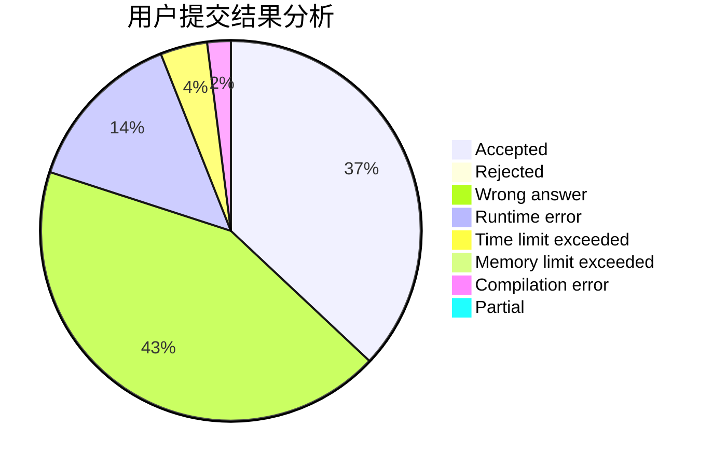
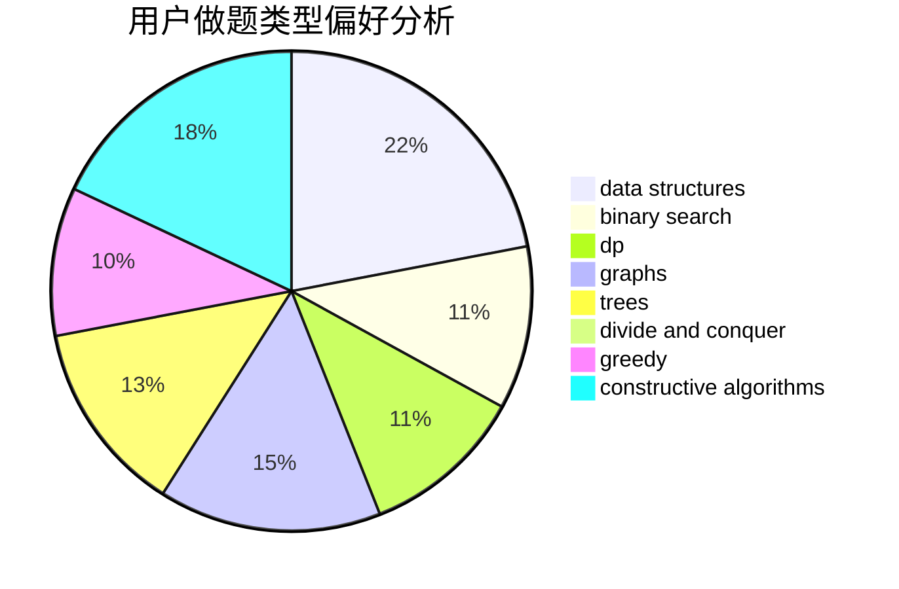

# GCR

<!-- tabs:start -->

#### **用户提交结果分析**

#### **用户做题类型偏好分析**

#### **用户错题知识点分析**

<!-- tabs:end -->
# 推荐题目
[860B](https://codeforces.com/contest/860/problem/B)		dsu,graphs,sortings,trees		  
[354D](https://codeforces.com/contest/354/problem/D)		dp		  
[346A](https://codeforces.com/contest/346/problem/A)		games,
                        math,
                        number theory		  
[1246F](https://codeforces.com/contest/1246/problem/F)		nan		  
[264D](https://codeforces.com/contest/264/problem/D)		dp,
                        two pointers		  
[1198C](https://codeforces.com/contest/1198/problem/C)		constructive algorithms,
                        graphs,
                        greedy,
                        sortings		  
[669A](https://codeforces.com/contest/669/problem/A)		math		  
[887F](https://codeforces.com/contest/887/problem/F)		greedy,
                        sortings		  
[1100D](https://codeforces.com/contest/1100/problem/D)		constructive algorithms,
                        games,
                        interactive		  
[400E](https://codeforces.com/contest/400/problem/E)		binary search,
                        bitmasks,
                        data structures		  
