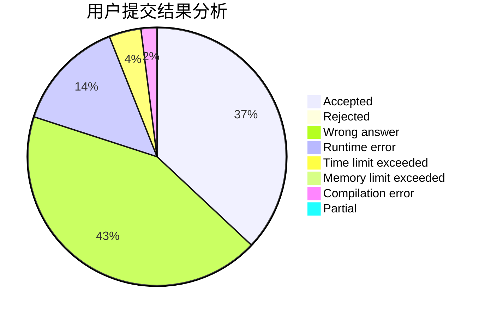
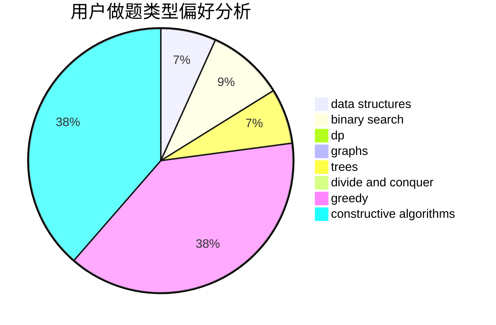

# GCR

<!-- tabs:start -->

#### **用户提交结果分析**

#### **用户做题类型偏好分析**

#### **用户错题知识点分析**

<!-- tabs:end -->
# 推荐题目
[841B](https://codeforces.com/contest/841/problem/B)		games,
                        math		  
[325C](https://codeforces.com/contest/325/problem/C)		dfs and similar,
                        graphs,
                        shortest paths		  
[316G3](https://codeforces.com/contest/316G/problem/3)		string suffix structures		  
[1241B](https://codeforces.com/contest/1241/problem/B)		dsu,graphs,sortings,trees		  
[243C](https://codeforces.com/contest/243/problem/C)		dfs and similar,
                        implementation		  
[1194A](https://codeforces.com/contest/1194/problem/A)		math		  
[639D](https://codeforces.com/contest/639/problem/D)		data structures,
                        greedy,
                        sortings,
                        two pointers		  
[868D](https://codeforces.com/contest/868/problem/D)		bitmasks,
                        brute force,
                        dp,
                        implementation,
                        strings		  
[1100A](https://codeforces.com/contest/1100/problem/A)		implementation		  
[371C](https://codeforces.com/contest/371/problem/C)		binary search,
                        brute force		  
