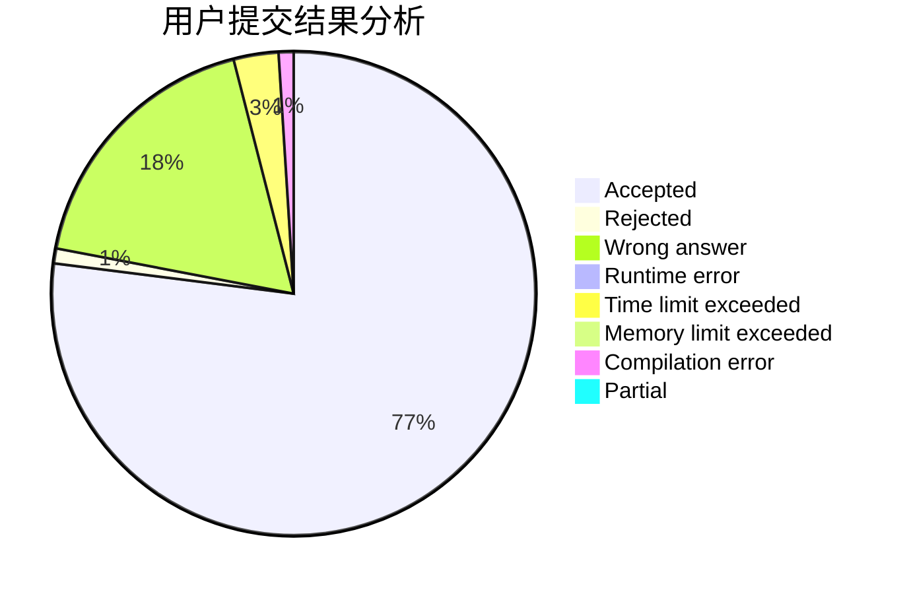
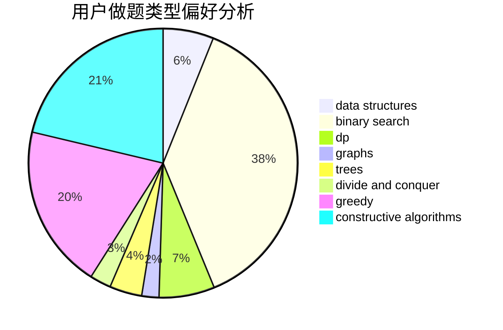
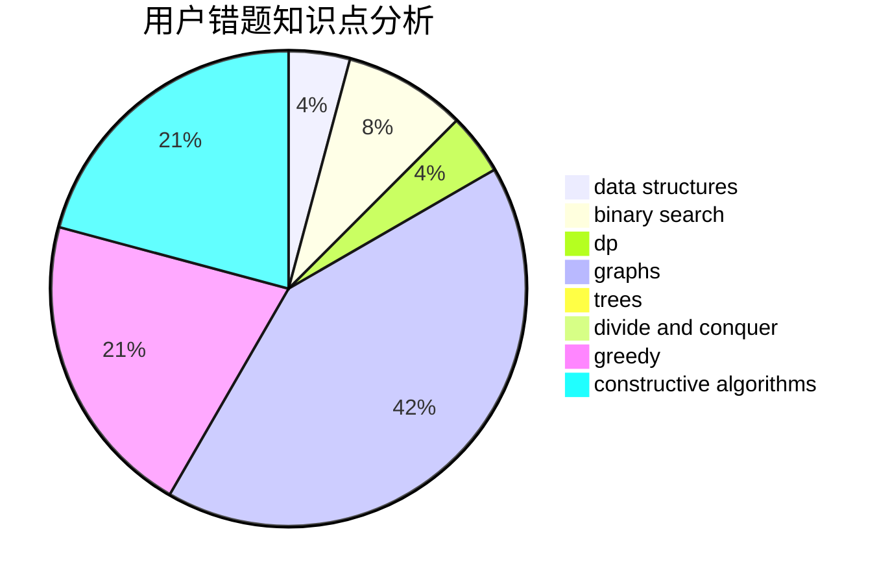

# GDUT20ZYL
<!-- tabs:start -->
#### **用户提交结果分析**

#### **用户做题类型偏好分析**

#### **用户错题知识点分析**

<!-- tabs:end -->
# 推荐题目
[Numbers on Tree](http://codeforces.com/problemset/problem/1286/B)		constructive algorithms,
                        data structures,
                        dfs and similar,
                        graphs,
                        greedy,
                        trees		  
[Ciel and Flipboard](http://codeforces.com/problemset/problem/321/D)		dp,
                        greedy,
                        math		  
[Search for Pretty Integers](https://codeforces.com/contest/872/problem/A)		brute force,
                        implementation		  
[Expecting Trouble](http://codeforces.com/problemset/problem/345/A)		*special problem,
                        probabilities		  
[Restore the Tree](http://codeforces.com/problemset/problem/871/E)		graphs,
                        greedy,
                        trees		  
[Death Note](http://codeforces.com/problemset/problem/1016/A)		greedy,
                        implementation,
                        math		  
[Strange Function](http://codeforces.com/problemset/problem/1334/F)		binary search,
                        data structures,
                        dp,
                        greedy		  
[Toy Train](http://codeforces.com/problemset/problem/1129/A2)		brute force,
                        greedy		  
[Too Much Money](http://codeforces.com/problemset/problem/725/E)		brute force,
                        greedy		  
[Paths](https://codeforces.com/contest/871/problem/D)		data structures,
                        number theory		  
<!-- tabs:start -->
#### **data structures**
[Numbers on Tree](http://codeforces.com/problemset/problem/1286/B)		constructive algorithms,
                        data structures,
                        dfs and similar,
                        graphs,
                        greedy,
                        trees		  
[Ciel and Flipboard](http://codeforces.com/problemset/problem/1334/F)		binary search,
                        data structures,
                        dp,
                        greedy		  
[Search for Pretty Integers](https://codeforces.com/contest/871/problem/D)		data structures,
                        number theory		  
[Expecting Trouble](http://codeforces.com/problemset/problem/523/D)		*special problem,
                        data structures,
                        implementation		  
[Restore the Tree](http://codeforces.com/problemset/problem/798/E)		constructive algorithms,
                        data structures,
                        graphs,
                        sortings		  
[Death Note](http://codeforces.com/problemset/problem/870/F)		data structures,
                        number theory		  
[Strange Function](http://codeforces.com/problemset/problem/1398/E)		binary search,
                        data structures,
                        greedy,
                        implementation,
                        math,
                        sortings		  
[Toy Train](https://codeforces.com/contest/860/problem/B)		data structures,
                        implementation,
                        sortings		  
[Too Much Money](http://codeforces.com/problemset/problem/1207/G)		data structures,
                        dfs and similar,
                        hashing,
                        string suffix structures,
                        strings,
                        trees		  
[Paths](http://codeforces.com/problemset/problem/1492/C)		binary search,
                        data structures,
                        dp,
                        greedy,
                        two pointers		  
#### **binary search**
[Numbers on Tree](http://codeforces.com/problemset/problem/1334/F)		binary search,
                        data structures,
                        dp,
                        greedy		  
[Ciel and Flipboard](http://codeforces.com/problemset/problem/73/B)		binary search,
                        greedy,
                        sortings		  
[Search for Pretty Integers](https://codeforces.com/contest/1337/problem/D)		binary search,
                        greedy,
                        math,
                        sortings,
                        two pointers		  
[Expecting Trouble](http://codeforces.com/problemset/problem/1398/E)		binary search,
                        data structures,
                        greedy,
                        implementation,
                        math,
                        sortings		  
[Restore the Tree](http://codeforces.com/problemset/problem/1492/C)		binary search,
                        data structures,
                        dp,
                        greedy,
                        two pointers		  
[Death Note](http://codeforces.com/problemset/problem/1463/D)		binary search,
                        constructive algorithms,
                        greedy,
                        two pointers		  
[Strange Function](http://codeforces.com/problemset/problem/1490/G)		binary search,
                        data structures,
                        math		  
[Toy Train](http://codeforces.com/problemset/problem/1479/D)		binary search,
                        bitmasks,
                        brute force,
                        data structures,
                        probabilities,
                        trees		  
[Too Much Money](http://codeforces.com/problemset/problem/1436/E)		binary search,
                        data structures,
                        two pointers		  
[Paths](http://codeforces.com/problemset/problem/1461/D)		binary search,
                        brute force,
                        data structures,
                        divide and conquer,
                        implementation,
                        sortings		  
#### **dp**
[Numbers on Tree](http://codeforces.com/problemset/problem/321/D)		dp,
                        greedy,
                        math		  
[Ciel and Flipboard](http://codeforces.com/problemset/problem/1334/F)		binary search,
                        data structures,
                        dp,
                        greedy		  
[Search for Pretty Integers](http://codeforces.com/problemset/problem/1220/E)		dfs and similar,
                        dp,
                        dsu,
                        graphs,
                        greedy,
                        trees		  
[Expecting Trouble](https://codeforces.com/contest/604/problem/C)		dp,
                        greedy,
                        math		  
[Restore the Tree](https://codeforces.com/contest/871/problem/A)		dp,
                        greedy,
                        math,
                        number theory		  
[Death Note](http://codeforces.com/problemset/problem/316/D3)		dp,
                        math		  
[Strange Function](http://codeforces.com/problemset/problem/870/C)		dp,
                        greedy,
                        math,
                        number theory		  
[Toy Train](http://codeforces.com/problemset/problem/1497/D)		bitmasks,
                        dp,
                        graphs,
                        number theory		  
[Too Much Money](http://codeforces.com/problemset/problem/1492/C)		binary search,
                        data structures,
                        dp,
                        greedy,
                        two pointers		  
[Paths](https://codeforces.com/contest/1457/problem/C)		brute force,
                        dp,
                        implementation		  
#### **graph**
[Numbers on Tree](http://codeforces.com/problemset/problem/1286/B)		constructive algorithms,
                        data structures,
                        dfs and similar,
                        graphs,
                        greedy,
                        trees		  
[Ciel and Flipboard](http://codeforces.com/problemset/problem/871/E)		graphs,
                        greedy,
                        trees		  
[Search for Pretty Integers](http://codeforces.com/problemset/problem/870/E)		dfs and similar,
                        dsu,
                        graphs,
                        trees		  
[Expecting Trouble](http://codeforces.com/problemset/problem/1220/E)		dfs and similar,
                        dp,
                        dsu,
                        graphs,
                        greedy,
                        trees		  
[Restore the Tree](http://codeforces.com/problemset/problem/1055/A)		graphs		  
[Death Note](http://codeforces.com/problemset/problem/798/E)		constructive algorithms,
                        data structures,
                        graphs,
                        sortings		  
[Strange Function](https://codeforces.com/contest/871/problem/C)		dfs and similar,
                        dsu,
                        graphs,
                        trees		  
[Toy Train](http://codeforces.com/problemset/problem/700/C)		dfs and similar,
                        graphs		  
[Too Much Money](http://codeforces.com/problemset/problem/698/B)		constructive algorithms,
                        dfs and similar,
                        dsu,
                        graphs,
                        trees		  
[Paths](http://codeforces.com/problemset/problem/715/E)		combinatorics,
                        fft,
                        graphs,
                        math		  
#### **trees**
[Numbers on Tree](http://codeforces.com/problemset/problem/1286/B)		constructive algorithms,
                        data structures,
                        dfs and similar,
                        graphs,
                        greedy,
                        trees		  
[Ciel and Flipboard](http://codeforces.com/problemset/problem/871/E)		graphs,
                        greedy,
                        trees		  
[Search for Pretty Integers](http://codeforces.com/problemset/problem/870/E)		dfs and similar,
                        dsu,
                        graphs,
                        trees		  
[Expecting Trouble](http://codeforces.com/problemset/problem/1220/E)		dfs and similar,
                        dp,
                        dsu,
                        graphs,
                        greedy,
                        trees		  
[Restore the Tree](https://codeforces.com/contest/871/problem/C)		dfs and similar,
                        dsu,
                        graphs,
                        trees		  
[Death Note](http://codeforces.com/problemset/problem/698/B)		constructive algorithms,
                        dfs and similar,
                        dsu,
                        graphs,
                        trees		  
[Strange Function](http://codeforces.com/problemset/problem/1207/G)		data structures,
                        dfs and similar,
                        hashing,
                        string suffix structures,
                        strings,
                        trees		  
[Toy Train](http://codeforces.com/problemset/problem/1479/D)		binary search,
                        bitmasks,
                        brute force,
                        data structures,
                        probabilities,
                        trees		  
[Too Much Money](http://codeforces.com/problemset/problem/1511/C)		brute force,
                        data structures,
                        implementation,
                        trees		  
[Paths](http://codeforces.com/problemset/problem/1499/F)		combinatorics,
                        dfs and similar,
                        dp,
                        trees		  
#### **divide and conquer**
[Numbers on Tree](http://codeforces.com/problemset/problem/1461/D)		binary search,
                        brute force,
                        data structures,
                        divide and conquer,
                        implementation,
                        sortings		  
[Ciel and Flipboard](http://codeforces.com/problemset/problem/1466/G)		combinatorics,
                        divide and conquer,
                        hashing,
                        math,
                        string suffix structures,
                        strings		  
[Search for Pretty Integers](http://codeforces.com/problemset/problem/1490/D)		dfs and similar,
                        divide and conquer,
                        implementation		  
[Expecting Trouble](https://codeforces.com/contest/1483/problem/C)		data structures,
                        divide and conquer,
                        dp		  
[Restore the Tree](http://codeforces.com/problemset/problem/1491/E)		brute force,
                        dfs and similar,
                        divide and conquer,
                        number theory,
                        trees		  
[Death Note](http://codeforces.com/problemset/problem/1303/G)		data structures,
                        divide and conquer,
                        geometry,
                        trees		  
[Strange Function](http://codeforces.com/problemset/problem/1494/D)		constructive algorithms,
                        data structures,
                        dfs and similar,
                        divide and conquer,
                        dsu,
                        greedy,
                        sortings,
                        trees		  
[Toy Train](http://codeforces.com/problemset/problem/1482/E)		data structures,
                        divide and conquer,
                        dp		  
[Too Much Money](http://codeforces.com/problemset/problem/566/C)		dfs and similar,
                        divide and conquer,
                        trees		  
[Paths](http://codeforces.com/problemset/problem/1428/F)		binary search,
                        data structures,
                        divide and conquer,
                        dp,
                        two pointers		  
#### **greedy**
[Numbers on Tree](http://codeforces.com/problemset/problem/1286/B)		constructive algorithms,
                        data structures,
                        dfs and similar,
                        graphs,
                        greedy,
                        trees		  
[Ciel and Flipboard](http://codeforces.com/problemset/problem/321/D)		dp,
                        greedy,
                        math		  
[Search for Pretty Integers](http://codeforces.com/problemset/problem/871/E)		graphs,
                        greedy,
                        trees		  
[Expecting Trouble](http://codeforces.com/problemset/problem/1016/A)		greedy,
                        implementation,
                        math		  
[Restore the Tree](http://codeforces.com/problemset/problem/1334/F)		binary search,
                        data structures,
                        dp,
                        greedy		  
[Death Note](http://codeforces.com/problemset/problem/1129/A2)		brute force,
                        greedy		  
[Strange Function](http://codeforces.com/problemset/problem/725/E)		brute force,
                        greedy		  
[Toy Train](http://codeforces.com/problemset/problem/73/B)		binary search,
                        greedy,
                        sortings		  
[Too Much Money](http://codeforces.com/problemset/problem/1220/E)		dfs and similar,
                        dp,
                        dsu,
                        graphs,
                        greedy,
                        trees		  
[Paths](https://codeforces.com/contest/604/problem/C)		dp,
                        greedy,
                        math		  
#### **constructive algorithms**
[Numbers on Tree](http://codeforces.com/problemset/problem/1286/B)		constructive algorithms,
                        data structures,
                        dfs and similar,
                        graphs,
                        greedy,
                        trees		  
[Ciel and Flipboard](http://codeforces.com/problemset/problem/14/C)		brute force,
                        constructive algorithms,
                        geometry,
                        implementation,
                        math		  
[Search for Pretty Integers](http://codeforces.com/problemset/problem/798/E)		constructive algorithms,
                        data structures,
                        graphs,
                        sortings		  
[Expecting Trouble](http://codeforces.com/problemset/problem/802/H)		constructive algorithms,
                        strings		  
[Restore the Tree](http://codeforces.com/problemset/problem/698/B)		constructive algorithms,
                        dfs and similar,
                        dsu,
                        graphs,
                        trees		  
[Death Note](http://codeforces.com/problemset/problem/1493/A)		constructive algorithms,
                        greedy		  
[Strange Function](http://codeforces.com/problemset/problem/1463/D)		binary search,
                        constructive algorithms,
                        greedy,
                        two pointers		  
[Toy Train](https://codeforces.com/contest/1456/problem/B)		bitmasks,
                        brute force,
                        constructive algorithms		  
[Too Much Money](http://codeforces.com/problemset/problem/1492/D)		bitmasks,
                        constructive algorithms,
                        greedy,
                        math		  
[Paths](https://codeforces.com/contest/1504/problem/D)		constructive algorithms,
                        games,
                        interactive		  
#### **sortings**
[Numbers on Tree](http://codeforces.com/problemset/problem/73/B)		binary search,
                        greedy,
                        sortings		  
[Ciel and Flipboard](http://codeforces.com/problemset/problem/798/E)		constructive algorithms,
                        data structures,
                        graphs,
                        sortings		  
[Search for Pretty Integers](https://codeforces.com/contest/1337/problem/D)		binary search,
                        greedy,
                        math,
                        sortings,
                        two pointers		  
[Expecting Trouble](http://codeforces.com/problemset/problem/1398/E)		binary search,
                        data structures,
                        greedy,
                        implementation,
                        math,
                        sortings		  
[Restore the Tree](https://codeforces.com/contest/860/problem/B)		data structures,
                        implementation,
                        sortings		  
[Death Note](https://codeforces.com/contest/1496/problem/C)		geometry,
                        greedy,
                        math,
                        sortings		  
[Strange Function](http://codeforces.com/problemset/problem/1495/A)		geometry,
                        greedy,
                        math,
                        sortings		  
[Toy Train](http://codeforces.com/problemset/problem/1497/A)		brute force,
                        data structures,
                        greedy,
                        sortings		  
[Too Much Money](http://codeforces.com/problemset/problem/1427/A)		math,
                        sortings		  
[Paths](http://codeforces.com/problemset/problem/1461/D)		binary search,
                        brute force,
                        data structures,
                        divide and conquer,
                        implementation,
                        sortings		  
<!-- tabs:end -->
