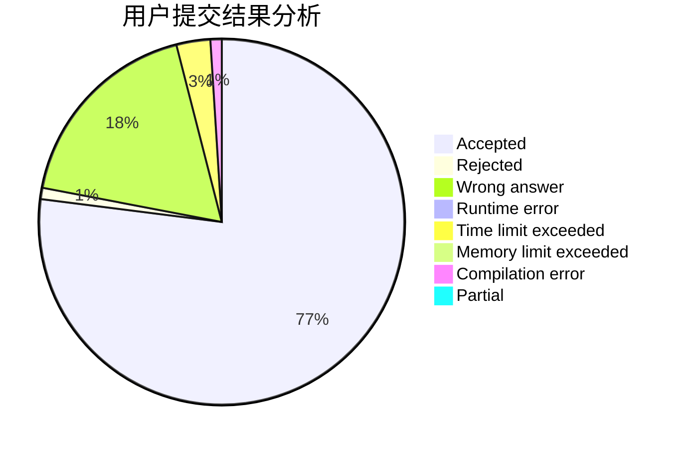
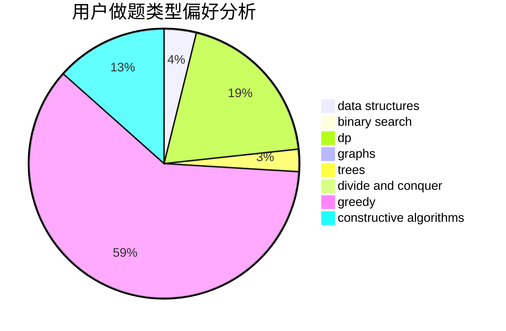
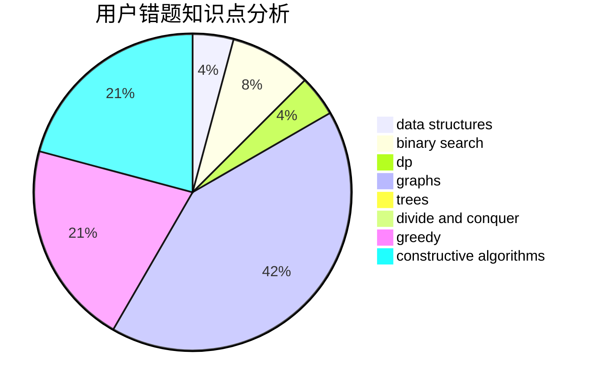

# GDUT20ZYL

<!-- tabs:start -->

#### **用户提交结果分析**

#### **用户做题类型偏好分析**

#### **用户错题知识点分析**

<!-- tabs:end -->
# 推荐题目
[817E](https://codeforces.com/contest/817/problem/E)		bitmasks,
                        data structures,
                        trees		  
[1131A](https://codeforces.com/contest/1131/problem/A)		math		  
[733F](https://codeforces.com/contest/733/problem/F)		data structures,
                        dsu,
                        graphs,
                        trees		  
[1344F](https://codeforces.com/contest/1344/problem/F)		matrices		  
[353A](https://codeforces.com/contest/353/problem/A)		implementation,
                        math		  
[1016D](https://codeforces.com/contest/1016/problem/D)		constructive algorithms,
                        flows,
                        math		  
[1293C](https://codeforces.com/contest/1293/problem/C)		dsu,graphs,sortings,trees		  
[371C](https://codeforces.com/contest/371/problem/C)		binary search,
                        brute force		  
[1341E](https://codeforces.com/contest/1341/problem/E)		dsu,graphs,sortings,trees		  
[605D](https://codeforces.com/contest/605/problem/D)		data structures,
                        dfs and similar		  
