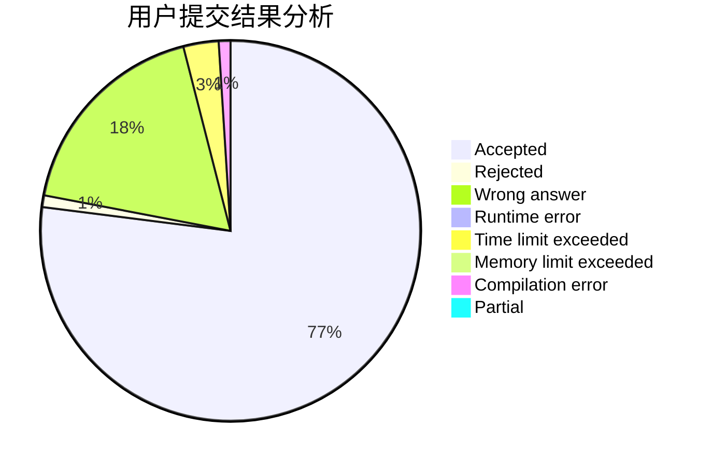
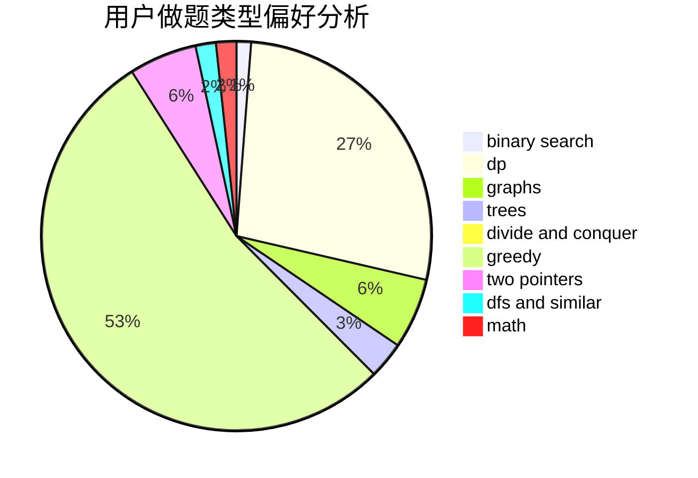

# GDUT20ZYL

<!-- tabs:start -->

#### **用户提交结果分析**

#### **用户做题类型偏好分析**

<!-- tabs:end -->
# 推荐题目
[817E](https://codeforces.com/contest/817/problem/E)
[1131A](https://codeforces.com/contest/1131/problem/A)
[733F](https://codeforces.com/contest/733/problem/F)
[1344F](https://codeforces.com/contest/1344/problem/F)
[353A](https://codeforces.com/contest/353/problem/A)
[1016D](https://codeforces.com/contest/1016/problem/D)
[1293C](https://codeforces.com/contest/1293/problem/C)
[371C](https://codeforces.com/contest/371/problem/C)
[1341E](https://codeforces.com/contest/1341/problem/E)
[605D](https://codeforces.com/contest/605/problem/D)
