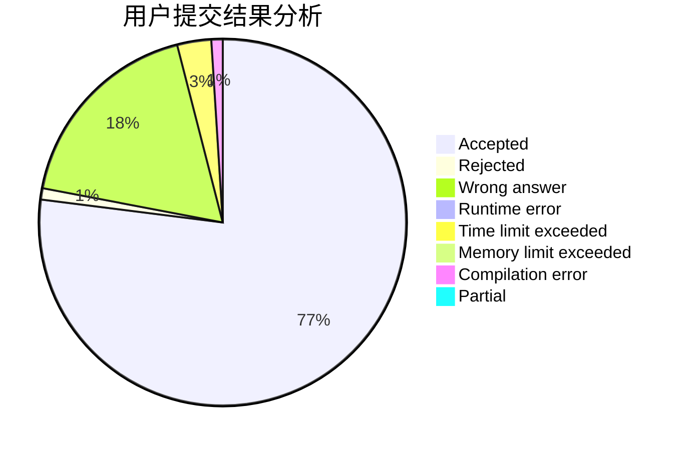
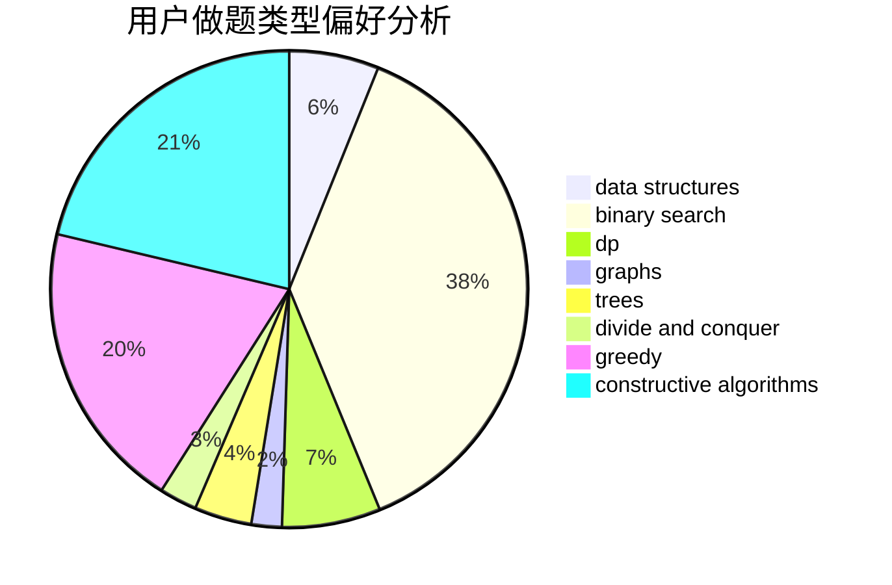
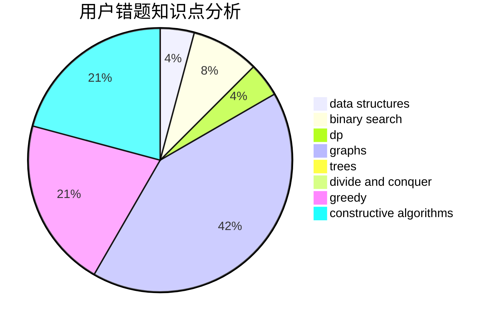

# GDUT20ZYL

<!-- tabs:start -->

#### **用户提交结果分析**

#### **用户做题类型偏好分析**

#### **用户错题知识点分析**

<!-- tabs:end -->
# 推荐题目
[802H](https://codeforces.com/contest/802/problem/H)		constructive algorithms,
                        strings		  
[1129A2](https://codeforces.com/contest/1129A/problem/2)		brute force,
                        greedy		  
[715E](https://codeforces.com/contest/715/problem/E)		combinatorics,
                        fft,
                        graphs,
                        math		  
[1337D](https://codeforces.com/contest/1337/problem/D)		dsu,graphs,sortings,trees		  
[321D](https://codeforces.com/contest/321/problem/D)		dp,
                        greedy,
                        math		  
[1016A](https://codeforces.com/contest/1016/problem/A)		greedy,
                        implementation,
                        math		  
[1286B](https://codeforces.com/contest/1286/problem/B)		constructive algorithms,
                        data structures,
                        dfs and similar,
                        graphs,
                        greedy,
                        trees		  
[345A](https://codeforces.com/contest/345/problem/A)		*special problem,
                        probabilities		  
[1334F](https://codeforces.com/contest/1334/problem/F)		binary search,
                        data structures,
                        dp,
                        greedy		  
[585C](https://codeforces.com/contest/585/problem/C)		number theory		  
