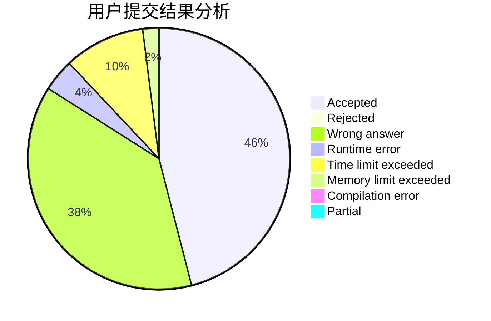
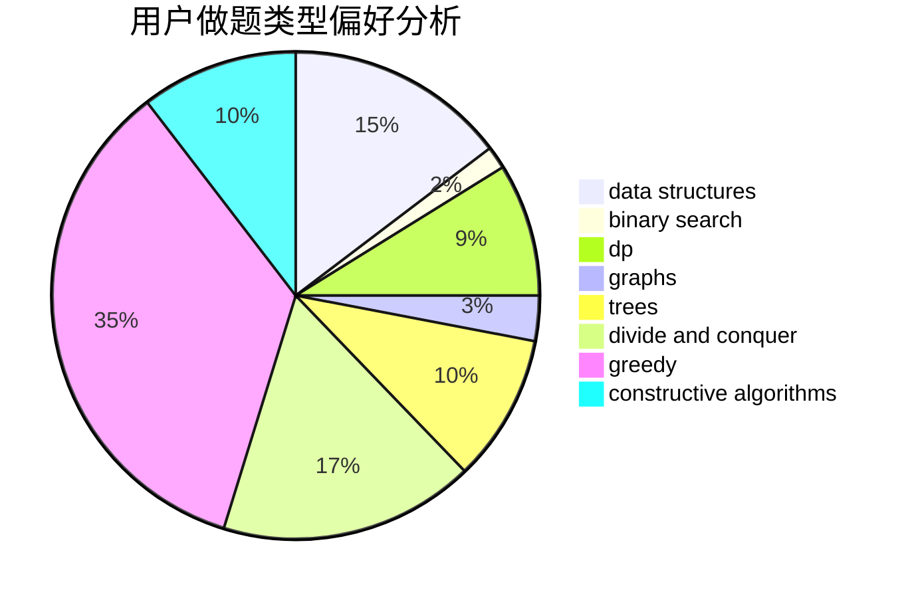
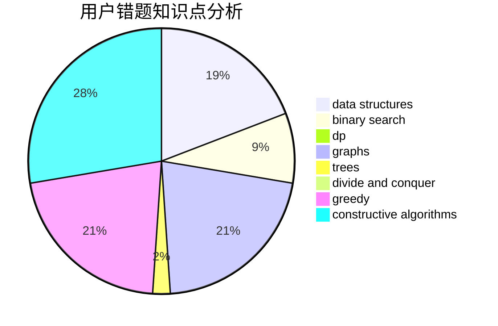

# GG_LC

<!-- tabs:start -->

#### **用户提交结果分析**

#### **用户做题类型偏好分析**

#### **用户错题知识点分析**

<!-- tabs:end -->
# 推荐题目
[872B](https://codeforces.com/contest/872/problem/B)		dsu,graphs,sortings,trees		  
[812C](https://codeforces.com/contest/812/problem/C)		binary search,
                        sortings		  
[1250M](https://codeforces.com/contest/1250/problem/M)		constructive algorithms,
                        divide and conquer		  
[1369C](https://codeforces.com/contest/1369/problem/C)		greedy,
                        math,
                        sortings,
                        two pointers		  
[872C](https://codeforces.com/contest/872/problem/C)		dsu,graphs,sortings,trees		  
[627C](https://codeforces.com/contest/627/problem/C)		data structures,
                        divide and conquer,
                        greedy		  
[306D](https://codeforces.com/contest/306/problem/D)		constructive algorithms,
                        geometry		  
[1195F](https://codeforces.com/contest/1195/problem/F)		data structures,
                        geometry,
                        math,
                        sortings		  
[429A](https://codeforces.com/contest/429/problem/A)		dfs and similar,
                        trees		  
[199E](https://codeforces.com/contest/199/problem/E)		dsu,graphs,sortings,trees		  
