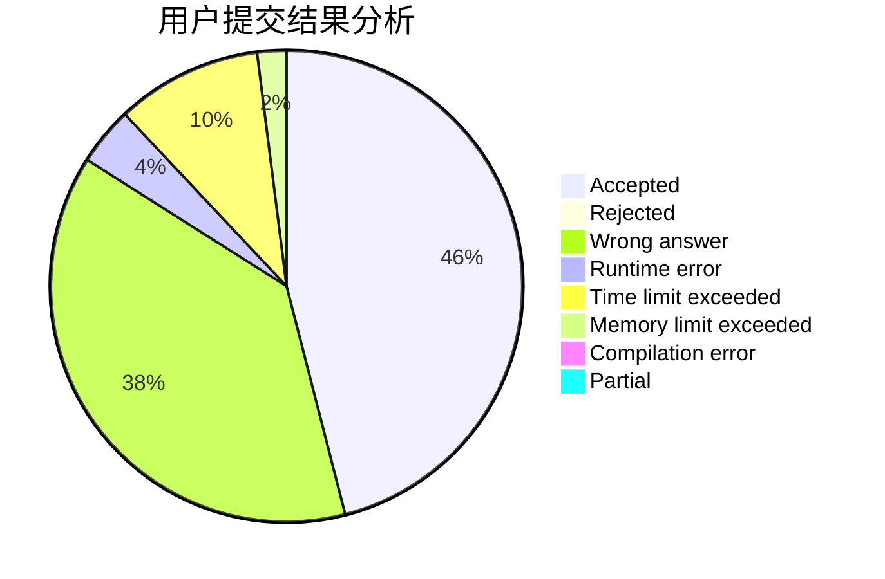
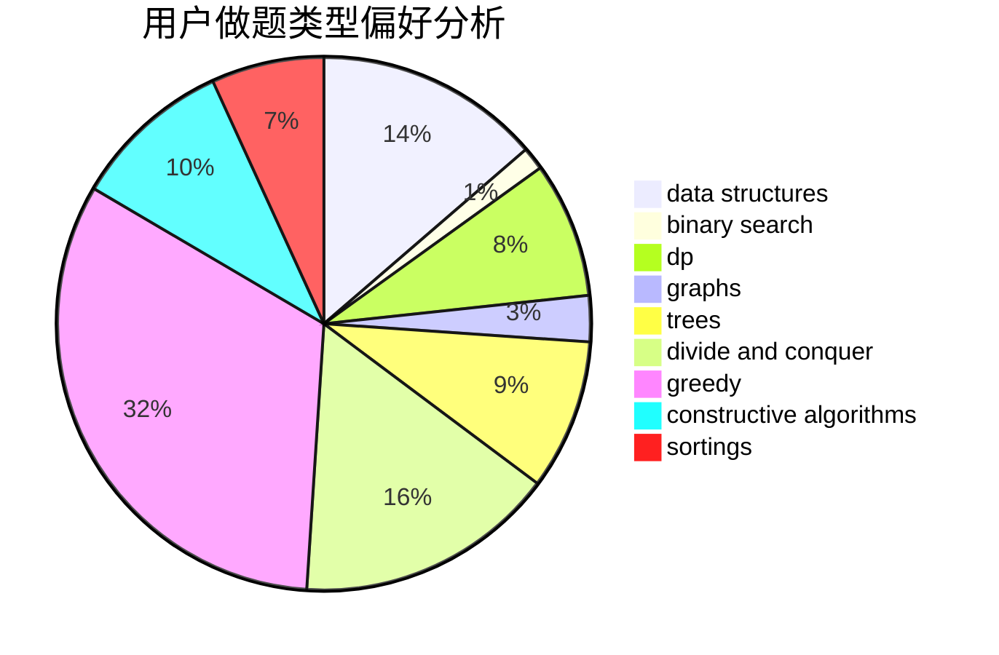
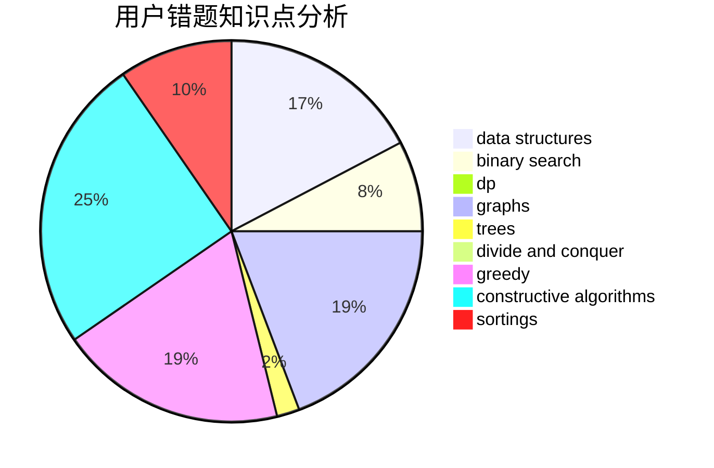

# GG_LC
<!-- tabs:start -->
#### **用户提交结果分析**

#### **用户做题类型偏好分析**

#### **用户错题知识点分析**

<!-- tabs:end -->
# 推荐题目
[1428F](http://codeforces.com/problemset/problem/1428/F)		binary search,
                        data structures,
                        divide and conquer,
                        dp,
                        two pointers		  
[306D](http://codeforces.com/problemset/problem/306/D)		constructive algorithms,
                        geometry		  
[872B](https://codeforces.com/contest/872/problem/B)		greedy		  
[860C](https://codeforces.com/contest/860/problem/C)		greedy,
                        implementation		  
[1195F](http://codeforces.com/problemset/problem/1195/F)		data structures,
                        geometry,
                        math,
                        sortings		  
[1033B](http://codeforces.com/problemset/problem/1033/B)		math,
                        number theory		  
[627C](http://codeforces.com/problemset/problem/627/C)		data structures,
                        divide and conquer,
                        greedy		  
[232B](http://codeforces.com/problemset/problem/232/B)		bitmasks,
                        combinatorics,
                        dp,
                        math		  
[1202C](http://codeforces.com/problemset/problem/1202/C)		brute force,
                        data structures,
                        dp,
                        greedy,
                        implementation,
                        math,
                        strings		  
[551D](http://codeforces.com/problemset/problem/551/D)		combinatorics,
                        implementation,
                        math,
                        matrices,
                        number theory		  
<!-- tabs:start -->
#### **data structures**
[1428F](http://codeforces.com/problemset/problem/1428/F)		binary search,
                        data structures,
                        divide and conquer,
                        dp,
                        two pointers		  
[1195F](http://codeforces.com/problemset/problem/1195/F)		data structures,
                        geometry,
                        math,
                        sortings		  
[627C](http://codeforces.com/problemset/problem/627/C)		data structures,
                        divide and conquer,
                        greedy		  
[1202C](http://codeforces.com/problemset/problem/1202/C)		brute force,
                        data structures,
                        dp,
                        greedy,
                        implementation,
                        math,
                        strings		  
[713A](http://codeforces.com/problemset/problem/713/A)		data structures,
                        implementation		  
[637B](http://codeforces.com/problemset/problem/637/B)		*special problem,
                        binary search,
                        constructive algorithms,
                        data structures,
                        sortings		  
[1223F](http://codeforces.com/problemset/problem/1223/F)		data structures,
                        divide and conquer,
                        dp,
                        hashing		  
[1401E](http://codeforces.com/problemset/problem/1401/E)		data structures,
                        geometry,
                        implementation,
                        sortings		  
[739E](http://codeforces.com/problemset/problem/739/E)		brute force,
                        data structures,
                        dp,
                        flows,
                        math,
                        probabilities,
                        sortings		  
[1482D](http://codeforces.com/problemset/problem/1482/D)		data structures,
                        dsu,
                        implementation,
                        shortest paths		  
#### **binary search**
[1428F](http://codeforces.com/problemset/problem/1428/F)		binary search,
                        data structures,
                        divide and conquer,
                        dp,
                        two pointers		  
[637B](http://codeforces.com/problemset/problem/637/B)		*special problem,
                        binary search,
                        constructive algorithms,
                        data structures,
                        sortings		  
[1427H](http://codeforces.com/problemset/problem/1427/H)		binary search,
                        games,
                        geometry,
                        ternary search		  
[199E](https://codeforces.com/contest/199/problem/E)		binary search,
                        geometry		  
[812C](http://codeforces.com/problemset/problem/812/C)		binary search,
                        sortings		  
[371C](http://codeforces.com/problemset/problem/371/C)		binary search,
                        brute force		  
[363D](http://codeforces.com/problemset/problem/363/D)		binary search,
                        greedy		  
[1494C](http://codeforces.com/problemset/problem/1494/C)		binary search,
                        dp,
                        greedy,
                        implementation,
                        two pointers		  
[1492C](http://codeforces.com/problemset/problem/1492/C)		binary search,
                        data structures,
                        dp,
                        greedy,
                        two pointers		  
[1463D](http://codeforces.com/problemset/problem/1463/D)		binary search,
                        constructive algorithms,
                        greedy,
                        two pointers		  
#### **dp**
[1428F](http://codeforces.com/problemset/problem/1428/F)		binary search,
                        data structures,
                        divide and conquer,
                        dp,
                        two pointers		  
[232B](http://codeforces.com/problemset/problem/232/B)		bitmasks,
                        combinatorics,
                        dp,
                        math		  
[1202C](http://codeforces.com/problemset/problem/1202/C)		brute force,
                        data structures,
                        dp,
                        greedy,
                        implementation,
                        math,
                        strings		  
[13D](http://codeforces.com/problemset/problem/13/D)		dp,
                        geometry		  
[379D](http://codeforces.com/problemset/problem/379/D)		bitmasks,
                        brute force,
                        dp		  
[872C](https://codeforces.com/contest/872/problem/C)		dp,
                        greedy,
                        math,
                        number theory		  
[873B](http://codeforces.com/problemset/problem/873/B)		dp,
                        implementation		  
[1223F](http://codeforces.com/problemset/problem/1223/F)		data structures,
                        divide and conquer,
                        dp,
                        hashing		  
[1338D](http://codeforces.com/problemset/problem/1338/D)		constructive algorithms,
                        dfs and similar,
                        dp,
                        math,
                        trees		  
[739E](http://codeforces.com/problemset/problem/739/E)		brute force,
                        data structures,
                        dp,
                        flows,
                        math,
                        probabilities,
                        sortings		  
#### **graph**
[1266F](http://codeforces.com/problemset/problem/1266/F)		dfs and similar,
                        graphs		  
[590C](http://codeforces.com/problemset/problem/590/C)		dfs and similar,
                        graphs,
                        shortest paths		  
[745C](https://codeforces.com/contest/745/problem/C)		dfs and similar,
                        graphs		  
[780D](http://codeforces.com/problemset/problem/780/D)		2-sat,
                        graphs,
                        greedy,
                        implementation,
                        shortest paths,
                        strings		  
[1487C](http://codeforces.com/problemset/problem/1487/C)		brute force,
                        constructive algorithms,
                        dfs and similar,
                        graphs,
                        greedy,
                        implementation,
                        math		  
[1437C](http://codeforces.com/problemset/problem/1437/C)		dp,
                        flows,
                        graph matchings,
                        greedy,
                        math,
                        sortings		  
[1470D](http://codeforces.com/problemset/problem/1470/D)		constructive algorithms,
                        dfs and similar,
                        graph matchings,
                        graphs,
                        greedy		  
[1476C](http://codeforces.com/problemset/problem/1476/C)		dp,
                        graphs,
                        greedy		  
[1304D](http://codeforces.com/problemset/problem/1304/D)		constructive algorithms,
                        graphs,
                        greedy,
                        two pointers		  
[1475C](http://codeforces.com/problemset/problem/1475/C)		combinatorics,
                        graphs,
                        math		  
#### **trees**
[1252F](http://codeforces.com/problemset/problem/1252/F)		hashing,
                        trees		  
[429A](http://codeforces.com/problemset/problem/429/A)		dfs and similar,
                        trees		  
[1338D](http://codeforces.com/problemset/problem/1338/D)		constructive algorithms,
                        dfs and similar,
                        dp,
                        math,
                        trees		  
[1479D](http://codeforces.com/problemset/problem/1479/D)		binary search,
                        bitmasks,
                        brute force,
                        data structures,
                        probabilities,
                        trees		  
[1511C](http://codeforces.com/problemset/problem/1511/C)		brute force,
                        data structures,
                        implementation,
                        trees		  
[1499F](http://codeforces.com/problemset/problem/1499/F)		combinatorics,
                        dfs and similar,
                        dp,
                        trees		  
[1491E](http://codeforces.com/problemset/problem/1491/E)		brute force,
                        dfs and similar,
                        divide and conquer,
                        number theory,
                        trees		  
[1466D](http://codeforces.com/problemset/problem/1466/D)		data structures,
                        greedy,
                        sortings,
                        trees		  
[1495D](http://codeforces.com/problemset/problem/1495/D)		combinatorics,
                        dfs and similar,
                        graphs,
                        math,
                        shortest paths,
                        trees		  
[1303G](http://codeforces.com/problemset/problem/1303/G)		data structures,
                        divide and conquer,
                        geometry,
                        trees		  
#### **divide and conquer**
[1428F](http://codeforces.com/problemset/problem/1428/F)		binary search,
                        data structures,
                        divide and conquer,
                        dp,
                        two pointers		  
[627C](http://codeforces.com/problemset/problem/627/C)		data structures,
                        divide and conquer,
                        greedy		  
[1250M](http://codeforces.com/problemset/problem/1250/M)		constructive algorithms,
                        divide and conquer		  
[1223F](http://codeforces.com/problemset/problem/1223/F)		data structures,
                        divide and conquer,
                        dp,
                        hashing		  
[1461D](http://codeforces.com/problemset/problem/1461/D)		binary search,
                        brute force,
                        data structures,
                        divide and conquer,
                        implementation,
                        sortings		  
[1466G](http://codeforces.com/problemset/problem/1466/G)		combinatorics,
                        divide and conquer,
                        hashing,
                        math,
                        string suffix structures,
                        strings		  
[1490D](http://codeforces.com/problemset/problem/1490/D)		dfs and similar,
                        divide and conquer,
                        implementation		  
[1483C](https://codeforces.com/contest/1483/problem/C)		data structures,
                        divide and conquer,
                        dp		  
[1491E](http://codeforces.com/problemset/problem/1491/E)		brute force,
                        dfs and similar,
                        divide and conquer,
                        number theory,
                        trees		  
[1303G](http://codeforces.com/problemset/problem/1303/G)		data structures,
                        divide and conquer,
                        geometry,
                        trees		  
#### **greedy**
[872B](https://codeforces.com/contest/872/problem/B)		greedy		  
[860C](https://codeforces.com/contest/860/problem/C)		greedy,
                        implementation		  
[627C](http://codeforces.com/problemset/problem/627/C)		data structures,
                        divide and conquer,
                        greedy		  
[1202C](http://codeforces.com/problemset/problem/1202/C)		brute force,
                        data structures,
                        dp,
                        greedy,
                        implementation,
                        math,
                        strings		  
[872C](https://codeforces.com/contest/872/problem/C)		dp,
                        greedy,
                        math,
                        number theory		  
[246A](http://codeforces.com/problemset/problem/246/A)		constructive algorithms,
                        greedy,
                        sortings		  
[853A](http://codeforces.com/problemset/problem/853/A)		greedy		  
[780D](http://codeforces.com/problemset/problem/780/D)		2-sat,
                        graphs,
                        greedy,
                        implementation,
                        shortest paths,
                        strings		  
[808C](http://codeforces.com/problemset/problem/808/C)		constructive algorithms,
                        greedy,
                        sortings		  
[363D](http://codeforces.com/problemset/problem/363/D)		binary search,
                        greedy		  
#### **constructive algorithms**
[306D](http://codeforces.com/problemset/problem/306/D)		constructive algorithms,
                        geometry		  
[637B](http://codeforces.com/problemset/problem/637/B)		*special problem,
                        binary search,
                        constructive algorithms,
                        data structures,
                        sortings		  
[1250M](http://codeforces.com/problemset/problem/1250/M)		constructive algorithms,
                        divide and conquer		  
[246A](http://codeforces.com/problemset/problem/246/A)		constructive algorithms,
                        greedy,
                        sortings		  
[808C](http://codeforces.com/problemset/problem/808/C)		constructive algorithms,
                        greedy,
                        sortings		  
[1338D](http://codeforces.com/problemset/problem/1338/D)		constructive algorithms,
                        dfs and similar,
                        dp,
                        math,
                        trees		  
[305A](http://codeforces.com/problemset/problem/305/A)		brute force,
                        constructive algorithms,
                        implementation		  
[1042C](http://codeforces.com/problemset/problem/1042/C)		constructive algorithms,
                        greedy,
                        math		  
[804A](http://codeforces.com/problemset/problem/804/A)		constructive algorithms,
                        greedy,
                        math		  
[1493A](http://codeforces.com/problemset/problem/1493/A)		constructive algorithms,
                        greedy		  
#### **sortings**
[1195F](http://codeforces.com/problemset/problem/1195/F)		data structures,
                        geometry,
                        math,
                        sortings		  
[637B](http://codeforces.com/problemset/problem/637/B)		*special problem,
                        binary search,
                        constructive algorithms,
                        data structures,
                        sortings		  
[812C](http://codeforces.com/problemset/problem/812/C)		binary search,
                        sortings		  
[246A](http://codeforces.com/problemset/problem/246/A)		constructive algorithms,
                        greedy,
                        sortings		  
[808C](http://codeforces.com/problemset/problem/808/C)		constructive algorithms,
                        greedy,
                        sortings		  
[1369C](http://codeforces.com/problemset/problem/1369/C)		greedy,
                        math,
                        sortings,
                        two pointers		  
[1401E](http://codeforces.com/problemset/problem/1401/E)		data structures,
                        geometry,
                        implementation,
                        sortings		  
[739E](http://codeforces.com/problemset/problem/739/E)		brute force,
                        data structures,
                        dp,
                        flows,
                        math,
                        probabilities,
                        sortings		  
[1496C](https://codeforces.com/contest/1496/problem/C)		geometry,
                        greedy,
                        math,
                        sortings		  
[1495A](http://codeforces.com/problemset/problem/1495/A)		geometry,
                        greedy,
                        math,
                        sortings		  
<!-- tabs:end -->
